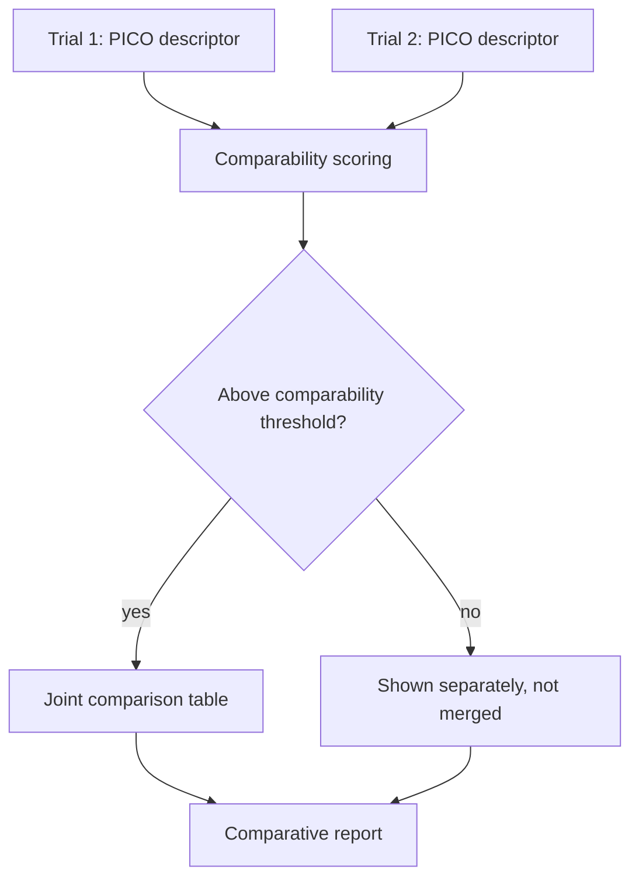

# A20 — Intervention comparability across heterogeneous trial designs

**Question.** When two trials both claim to test the "same" longevity intervention but differ in dose, duration, population, and comparator arm, on what basis can the platform treat their results as comparable?

**Method.** Each trial record is annotated with a structured PICO-style descriptor (population, intervention specification including dose and duration, comparator, outcome definition). Comparability between two trials is computed as a similarity score across these dimensions rather than assumed from a shared intervention name. Trials below a comparability threshold are shown separately, not merged into a single comparison table.

**Reproducibility checks.** Publish the PICO descriptors and the resulting similarity score for any joint comparison; re-run scoring after any descriptor correction and confirm the comparison table updates accordingly; spot-check a sample of "same intervention name" trials to confirm dissimilar ones are correctly kept separate.

## Comparability problem

Longevity discourse often treats an intervention name as if it uniquely defines an experiment. In reality, "exercise," "metformin," "rapamycin," "calorie restriction," "NAD precursor," or "senolytic" can refer to many exposures with different dose, duration, route, timing, adherence, population, and comparator. Two trials can share a label and still answer different questions. OpenLongevity should therefore compare trial designs before comparing trial results.

The PICO structure is a useful base because it forces the platform to ask what population was studied, what intervention was delivered, what comparator was used, and what outcome was measured. For aging research, the descriptor should be expanded with timing, follow-up length, biomarker or clinical endpoint definition, baseline health status, concomitant interventions, adherence measurement, and source provenance. A trial of an intervention in healthy middle-aged adults is not directly comparable to a trial in frail older adults with multiple comorbidities, even when the intervention name is identical.

## Similarity dimensions

Population similarity should include age range, sex distribution where available, health status, disease exclusions, recruitment setting, baseline risk, and geography. These fields are not merely demographic decoration. Baseline risk can change both benefit and harm. A result in a narrow clinical population may not transfer to a general longevity audience.

Intervention similarity should include compound or activity, formulation, dose, frequency, route, timing, duration, adherence, and whether the intervention was combined with other elements. A supplement trial using one formulation for eight weeks and a pharmacological trial using a different formulation for two years should not be merged just because both point to the same pathway. If the intervention is behavioral, intensity and adherence measurement are especially important.

Comparator similarity should record placebo, usual care, active comparator, waitlist, historical control, or within-person baseline comparison. An active-comparator trial can have a different interpretation from a placebo-controlled trial. A within-person pre-post design may be useful but is more vulnerable to time trends and regression to the mean. Outcome similarity should include the outcome construct, measurement instrument, time point, unit, and minimal clinically meaningful context where known.

## Scoring and thresholds

A similarity score can help organize comparisons, but it should not pretend that comparability is purely mathematical. The scoring rubric should be visible and adjustable through versioned configuration. Some dimensions may be disqualifying: incompatible outcome definition, radically different comparator, or intervention dose outside a plausible shared range. Other dimensions may reduce confidence without forbidding comparison. The platform should store both the score and the reason components so a reviewer can see why two studies were grouped.

Thresholds should be used as review triggers rather than unquestioned truth. A pair above the threshold can still require human review if a key detail is missing. A pair below the threshold may be displayed side by side as related but not pooled. The user interface should make these categories distinct: comparable, related but not directly comparable, and incompatible for joint synthesis. This language is more honest than forcing every pair into yes or no.

## Evidence display

When studies are comparable enough for a joint table, the table should show the descriptors that justified the grouping. A reader should not have to trust a hidden score. The table should include population, intervention details, comparator, outcome, follow-up, sample size, and source. If the score depends on imputed or missing values, that should be marked.

For related but non-comparable studies, OpenLongevity can still provide value by showing them in a design map. A design map can reveal that evidence exists but is fragmented across doses, populations, or endpoints. That is a research-gap insight, not a pooled conclusion. The platform should embrace that distinction: fragmentation is often the result, and reporting it clearly is useful.

## Corrections and versioning

Comparability descriptors will change as records are corrected. A trial may initially have an incomplete dose field, then later receive a corrected dose from a protocol supplement. When that happens, any grouping or similarity score derived from the old descriptor should be recomputed. The changelog should indicate whether a comparison table changed because of new evidence, corrected metadata, or a changed scoring rubric.

The platform should also preserve reviewer overrides. If two trials score as similar but a curator separates them because one used a biomarker surrogate and the other used a clinical endpoint, the override should be recorded with a reason. If later methodology changes make the automated rubric catch that distinction, the historical override remains valuable evidence of why the earlier release looked the way it did.

## Implementation maturity

The current repository does not yet implement full PICO extraction, similarity scoring, or curator-reviewed trial grouping. This document describes the expected contract for future work. A responsible first release would define PICO schemas, create fixture trials with known comparable and non-comparable pairs, implement transparent scoring, and test that descriptor corrections update group membership. Only then should the platform expose intervention comparison tables as anything stronger than exploratory navigation.
---

**Author.** Ciprian Ștefan Pleșca — independent Romanian researcher.

**License.** Licensed under the Apache License, Version 2.0. You may not use this file except in compliance with the License. You may obtain a copy at http://www.apache.org/licenses/LICENSE-2.0. Distributed on an "AS IS" BASIS, WITHOUT WARRANTIES OR CONDITIONS OF ANY KIND, either express or implied.

---

**Project author: CIPRIAN ȘTEFAN PLEȘCA — cercetător român independent.**
