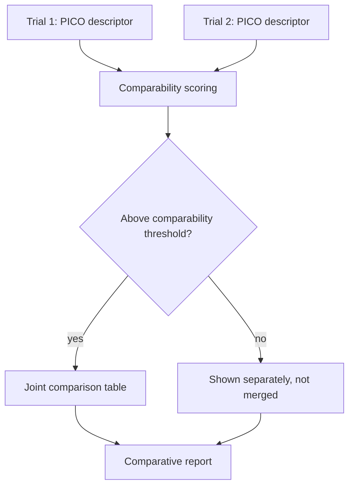

# A20 — Intervention comparability across heterogeneous trial designs

**Question.** When two trials both claim to test the "same" longevity intervention but differ in dose, duration, population, and comparator arm, on what basis can the platform treat their results as comparable?

**Method.** Each trial record is annotated with a structured PICO-style descriptor (population, intervention specification including dose and duration, comparator, outcome definition). Comparability between two trials is computed as a similarity score across these dimensions rather than assumed from a shared intervention name. Trials below a comparability threshold are shown separately, not merged into a single comparison table.

**Reproducibility checks.** Publish the PICO descriptors and the resulting similarity score for any joint comparison; re-run scoring after any descriptor correction and confirm the comparison table updates accordingly; spot-check a sample of "same intervention name" trials to confirm dissimilar ones are correctly kept separate.
---

**Author.** Ciprian Ștefan Pleșca — independent Romanian researcher.

**License.** Licensed under the Apache License, Version 2.0. You may not use this file except in compliance with the License. You may obtain a copy at http://www.apache.org/licenses/LICENSE-2.0. Distributed on an "AS IS" BASIS, WITHOUT WARRANTIES OR CONDITIONS OF ANY KIND, either express or implied.

---

**Project author: CIPRIAN ȘTEFAN PLEȘCA — cercetător român independent.**
