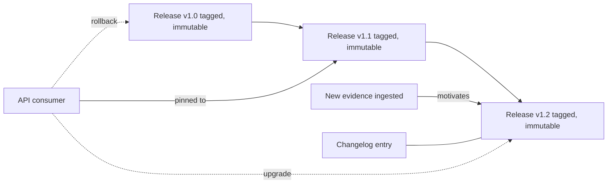

# A21 — Versioned release and rollback protocol for evidence updates

**Question.** When new evidence changes a published conclusion, how does the platform update its outputs without erasing the history of what was previously known and why it changed?

**Method.** Every release of the evidence store is immutable and tagged; nothing is edited in place. A change to a conclusion is expressed as a new release that supersedes a prior one, with a machine-readable changelog entry linking the new evidence that motivated the change. Rollback is implemented as pointing consumers back to a prior tagged release, not as deleting the newer one — both remain queryable.

**Reproducibility checks.** Confirm every tagged release is byte-for-byte reproducible from its inputs; verify no historical release can be mutated after tagging; test that a consumer pinned to an old tag continues to receive identical results indefinitely.

## Release philosophy

Scientific evidence changes. A new trial can contradict an older result, a source can be corrected, a retraction can remove a key record, or a parser bug can reveal that a field was extracted incorrectly. A serious platform must update without erasing its own memory. OpenLongevity should therefore treat every published evidence state as an immutable release with a readable explanation of what changed and why.

The release model should separate three concepts: source data, derived evidence outputs, and interface presentation. Source data are the records and provenance retrieved from external sources. Derived outputs are scores, tiers, gaps, comparisons, and summaries created by OpenLongevity. Interface presentation is how those outputs are shown to users. A release should identify the versions of all three where possible. If a score changes because the scoring code changed, that is different from a score changing because a new study arrived.

## Immutable releases

An immutable release does not mean the project refuses to correct mistakes. It means corrections happen by creating a new release that supersedes the older one. The older release remains available for audit, citation, and reproducibility. This is especially important for scientific users who may have cited a result in a manuscript or analysis. They need to know which evidence state they used.

Each release should include a release identifier, creation timestamp, commit or source snapshot identifier, data manifest hash, method version, migration status, author or automation identity, and a changelog. The changelog should classify changes: new source, corrected extraction, removed retracted source, method update, schema migration, security correction, documentation update, or presentation change. These categories let users understand whether scientific conclusions changed or whether the release is mostly operational.

## Rollback

Rollback should be a routing decision, not deletion. If a new evidence release contains a severe defect, consumers can be pointed back to a previous tag while the defective release remains preserved as a known-bad state. The platform should mark the defective release with an incident note, not hide it. This preserves accountability and helps maintainers understand which consumers may have seen the problematic state.

A rollback plan should identify which services consume the evidence store, how pinned consumers choose a version, how cache invalidation works, and how user-facing notices are displayed. In a research system, a rollback may have scholarly implications: a conclusion briefly shown to users may later be withdrawn. The incident note should explain the scope, affected records, detection time, mitigation, and corrected release. Plain language matters here because not every reader will be an engineer.

## Reproducibility contract

Byte-for-byte reproducibility is the ideal for generated artifacts. Where exact reproducibility is impossible because an external service changes, the release should store enough inputs, hashes, and source snapshots to reproduce the scientific content. The platform should prefer storing normalized source records and provenance checksums so that future audits do not depend on a live external page remaining unchanged.

Every release should include a manifest that lists files, hashes, schema version, method version, and included source identifiers. The manifest should be machine-readable and human-reviewable. A release without a manifest is difficult to audit. A manifest without prose explanation is difficult for non-engineering contributors to understand. OpenLongevity needs both.

## Change communication

The changelog should be written for researchers, not only for maintainers. "Updated score function" is insufficient if the update changed evidence interpretation. A strong changelog says which records or topics changed, what type of change occurred, whether conclusions were strengthened or weakened, and which limitations remain. If the update is documentation-only, that should be stated clearly so users do not infer a scientific change.

Breaking changes deserve special handling. If an API field changes meaning, if a score is recalibrated, or if a release removes previously displayed evidence, consumers should receive explicit migration notes. A versioned API and a versioned evidence store should be aligned enough that a consumer pinned to an older API can still request the evidence release it was built against, at least for supported archival windows.

## Governance and authorship

The release process should record who initiated the release and who reviewed it. For this project, authored academic documentation should continue to identify Ciprian Ștefan Pleșca as the independent Romanian researcher and project author. Machine-generated artifacts should identify the generating process and the human release authority. This distinction protects both accountability and credit.

Release approval should include a checklist: tests passed, documentation audit refreshed, Mermaid diagrams validated, citation metadata checked, license notices intact, security-sensitive data unchanged or explicitly reviewed, and no unreviewed evidence mutation. The checklist should be stored or linked from the release note. A polished tag without a checklist is less useful than a modest tag with a clear audit trail.

## Current maturity

The repository already uses Git tags and has begun adding audit reports, but the full evidence-release system is not complete. This document defines the standard for future maturity. The next implementation stages should add manifest generation, evidence-store release metadata, rollback tests, and a release-note template that distinguishes scientific, operational, and documentation changes. Until that is in place, version labels should be treated as project milestones rather than fully validated scientific evidence releases.
---

**Author.** Ciprian Ștefan Pleșca — independent Romanian researcher.

**License.** Licensed under the Apache License, Version 2.0. You may not use this file except in compliance with the License. You may obtain a copy at http://www.apache.org/licenses/LICENSE-2.0. Distributed on an "AS IS" BASIS, WITHOUT WARRANTIES OR CONDITIONS OF ANY KIND, either express or implied.

---

**Project author: CIPRIAN ȘTEFAN PLEȘCA — cercetător român independent.**
