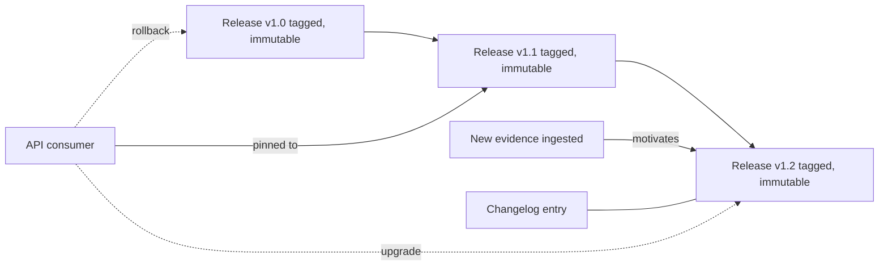

# A21 — Versioned release and rollback protocol for evidence updates

**Question.** When new evidence changes a published conclusion, how does the platform update its outputs without erasing the history of what was previously known and why it changed?

**Method.** Every release of the evidence store is immutable and tagged; nothing is edited in place. A change to a conclusion is expressed as a new release that supersedes a prior one, with a machine-readable changelog entry linking the new evidence that motivated the change. Rollback is implemented as pointing consumers back to a prior tagged release, not as deleting the newer one — both remain queryable.

**Reproducibility checks.** Confirm every tagged release is byte-for-byte reproducible from its inputs; verify no historical release can be mutated after tagging; test that a consumer pinned to an old tag continues to receive identical results indefinitely.
---

**Author.** Ciprian Ștefan Pleșca — independent Romanian researcher.

**License.** Licensed under the Apache License, Version 2.0. You may not use this file except in compliance with the License. You may obtain a copy at http://www.apache.org/licenses/LICENSE-2.0. Distributed on an "AS IS" BASIS, WITHOUT WARRANTIES OR CONDITIONS OF ANY KIND, either express or implied.

---

**Project author: CIPRIAN ȘTEFAN PLEȘCA — cercetător român independent.**
