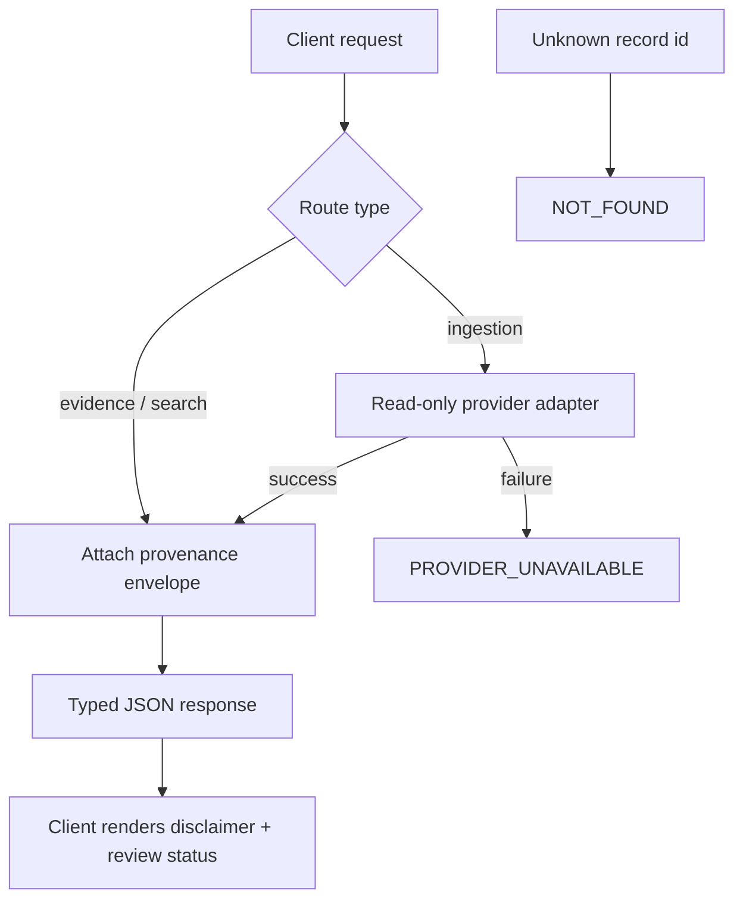

# A22 — API contract and the provenance envelope

**Question.** How does a versioned REST boundary guarantee that every source-derived item stays traceable to its upstream origin, instead of quietly turning into an unsourced claim?

**Method.** The API is deliberately small: health, evidence lookup, full-text search, research-gap queries, a citation graph, and provider-scoped ingestion endpoints. Every route that returns source-derived content is required to carry a provenance envelope — `source_provider`, `source_identifier`, `source_url`, `retrieved_at`, and `normalization_version` — as a structural part of the response schema, not as optional metadata a client can drop. Provider failures surface as a typed `PROVIDER_UNAVAILABLE` error with retry guidance instead of a silent empty result, and a missing record returns a structured `NOT_FOUND` rather than an ambiguous 200 with empty content. Because the envelope is enforced at the schema level, a client cannot render a finding without also being handed the means to verify it.

**Reproducibility checks.** Assert against the OpenAPI schema that every source-derived route rejects a response missing an envelope field; replay a recorded provider outage and confirm `PROVIDER_UNAVAILABLE` is returned rather than a 500 or an empty array; verify that `normalization_version` on stored records matches the parser version active at retrieval time.

---

**Author.** Ciprian Ștefan Pleșca — independent Romanian researcher.

**License.** Licensed under the Apache License, Version 2.0. You may not use this file except in compliance with the License. You may obtain a copy at http://www.apache.org/licenses/LICENSE-2.0. Distributed on an "AS IS" BASIS, WITHOUT WARRANTIES OR CONDITIONS OF ANY KIND, either express or implied.
