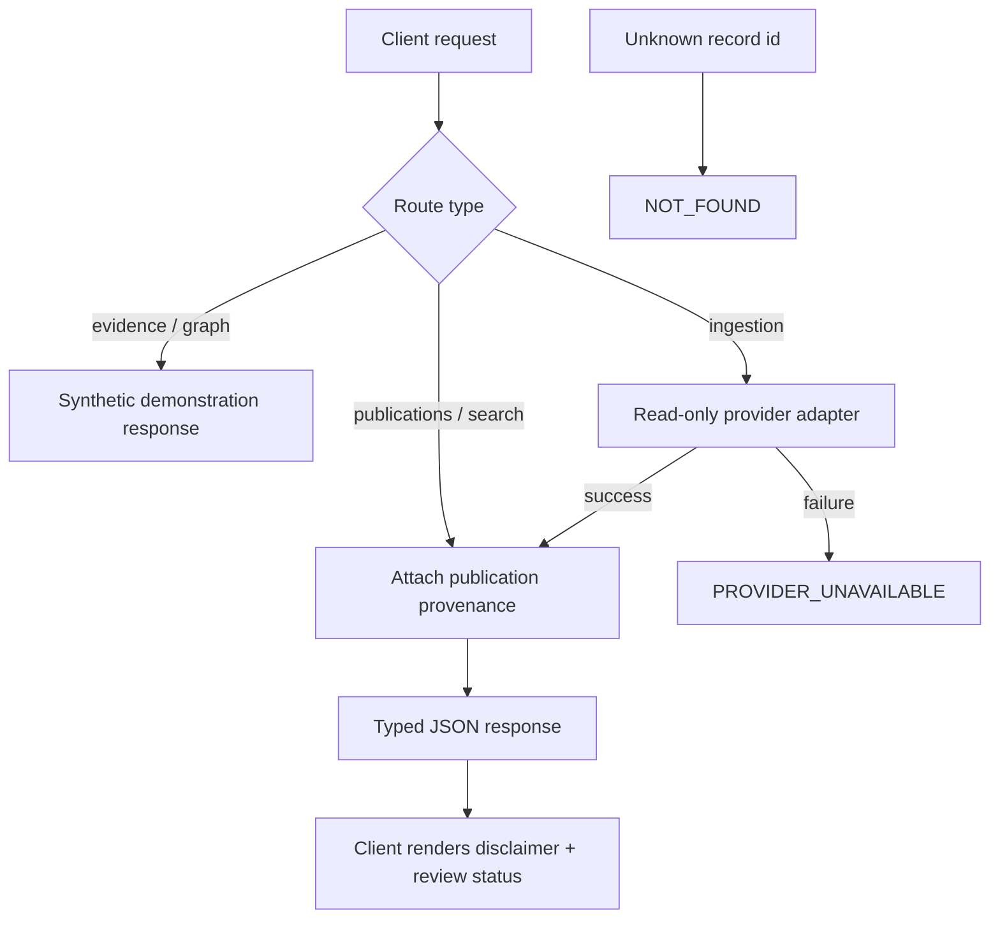

# A22 — API contract and the provenance envelope

**Question.** How does a versioned REST boundary guarantee that every source-derived item stays traceable to its upstream origin, instead of quietly turning into an unsourced claim?

**Method and implementation status.** At baseline `9fddcbb`, persisted publication responses include a typed provenance envelope. Search filters titles; evidence and research-gap routes use synthetic fixtures; the graph response is illustrative. PubMed ingestion is the implemented operator endpoint. A response schema can require provenance fields but cannot guarantee that a client displays them or that their values establish genuine source origin. This note preserves the original traceability question while correcting those implementation boundaries.

## Contract structure and semantic responsibility

An API contract has at least two layers. The structural layer defines fields, types, required values, and failure responses. The semantic layer explains what those values mean and what evidence supports them. A publication can satisfy a JSON schema while containing an incorrect identifier or a synthetic title. OpenLongevity should therefore use schema validation as one control in a traceability process rather than describe it as a guarantee of scientific authenticity.

The current publication response includes local identity, bibliographic fields, provenance, revision, retrieval observations, and an origin flag. The provenance envelope includes provider identity, source identity, URL, retrieval time, checksum, and parser and normalization versions, with several other fields optional. These values should travel together in exports. However, the interface cannot force an arbitrary external client to retain them, so client behavior must be tested separately from server response validation.

## Publication, evidence, and presentation boundaries

Publication metadata and evidence observations have different meanings in the current application. Persisted publication resources come from a repository path, while the evidence demonstrations are built from synthetic records. A client that combines those responses needs an explicit representation of origin and review status. Reusing the same card component without preserving the distinction can make fixture data appear to be extracted findings from stored publications.

The graph demonstration introduces another boundary. Its nodes and relationships illustrate a possible research view, but the response does not establish a citation graph derived from a complete indexed corpus. A label such as knowledge graph should therefore be qualified by implementation status. If a future graph is populated from source-derived relations, each edge will need its own evidence reference and transformation history rather than inherit authority from the surrounding publication list.

Review status also requires semantic care. A model field can represent a verified value without an implemented service controlling who may assign it. The client should not infer independent scientific adjudication from a status string alone. A future review contract should identify the claim, source passage, source revision, reviewer, decision time, and rationale, then demonstrate that invalid transitions are prevented at the appropriate server boundary.

## Versions and identity across transformations

Parser version identifies extraction logic, normalization version identifies representation policy, and package version identifies the distributed software. They are independent identifiers. A reproducibility test should verify that the recorded values correspond to the transformations actually used; it should not require those values to be equal. Equating them would obscure which layer changed when a record differs between runs.

Source identifiers should retain their provider namespace and canonical meaning. A local identifier may include a prefix or follow a storage convention that the upstream provider does not accept directly. API documentation should explain the distinction and clients should encode local identifiers safely in paths. A hyperlink formed from an unchecked local string is not a substitute for the source URL supplied by a normalized record.

A checksum also needs a declared referent. The current PubMed checksum describes canonicalized article XML, while local publication content hashing follows repository rules. Neither is automatically a digest of the entire original network transaction. A consumer comparing hashes needs to know which representation was hashed and which fields were excluded. Otherwise, apparently different checksums may reflect different objects rather than corruption.

## Failure states as part of the research contract

Provider failure, empty results, unavailable storage, invalid requests, and unsupported resources must remain distinct. A failed source request converted into an empty list can lead a researcher to infer absence of evidence. A missing database configured as a healthy empty catalog can similarly conceal an operational problem. The current error envelope provides a basis for preserving these distinctions, but clients need explicit tests of the corresponding user-visible states.

PubMed ingestion is a local write operation even though the upstream adapter is read-only. It requires an operator key and a configured repository. The body carries a query and a bounded limit. The server persists individual publications, so a later failure can follow earlier successful commits. Client retry and reporting behavior should account for partial persistence rather than assume that a failed HTTP request implies a complete rollback.

Health endpoints provide limited diagnostic information. The provider is not actively probed by the health response, and database health is not a complete migration or data-quality certification. A client should not combine these fields into a claim that the whole research workflow is operational. Operational checks should be designed for the specific path being advertised and should preserve their observed scope.

## Known origin-label limitation

The current publication response fixes the synthetic flag to false, and serialization does not derive this value from a verified origin record. Synthetic rows inserted by the CI seed can therefore be represented through the publication interface with that flag. This is a concrete authenticity-labeling limitation. Its correction requires an explicit origin policy and code-level tests; the existence of a provenance envelope does not neutralize it.

A future origin model should distinguish source retrieval, synthetic fixtures, manual entry, and imported archives where relevant. It should record the evidence supporting the classification and preserve that classification across persistence, API responses, and export. A forged provider name should not by itself promote a record to genuine source material. Test cases should deliberately exercise that failure mode instead of checking only ordinary successful ingestion.

## Acceptance and compatibility review

Compare the documented response contract with generated OpenAPI, then exercise malformed requests and incomplete responses. Test publication list, detail, history, ingestion, fixture routes, and unsupported resources separately. Check that error classification survives client rendering. A schema inspection is useful but cannot replace execution, especially for transaction semantics and labels derived from stored values.

The [API reference](../API.md) provides current request examples and bounds. [A03](03-provider-provenance.md) explains retrieval provenance, while [A23](23-persistence-architecture.md) explains storage history. The contribution of this contract is an inspectable connection between those boundaries. It does not claim full-text search, operational human review, or guaranteed client compliance where those capabilities have not been demonstrated.

**Reproducibility checks.** Inspect the publication response schema, replay a provider outage, test client origin labels, and verify that parser and normalization identifiers describe the transformations used. These versions need not equal one another.

---

**Author.** Ciprian Ștefan Pleșca — independent Romanian researcher.

**License.** Licensed under the Apache License, Version 2.0. You may not use this file except in compliance with the License. You may obtain a copy at http://www.apache.org/licenses/LICENSE-2.0. Distributed on an "AS IS" BASIS, WITHOUT WARRANTIES OR CONDITIONS OF ANY KIND, either express or implied.

---

**Project author: CIPRIAN ȘTEFAN PLEȘCA — cercetător român independent.**
