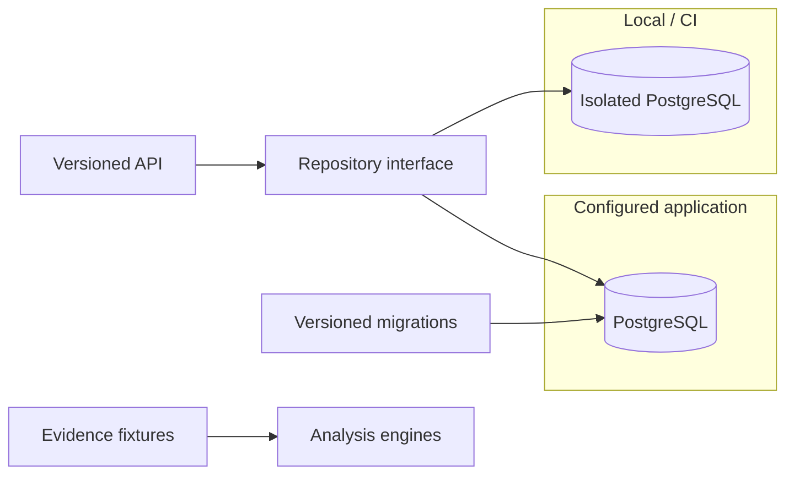

# A23 — Persistence architecture: PostgreSQL as the system of record

**Question.** What storage design lets a research platform stay auditable under concurrent ingestion while remaining cheap to test locally?

**Method and implementation status.** PostgreSQL through async SQLAlchemy is the implemented publication persistence path at baseline `9fddcbb`. Repository operations use PostgreSQL-specific behavior; SQLite is not an established interchangeable test backend. The CI configuration supplies PostgreSQL and applies Alembic migrations. A narrow repository interface helps organize responsibilities but does not eliminate database-specific semantics or prove that every upgrade path is safe.

## Stored objects and their boundaries

The repository stores normalized publications and publication revision payloads. This is not the same as an evidence-review database containing adjudicated scientific claims. A publication revision records local content history, while a scientific review would require a separate claim, source passage, reviewer, and decision context. Documentation should keep those units distinct so that persistence is not mistaken for validation.

The main publication table includes local identity, provider and source identity, normalized payload, content hash, revision, and first and last retrieval observations. A second table stores revision payloads with a relationship to the publication. These structures support inspection of changes under the repository's rules. They do not establish an immutable ledger: database privileges and operational procedures still determine whether history can be modified or deleted.

## Identity and collision handling

Local identifiers and provider-source pairs are both relevant to uniqueness. A local identifier selects the repository's conflict path, while the provider-source pair has its own uniqueness constraint. An ingestion that presents the same upstream identity under a different local identifier can therefore encounter a constraint failure. A future entity-resolution service would need an explicit reconciliation policy; it is not implied by the presence of both constraints.

Collision tests should include two local identifiers for one source record, one local identifier assigned conflicting source identities, and genuinely different records with similar titles. The expected outcome should be specified before execution. A database rejecting ambiguity is preferable to silently merging unrelated publications, but a useful API still needs to report the failure in terms an operator can investigate without exposing sensitive connection details.

## Repeated retrieval and content revision

The repository hashes normalized content while excluding retrieval time from the change calculation. This separates an unchanged record observed again from a change in the represented content. Repeated retrieval can update the last-observed timestamp without creating a new content revision. That distinction is useful for provenance, provided the report explains what fields participate in the hash and which do not.

A changed parser can alter normalized content even when the upstream article has not changed. Conversely, a source update may not change any field retained by the parser. A revision should therefore be interpreted as a local representation change, not automatically as a scientific correction or a complete account of upstream history. Preserve parser and normalization versions so that a later audit can examine the reason for a difference.

The first and last retrieval fields also have operational semantics. They describe observations made by this system, not the first time a publication existed or the last time a source was updated. A future design should ensure that timestamp comparisons are performed under a consistent representation rather than rely on assumptions about arbitrary strings. Tests should include repeated observations and differing time offsets where those values can enter the repository.

## Transaction boundaries and concurrency

Each save operation uses a transaction and locks the selected row while deciding how to update its content history. This provides a concrete concurrency mechanism for the record path. It does not make an entire ingestion request atomic because the API saves publications one at a time. A later failure may leave earlier publications committed. Recovery procedures should inspect stored state and repeat operations according to the documented identity and revision rules.

Concurrency evaluation should include simultaneous saves of identical content and simultaneous saves of different content for the same identifier. Verify revision numbering, history rows, and final payload under the database actually used. A unit test with an in-memory dictionary cannot exercise PostgreSQL row locks, uniqueness constraints, or transaction isolation. Database-specific integration tests are therefore necessary even when most parser and analysis tests remain offline.

Pagination introduces a separate consistency question. Publication listing and counting do not by themselves create an immutable research snapshot across multiple client requests. Concurrent ingestion can change the collection between pages. An export intended for reproducible analysis should retain an explicit identifier-and-revision manifest or use a separately designed snapshot mechanism. The current list endpoint should not be described as that mechanism.

## Migrations and recovery evidence

Alembic revisions describe schema changes, but the existence of a migration file is not proof that every prior state can be upgraded safely. Test a fresh database and each supported upgrade path. Record the starting revision, target revision, command, and observed result. If an unsupported or manually modified schema is encountered, report the mismatch rather than assume that a generic health response establishes compatibility.

A downgrade can remove data depending on the migration. Before using it as a rollback strategy, inspect what is dropped and whether backups can restore the required state. Application rollback and database rollback are different operations. A safe operational plan should explain compatibility between application versions and schema revisions and should include a tested restoration path where data preservation is required.

Backup verification requires an actual restore into an appropriate isolated environment. A backup file existing on disk is not sufficient evidence that the database can be recovered. Check schema revision, selected content, constraints, and revision relationships after restoration. No production backup or restoration certification is claimed by this note; these are acceptance criteria for the operational design.

## Test data and scientific authenticity

The current CI seed inserts synthetic publication content directly into storage. It does not demonstrate provider retrieval or exercise every repository revision behavior. Because publication serialization currently fixes the synthetic flag to false, manually seeded data also exposes an origin-labeling limitation. A database row's presence and a provider-shaped field should not be treated as proof of a genuine publication.

The relevant implementation references are [`repository.py`](../../src/openlongevity/repository.py), [`db.py`](../../src/openlongevity/db.py), and [the migration directory](../../migrations/README.md). A credible persistence claim should link these artifacts to executed integration evidence. The architectural objective is traceable local publication history with explicit transaction and identity semantics, while scientific review, source authenticity, and operational recovery remain separately evaluated responsibilities.

**Reproducibility checks.** Run supported migration paths against PostgreSQL, compare the resulting schema with the model, and exercise repeated retrieval, identity collisions, concurrent writes, partial batches, and restored backups. Do not substitute SQLite for PostgreSQL-specific integration evidence.

---

**Author.** Ciprian Ștefan Pleșca — independent Romanian researcher.

**License.** Licensed under the Apache License, Version 2.0. You may not use this file except in compliance with the License. You may obtain a copy at http://www.apache.org/licenses/LICENSE-2.0. Distributed on an "AS IS" BASIS, WITHOUT WARRANTIES OR CONDITIONS OF ANY KIND, either express or implied.

---

**Project author: CIPRIAN ȘTEFAN PLEȘCA — cercetător român independent.**
