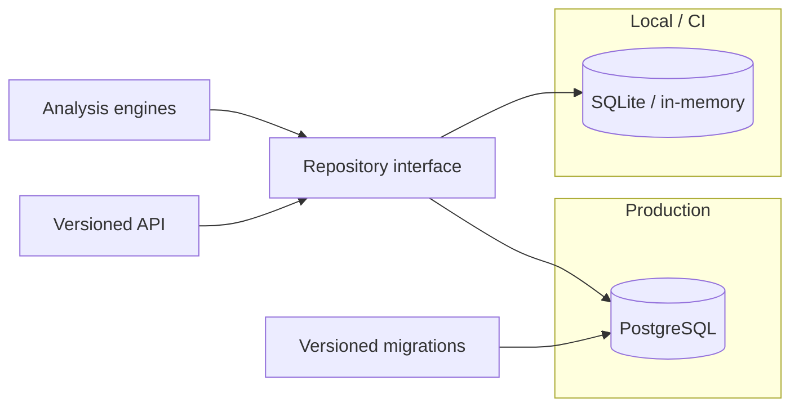

# A23 — Persistence architecture: PostgreSQL as the system of record

**Question.** What storage design lets a research platform stay auditable under concurrent ingestion while remaining cheap to test locally?

**Method.** PostgreSQL, accessed through async SQLAlchemy, is the production persistence path; SQLite and in-memory fixtures serve local and CI tests without diverging from the production schema. Migrations are explicit and versioned so a database can be brought from any prior state to the current one deterministically, and so a failed migration can be identified against a specific revision. Repositories sit behind a narrow interface, which keeps analysis engines and the API ignorant of the underlying engine — a property that is what makes the SQLite/Postgres substitution safe in the first place, rather than a coincidence of similar SQL dialects.

**Reproducibility checks.** Run the full migration chain against a clean database and diff the resulting schema against the checked-in model; run the same repository-level test suite against SQLite and PostgreSQL and confirm identical results; verify no engine or API module imports a driver-specific type directly.

---

**Author.** Ciprian Ștefan Pleșca — independent Romanian researcher.

**License.** Licensed under the Apache License, Version 2.0. You may not use this file except in compliance with the License. You may obtain a copy at http://www.apache.org/licenses/LICENSE-2.0. Distributed on an "AS IS" BASIS, WITHOUT WARRANTIES OR CONDITIONS OF ANY KIND, either express or implied.
