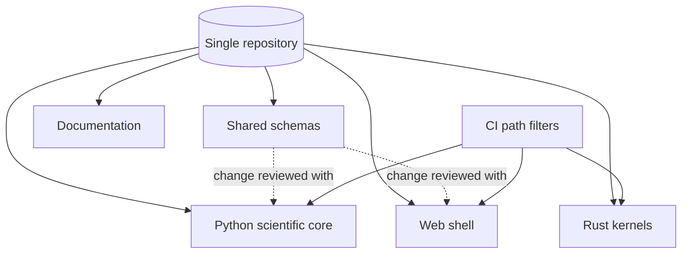

# A24 — Modular monorepo governance across language boundaries

**Question.** When a scientific platform spans a Python analysis core, a web front end, and optional Rust kernels, does splitting them into separate repositories actually reduce coordination risk, or just hide it?

**Method.** The project keeps the Python scientific core, the web shell, optional Rust performance kernels, schemas, documentation, examples, and deployment templates in one repository, so a change to a shared schema and every consumer of that schema lands in one reviewable, atomically revertible commit. The alternative — polyrepo with pinned cross-repository versions — trades that atomicity for independent release cadence, which this platform does not need at its current scale: schema and contract changes are frequent enough, and consumers few enough, that coordinated review dominates independent deployability. Module boundaries are still enforced by ownership and CI path filters, not by repository walls, so the monorepo does not collapse into an unstructured pile.

**Reproducibility checks.** Confirm that a schema-changing pull request's CI runs the Python, web, and Rust test suites that depend on it in the same run; verify that CI path filters correctly skip suites unaffected by a given change, so the monorepo's cost stays proportional to what actually changed; audit that no cross-module import bypasses the declared module boundaries.

---

**Author.** Ciprian Ștefan Pleșca — independent Romanian researcher.

**License.** Licensed under the Apache License, Version 2.0. You may not use this file except in compliance with the License. You may obtain a copy at http://www.apache.org/licenses/LICENSE-2.0. Distributed on an "AS IS" BASIS, WITHOUT WARRANTIES OR CONDITIONS OF ANY KIND, either express or implied.
