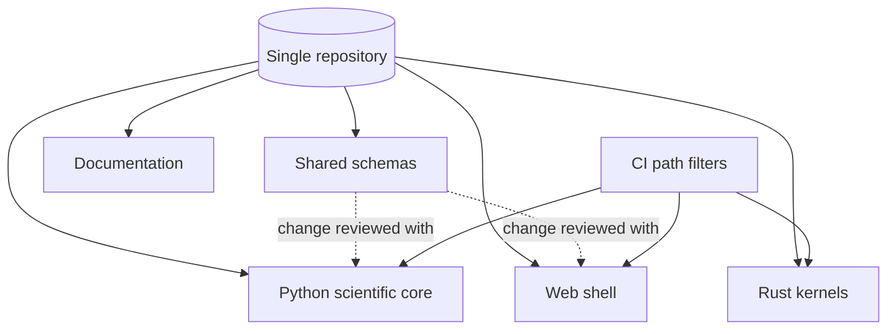

# A24 — Modular monorepo governance across language boundaries

**Question.** When a scientific platform spans a Python analysis core, a web front end, and optional Rust kernels, does splitting them into separate repositories actually reduce coordination risk, or just hide it?

**Method.** The project keeps the Python scientific core, the web shell, optional Rust performance kernels, schemas, documentation, examples, and deployment templates in one repository, so a change to a shared schema and every consumer of that schema lands in one reviewable, atomically revertible commit. The alternative — polyrepo with pinned cross-repository versions — trades that atomicity for independent release cadence, which this platform does not need at its current scale: schema and contract changes are frequent enough, and consumers few enough, that coordinated review dominates independent deployability. Module boundaries are still enforced by ownership and CI path filters, not by repository walls, so the monorepo does not collapse into an unstructured pile.

**Reproducibility checks.** Confirm that a schema-changing pull request's CI runs the Python, web, and Rust test suites that depend on it in the same run; verify that CI path filters correctly skip suites unaffected by a given change, so the monorepo's cost stays proportional to what actually changed; audit that no cross-module import bypasses the declared module boundaries.

## Governance rationale

A monorepo is not a symbol of maturity by itself. It becomes useful only when it makes the scientific contract easier to audit. OpenLongevity has several surfaces that must agree with each other: evidence schemas, API payloads, persistence migrations, documentation examples, front-end presentation, and optional performance kernels. If these surfaces are split into separate repositories too early, a reviewer has to reconstruct whether a schema change, migration, and documentation update were actually compatible at one point in time. A single repository keeps that evidence together.

The main governance value is atomicity. A pull request can change a Pydantic model, update the SQL migration or repository layer, adjust the front-end type expectation, and update the academic documentation in one review. If the change is wrong, it can be reverted as one change. In a polyrepo arrangement, the same correction may require several version pins and release orders. That can be justified for large independent teams, but it is unnecessary overhead for the current project stage.

## Boundary discipline

The danger of a monorepo is that it can encourage accidental coupling. OpenLongevity should therefore define module boundaries explicitly. The Python evidence core owns scientific record definitions, scoring utilities, provider normalization, and API behavior. The web shell consumes documented contracts and should not reimplement scientific scoring logic. Rust kernels, when present, should be narrow computational accelerators with tests that compare their outputs to reference implementations. Documentation should describe observed contracts and planned protocols separately.

Boundary enforcement should appear in CI and review templates. A schema change should trigger Python tests and any web type checks that consume the schema. A documentation-only change should not waste time running unrelated performance suites unless the docs include executable examples. A Rust-only kernel change should still run cross-language parity checks if the kernel affects scientific output. The point is not to run everything always; the point is to run the right evidence of correctness for the changed boundary.

## Ownership model

Ownership should be recorded by module rather than by repository. A future `CODEOWNERS` file can map `src/`, `services/`, `apps/web/`, `packages/rust/`, `sql/`, `docs/`, and `scripts/` to appropriate reviewers. The author and maintainer, Ciprian Ștefan Pleșca, remains the project authority, but the governance model should still describe how outside contributors can propose changes without bypassing scientific review. A contributor editing a dashboard label has a different review path from a contributor changing evidence scoring.

Review should focus on the contract crossing the boundary. For example, a provider-adapter change should be reviewed for provenance fields, rate-limit behavior, parser resilience, and licensing compliance. A documentation change should be reviewed for accuracy against the code and for avoiding claims not supported by implementation. A front-end change should be reviewed for whether it preserves disclaimers and provenance visibility. These review lenses keep the monorepo from becoming a loose folder collection.

## Versioning inside one repository

A monorepo can still contain independently versioned packages. The key is to make compatibility visible. If the Python package version, web package version, and evidence release version differ, the documentation should explain which combinations were tested. A release tag should identify the whole repository state, while package metadata can identify package-level milestones. This prevents the false impression that one package version alone describes the entire scientific platform.

Shared schemas deserve special care. A breaking schema change should include migration notes, fixture updates, API examples, and documentation changes in the same pull request. A non-breaking addition should still explain default behavior and backward compatibility. If a future external consumer depends on the API, the project may need explicit deprecation windows. The monorepo does not remove the need for semantic discipline; it makes the discipline easier to verify.

## Audit expectations

An independent auditor should be able to start from a commit and answer three questions: which modules changed, which contracts were affected, and which checks prove those contracts still hold. The repository should support that by keeping scripts, reports, and documentation near the code they validate. Audit reports belong in versioned documentation, not in private notes, because the platform's credibility depends on reproducible claims.

The current repository already benefits from monorepo atomicity, but enforcement is incomplete. Future maturity should add ownership rules, path-aware CI documentation, boundary tests for shared schemas, and release notes that identify cross-module changes. If the project later grows to a scale where independent deployment matters more than atomic scientific review, a polyrepo migration can be reconsidered. At this stage, the monorepo is the more honest structure because it keeps the evidence contract reviewable in one place.

---

**Author.** Ciprian Ștefan Pleșca — independent Romanian researcher.

**License.** Licensed under the Apache License, Version 2.0. You may not use this file except in compliance with the License. You may obtain a copy at http://www.apache.org/licenses/LICENSE-2.0. Distributed on an "AS IS" BASIS, WITHOUT WARRANTIES OR CONDITIONS OF ANY KIND, either express or implied.

---

**Project author: CIPRIAN ȘTEFAN PLEȘCA — cercetător român independent.**
