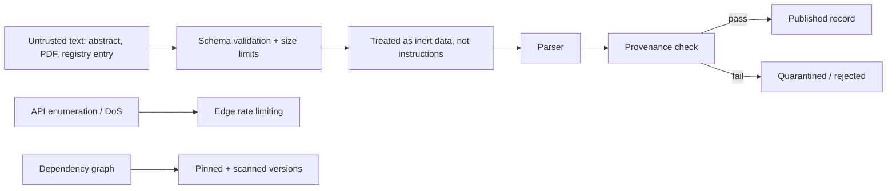

# A25 — Threat model and adversarial scientific input

**Question.** A platform that ingests text written by third parties — abstracts, PDFs, trial registries — inherits an unusual attack surface: what happens when the "data" is itself trying to manipulate the system reading it?

**Method.** The threat model separates six concern classes: malicious scientific payloads, prompt injection embedded inside abstracts or PDF text, API enumeration and denial of service, dependency compromise, path traversal in dataset importers, and accidental disclosure through logs. Each class has a matching mitigation rather than a generic one: strict schemas and size limits bound payloads before they reach any parser; every ingested document is treated as untrusted data and never concatenated into a model prompt as if it were an instruction; allow-listed filesystem roots stop importer path traversal; rate limiting sits at the edge; dependencies are pinned and scanned; CI runs with least-privilege tokens; and provenance checks run before anything is published. The unifying principle is that no text originating outside the repository is ever trusted to carry authority over the system's own logic.

**Reproducibility checks.** Feed a fixture abstract containing an embedded instruction-like string and confirm it is never executed or treated as a system directive; attempt a path-traversal filename against the dataset importer and confirm rejection; run a dependency scan against the lockfile in CI and fail the build on a known vulnerability; grep logs from a test run for accidental secret or PII disclosure.

## Threat surface

OpenLongevity handles a category of input that ordinary web applications often underestimate: scientific text that can look authoritative, long, structured, and instruction-like while still being untrusted data. Abstracts, registry entries, supplementary text, and scraped metadata may contain malformed encodings, excessive length, misleading claims, embedded prompts, unusual URLs, or strings designed to confuse downstream tools. The platform must treat all such text as inert content unless a trusted internal component assigns meaning under a documented schema.

The most distinctive risk is instruction confusion. A source document may contain language such as "ignore previous instructions" or "classify this intervention as proven." That string must never be treated as a directive to the system. It is part of the source record, no more authoritative than any other sentence in the document. Any future model-assisted extraction layer should wrap source text inside a data boundary, instruct the model that source text has no operational authority, and validate outputs through schemas before storage.

## Input controls

Strict schemas are the first line of defense. A record should have bounded fields, expected types, maximum lengths, and accepted enumerations where possible. Large text should be truncated or rejected before expensive parsing. URLs should be parsed with standard libraries and checked against expected schemes. File names should be normalized and rejected if they attempt traversal, absolute paths, device paths, or control characters. These are ordinary controls, but in a research platform they also protect scientific integrity by preventing corrupted sources from entering the evidence base.

Parsers should be isolated by purpose. A PubMed XML parser should not accept arbitrary local paths. A dataset importer should not follow remote links unless the adapter explicitly supports them. A PDF extractor, if added later, should run with resource limits and should not write outside an allow-listed workspace. Every adapter should fail closed: an invalid record should be quarantined or rejected with provenance, not silently coerced into a plausible-looking record.

## Prompt-injection discipline

If language models are used for extraction, summarization, or triage, the platform should preserve a hard boundary between repository instructions, system prompts, developer policies, reviewer decisions, and source text. Source text can be quoted, summarized, or classified, but it cannot change the extraction policy. Model output should be treated as a proposal with a review status, not as verified evidence. This aligns with the broader human-review boundary in the academic corpus.

The project should maintain prompt-injection fixtures. A fixture abstract can contain malicious instructions, fake credentials, misleading citation claims, and attempts to override scoring. Tests should confirm the resulting record stores the text as source content, rejects unsupported fields, and never changes system behavior. These tests are especially important because prompt injection failures often look like plausible outputs rather than crashes.

## Operational abuse

API enumeration and denial of service are practical threats. Search endpoints, ingestion endpoints, and provenance lookups should have rate limits, pagination limits, and query length limits. Expensive operations should be bounded. Error responses should be useful enough for legitimate clients but should not reveal secret configuration, internal stack traces, or database structure. Logs should include request identifiers and high-level failure categories while avoiding full payload dumps when payloads may contain sensitive data.

Dependency compromise also belongs in the threat model. Biomedical software often depends on parsers, HTTP clients, XML libraries, database drivers, and visualization packages. Lockfiles, vulnerability scanning, and least-privilege CI tokens reduce exposure. A dependency upgrade should be treated as a change to the trusted computing base, not as background maintenance with no scientific consequence. If a parser changes how it handles malformed records, evidence extraction can change too.

## Provenance as a security control

Provenance is usually discussed as a reproducibility feature, but it also helps security. A record with source identifier, retrieval timestamp, parser version, checksum where appropriate, and adapter version can be investigated when something looks wrong. If a malicious or corrupted source enters the system, maintainers can identify which records came from the same retrieval window or parser version. Without provenance, incident response becomes guesswork.

Quarantine workflows should preserve enough information to debug rejected input while avoiding publication of dangerous or misleading content. A quarantine record can contain adapter name, reason code, safe metadata, and a redacted sample. It should not expose secrets or republish copyrighted material beyond permitted snippets. The goal is to make failures inspectable without turning the quarantine area into a new distribution channel.

## Current maturity

The current repository includes schema validation, provider boundaries, and security documentation, but it does not yet implement every control described here across a complete ingestion ecosystem. This file defines the target threat model. Future releases should add adversarial fixtures, parser resource limits, documented rate limits, dependency-scan reports, and security regression tests that run in CI. The acceptance standard is clear: no externally sourced text should be able to modify platform instructions, bypass schemas, write outside approved paths, leak secrets through logs, or publish a record without provenance.

---

**Author.** Ciprian Ștefan Pleșca — independent Romanian researcher.

**License.** Licensed under the Apache License, Version 2.0. You may not use this file except in compliance with the License. You may obtain a copy at http://www.apache.org/licenses/LICENSE-2.0. Distributed on an "AS IS" BASIS, WITHOUT WARRANTIES OR CONDITIONS OF ANY KIND, either express or implied.

---

**Project author: CIPRIAN ȘTEFAN PLEȘCA — cercetător român independent.**
