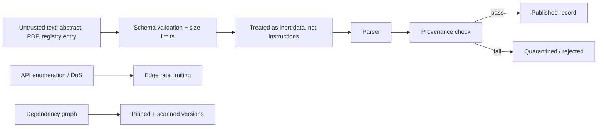

# A25 — Threat model and adversarial scientific input

**Question.** A platform that ingests text written by third parties — abstracts, PDFs, trial registries — inherits an unusual attack surface: what happens when the "data" is itself trying to manipulate the system reading it?

**Method.** The threat model separates six concern classes: malicious scientific payloads, prompt injection embedded inside abstracts or PDF text, API enumeration and denial of service, dependency compromise, path traversal in dataset importers, and accidental disclosure through logs. Each class has a matching mitigation rather than a generic one: strict schemas and size limits bound payloads before they reach any parser; every ingested document is treated as untrusted data and never concatenated into a model prompt as if it were an instruction; allow-listed filesystem roots stop importer path traversal; rate limiting sits at the edge; dependencies are pinned and scanned; CI runs with least-privilege tokens; and provenance checks run before anything is published. The unifying principle is that no text originating outside the repository is ever trusted to carry authority over the system's own logic.

**Reproducibility checks.** Feed a fixture abstract containing an embedded instruction-like string and confirm it is never executed or treated as a system directive; attempt a path-traversal filename against the dataset importer and confirm rejection; run a dependency scan against the lockfile in CI and fail the build on a known vulnerability; grep logs from a test run for accidental secret or PII disclosure.

---

**Author.** Ciprian Ștefan Pleșca — independent Romanian researcher.

**License.** Licensed under the Apache License, Version 2.0. You may not use this file except in compliance with the License. You may obtain a copy at http://www.apache.org/licenses/LICENSE-2.0. Distributed on an "AS IS" BASIS, WITHOUT WARRANTIES OR CONDITIONS OF ANY KIND, either express or implied.
