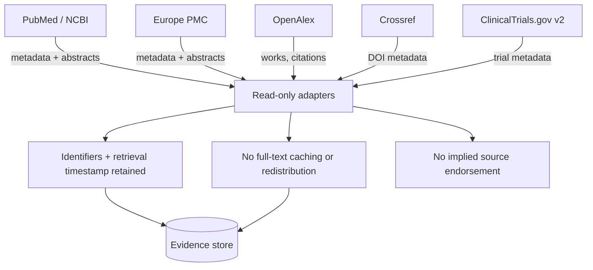

# A26 — Data source catalog and licensing boundary

**Question.** Can a platform aggregate five independent scientific registries without ever misrepresenting what it is licensed to redistribute?

**Method.** Five read-only sources are catalogued with their specific use, access method, and licensing terms: PubMed/NCBI E-utilities and Europe PMC for publication metadata and abstracts, OpenAlex for works, authors, and citation graphs, Crossref for DOI metadata, and ClinicalTrials.gov v2 for trial registration metadata. Each adapter is bound to a single, explicit contract — retain identifiers and retrieval timestamps, never cache or redistribute full-text articles, and never imply endorsement by the source. This is stricter than what most of these APIs technically allow, and that gap is intentional: the catalog is the boundary the system promises never to cross, not merely the boundary each provider enforces.

**Reproducibility checks.** Audit stored records for any field containing full article text rather than an abstract or metadata field; confirm every stored record cites a `retrieved_at` timestamp and a source identifier resolvable back to the origin API; re-review each provider's terms on a fixed schedule and flag any catalog entry that has drifted out of compliance.

## Catalog purpose

A data-source catalog is a research instrument, not just a list of APIs. It states which external sources the platform relies on, what each source is allowed to provide, how records are identified, and what the project promises not to redistribute. This is essential for OpenLongevity because open science depends on respecting the licenses, terms, and attribution requirements of the sources that make discovery possible.

The catalog should keep a conservative boundary. If an API permits a broad use but the project only needs metadata, the adapter should collect metadata. If a source exposes abstracts but not full text, the platform should not imply that it stores articles. If a provider requires attribution or discourages bulk redistribution, the record should retain source identifiers and point back to the original service. This restraint protects the project legally and academically.

## Provider-specific fields

Each source entry should include source name, access endpoint, access method, permitted data categories, prohibited data categories, citation or attribution requirement, rate-limit expectation, license or terms link, adapter owner, review date, and known caveats. For PubMed or NCBI E-utilities, the emphasis is publication metadata, identifiers, abstracts where available, and careful request behavior. For Crossref, DOI metadata and relationships are central. For ClinicalTrials.gov, registry metadata and study status need clear retrieval timestamps because entries can change.

Europe PMC and OpenAlex have different coverage and metadata conventions from PubMed and Crossref. The catalog should not collapse them into one generic publication source. Differences in author identity, citation counts, open-access status, and abstract availability can affect downstream analysis. The adapter should preserve the provider label so a reviewer can understand why two records that appear similar may have different fields.

## Redistribution boundary

The clearest rule is that OpenLongevity should not cache or redistribute full-text articles unless a future source-specific policy explicitly permits it and the project has implemented compliance controls. Abstracts, metadata, and identifiers are already useful for discovery and evidence navigation. Full text introduces copyright, storage, and attribution complexity that the current platform does not need to assume.

The user interface should also avoid implying endorsement. A record retrieved from a source does not mean that source endorses OpenLongevity's scoring, categorization, or summary. Source identifiers should be displayed as provenance, not as a badge of approval. This distinction protects external providers and keeps the platform's interpretations accountable to the project.

## Drift management

Terms of use, API schemas, and provider behavior change. A catalog entry should therefore have a review schedule. When a provider changes its terms, deprecates an endpoint, adds fields, or changes rate limits, the adapter and documentation should be reviewed together. A mature platform should store the terms-review date and treat stale reviews as a documentation issue.

Schema drift can be subtle. A field may change meaning, become optional, or start returning values in a new format. The adapter should validate expected fields and record parser version. If a provider response changes, the platform should fail visibly or mark the record for review rather than silently accepting malformed data. Silent drift is dangerous because it can create the appearance of stable evidence while the input contract has changed.

## Licensing in outputs

Every exported record should include enough metadata for a downstream researcher to trace the source and understand redistribution limits. This means source name, source identifier, source URL where available, retrieval timestamp, license or terms category, and parser version. An export that strips these fields may be easier to read but weaker scientifically. Provenance is part of the record.

If multiple sources contribute to one normalized record, the output should show that merge. A DOI from Crossref, an abstract from PubMed, and a citation relationship from OpenAlex should not be represented as if they came from one provider. Multi-source enrichment is useful, but it increases responsibility to preserve source-specific terms and retrieval dates.

Provider conflicts should be preserved rather than hidden. If two sources disagree about a publication date, author spelling, retraction status, or license flag, the normalized record should record the conflict or choose a primary source under a documented rule. Silent reconciliation can create polished records that are harder to audit.

## Current maturity

The current repository contains provider adapters and documentation, but the complete catalog-governance workflow is still maturing. The next stage should add machine-readable catalog entries, automated checks for missing `retrieved_at` and source identifiers, fixture exports that preserve licensing fields, and a scheduled review note for provider terms. OpenLongevity's academic credibility depends partly on this restraint. A platform that mishandles source rights cannot credibly advocate open science, even if its scientific intentions are good.

---

**Author.** Ciprian Ștefan Pleșca — independent Romanian researcher.

**License.** Licensed under the Apache License, Version 2.0. You may not use this file except in compliance with the License. You may obtain a copy at http://www.apache.org/licenses/LICENSE-2.0. Distributed on an "AS IS" BASIS, WITHOUT WARRANTIES OR CONDITIONS OF ANY KIND, either express or implied.

---

**Project author: CIPRIAN ȘTEFAN PLEȘCA — cercetător român independent.**
