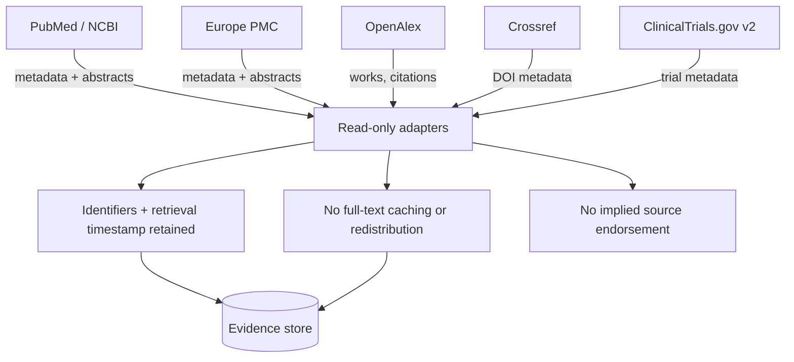

# A26 — Data source catalog and licensing boundary

**Question.** Can a platform aggregate five independent scientific registries without ever misrepresenting what it is licensed to redistribute?

**Method.** Five read-only sources are catalogued with their specific use, access method, and licensing terms: PubMed/NCBI E-utilities and Europe PMC for publication metadata and abstracts, OpenAlex for works, authors, and citation graphs, Crossref for DOI metadata, and ClinicalTrials.gov v2 for trial registration metadata. Each adapter is bound to a single, explicit contract — retain identifiers and retrieval timestamps, never cache or redistribute full-text articles, and never imply endorsement by the source. This is stricter than what most of these APIs technically allow, and that gap is intentional: the catalog is the boundary the system promises never to cross, not merely the boundary each provider enforces.

**Reproducibility checks.** Audit stored records for any field containing full article text rather than an abstract or metadata field; confirm every stored record cites a `retrieved_at` timestamp and a source identifier resolvable back to the origin API; re-review each provider's terms on a fixed schedule and flag any catalog entry that has drifted out of compliance.

---

**Author.** Ciprian Ștefan Pleșca — independent Romanian researcher.

**License.** Licensed under the Apache License, Version 2.0. You may not use this file except in compliance with the License. You may obtain a copy at http://www.apache.org/licenses/LICENSE-2.0. Distributed on an "AS IS" BASIS, WITHOUT WARRANTIES OR CONDITIONS OF ANY KIND, either express or implied.
