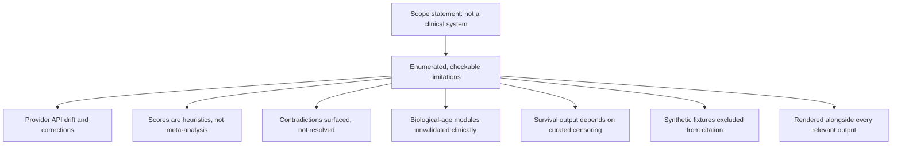

# A27 — Documented limitations as an epistemic boundary

**Question.** A navigation tool for longevity evidence sits one careless sentence away from being read as a clinical recommendation. How does a limitations document actually prevent that, rather than just disclaiming it?

**Method.** The platform states plainly what it is not — a clinical decision system, a diagnostic model, or proof that an intervention changes human lifespan — and then enumerates specific, falsifiable failure modes rather than a generic disclaimer: provider APIs can change or issue corrections after retrieval; evidence scores are transparent heuristics, not meta-analysis estimates; contradictions between studies are surfaced for human review and the engine does not adjudicate them; biological-age and pathway modules are baseline computational utilities without clinical validation; Kaplan–Meier output is only as trustworthy as the curated event and censoring times behind it; small or biased datasets can produce misleading associations; and synthetic fixtures used in tests and the dashboard must never be cited as real observations. Each limitation is written to be checkable against the running system, which is what separates it from boilerplate.

**Reproducibility checks.** Confirm each enumerated limitation maps to a specific UI or API surface where a user could otherwise be misled; test that synthetic fixture records are visibly flagged as such wherever they appear; re-derive the limitations list after each release and diff it against the previous version to confirm scope has not silently expanded.

---

**Author.** Ciprian Ștefan Pleșca — independent Romanian researcher.

**License.** Licensed under the Apache License, Version 2.0. You may not use this file except in compliance with the License. You may obtain a copy at http://www.apache.org/licenses/LICENSE-2.0. Distributed on an "AS IS" BASIS, WITHOUT WARRANTIES OR CONDITIONS OF ANY KIND, either express or implied.

---

**Project author: CIPRIAN ȘTEFAN PLEȘCA — cercetător român independent.**
