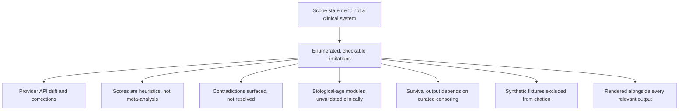

# A27 — Documented limitations as an epistemic boundary

**Question.** A navigation tool for longevity evidence sits one careless sentence away from being read as a clinical recommendation. How does a limitations document actually prevent that, rather than just disclaiming it?

**Method.** The platform states plainly what it is not — a clinical decision system, a diagnostic model, or proof that an intervention changes human lifespan — and then enumerates specific, falsifiable failure modes rather than a generic disclaimer: provider APIs can change or issue corrections after retrieval; evidence scores are transparent heuristics, not meta-analysis estimates; contradictions between studies are surfaced for human review and the engine does not adjudicate them; biological-age and pathway modules are baseline computational utilities without clinical validation; Kaplan–Meier output is only as trustworthy as the curated event and censoring times behind it; small or biased datasets can produce misleading associations; and synthetic fixtures used in tests and the dashboard must never be cited as real observations. Each limitation is written to be checkable against the running system, which is what separates it from boilerplate.

**Reproducibility checks.** Confirm each enumerated limitation maps to a specific UI or API surface where a user could otherwise be misled; test that synthetic fixture records are visibly flagged as such wherever they appear; re-derive the limitations list after each release and diff it against the previous version to confirm scope has not silently expanded.

## Function of limitations

A limitations document should change system behavior. If it merely says "not medical advice" and then the interface ranks interventions as if benefit were established, the limitation has failed. OpenLongevity should treat limitations as product requirements: every place where a user could overread an output should carry the relevant boundary. The limitation is not a legal afterthought; it is part of the scientific interface.

The strongest limitations are specific enough to test. "Scores are heuristic navigation aids" can be tested by checking whether the UI and API call them heuristic and whether the documentation avoids describing them as causal estimates. "Synthetic fixtures are not observations" can be tested by verifying that fixture records are labeled and excluded from citation-eligible exports. "Contradictions are surfaced, not resolved" can be tested by checking whether contradictory records remain visible rather than being collapsed into one winner.

## Categories of uncertainty

The platform should distinguish data uncertainty, model uncertainty, causal uncertainty, implementation uncertainty, and scope uncertainty. Data uncertainty concerns missing fields, provider drift, retractions, corrections, incomplete denominators, and biased study samples. Model uncertainty concerns heuristic scores, unvalidated algorithms, calibration limits, and performance outside test fixtures. Causal uncertainty concerns the gap between association, mechanism, intervention response, and human health outcome. Implementation uncertainty concerns incomplete modules, partial API behavior, or documentation that describes a target protocol rather than finished code. Scope uncertainty concerns whether a feature is meant for research navigation, educational exploration, or operational decision support.

These categories help prevent a common error: treating all uncertainty as a single disclaimer. A user reading a biomarker page needs different warnings from a user inspecting a provider adapter or a release note. The limitation should travel with the relevant object. That makes the platform feel more demanding, but it also makes it more trustworthy.

## Interface requirements

Limitations should be visible at the moment of interpretation. A dashboard card that shows an evidence score should show the score's meaning and boundary nearby. A graph edge should state whether it is curated, extracted, synthetic, inferred, or fixture-derived. A biological-age utility should state that it is not clinically validated. A survival curve should identify censoring assumptions and cohort limitations. The user should not have to search a separate page to discover that a result is not a clinical conclusion.

At the same time, limitations should not bury the interface in fear. The goal is clear labeling, not paralysis. A concise boundary near the result, with a link to a fuller limitation entry, can support both readability and rigor. The limitation document then becomes the canonical source for the longer explanation, while the interface carries the immediate warning.

## Release discipline

Every release should ask whether the limitations document still matches the product. If a new provider is added, the provider-drift and licensing limitations may need updates. If a new scoring method is introduced, its interpretation boundary must be documented. If a module graduates from fixture-only to real-data support, the limitation should change carefully rather than disappear. A removed limitation can be as important as an added one and should be justified.

The limitations diff should be part of release review. A release that expands capability while leaving limitations unchanged deserves suspicion. Either the new capability is already covered by a current limitation, or the documentation missed a boundary. This kind of review is what makes the limitations file operational rather than ceremonial.

## Academic tone

A strong limitations document does not weaken the project. It signals that the author understands the difference between research infrastructure and proof. In longevity research, where hype can outpace evidence, explicit boundaries are a mark of seriousness. They protect users from overinterpretation and protect the project from making claims it cannot support.

For Ciprian Ștefan Pleșca's authorship, the limitation standard is especially important because the project positions itself as independent and open. Independence does not mean absence of standards. It means the standards must be visible enough that others can inspect, challenge, and improve them. The limitations file is one of the main places where that scientific posture becomes concrete.

## Current maturity

The repository already contains a limitations document and repeated disclaimers, but the mapping from each limitation to each product surface is still incomplete. Future work should add a limitations matrix, UI checks for required boundary text, export checks for synthetic records, and release gates that fail when new capabilities lack documented limits. The target is a platform where a reader can explore ambitious longevity evidence without being invited to confuse navigation with medical certainty.

---

**Author.** Ciprian Ștefan Pleșca — independent Romanian researcher.

**License.** Licensed under the Apache License, Version 2.0. You may not use this file except in compliance with the License. You may obtain a copy at http://www.apache.org/licenses/LICENSE-2.0. Distributed on an "AS IS" BASIS, WITHOUT WARRANTIES OR CONDITIONS OF ANY KIND, either express or implied.

---

**Project author: CIPRIAN ȘTEFAN PLEȘCA — cercetător român independent.**
