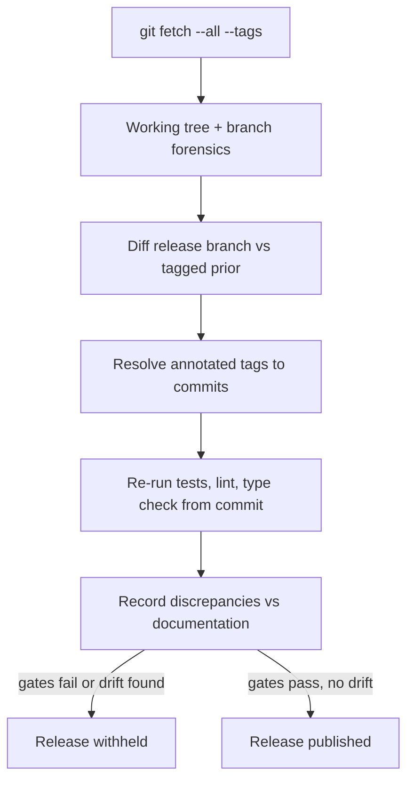

# A28 — Independent audit methodology for platform maturity claims

**Question.** How does a project verify its own "done" claims before a release, given that the people writing the release notes have every incentive to believe them?

**Method.** A baseline audit treats the repository itself as evidence: it fetches all remotes and tags, checks working-tree cleanliness, walks the branch and tag graph, diffs the release branch against the tagged prior version, and resolves annotated-tag objects to their underlying commits before trusting any version claim. Quality gates are then reproduced independently rather than read from a prior report — the test suite, linter, and type checker are re-run from the audited commit, and every discrepancy between what documentation claims and what the checkout actually contains is recorded rather than smoothed over: missing migrations, empty API catalogs, front-end scripts that only type-check without building or testing, and whitepaper code examples that do not match the real constructors are all findings, not footnotes. A release is withheld until the gates it claims to pass actually pass on a clean checkout.

**Reproducibility checks.** Re-run the audit's exact git commands against the same commit and confirm identical hashes and branch topology; independently re-execute the test, lint, and type-check commands on a clean checkout and compare pass/fail counts to the audit report; spot-check at least one documented code example against the actual source constructor it claims to demonstrate.

## Audit posture

An independent audit begins from distrust of summaries, not distrust of people. Release notes, README claims, and roadmaps are useful, but they are not evidence until they can be matched to a checkout, a tag, a test run, and a documented limitation. OpenLongevity should therefore treat the repository as the primary artifact. The audit asks what the code, documentation, tests, manifests, and Git history prove at a specific commit.

This posture is especially important for a project that wants academic credibility. A polished whitepaper can overstate implementation status even when written in good faith. A dashboard can show a concept before its provenance is complete. A tag can point to an annotated object rather than directly to a commit. The audit method exists to catch these mismatches before public claims harden into reputation.

## Evidence collection

The first audit phase should record repository URL, branch, commit hash, tag hash where relevant, tag target commit, working-tree status, remotes, and recent merge history. These fields establish the object being audited. Without them, a later reader cannot know whether a claim refers to main, a feature branch, a pull request merge commit, or a release tag.

The second phase should inventory claims. Claims can appear in README, release notes, whitepaper, academic files, API docs, workflow files, and deployment descriptions. Each claim should be classified as implemented, partially implemented, aspirational, external dependency, or documentation-only. The classification should quote or link the evidence. A claim that "provider adapters exist" can be checked in source files and tests. A claim that "human review is enforced" requires authorization paths, reviewer identity storage, and rejection tests; if those are absent, the audit should call it a target protocol rather than current behavior.

## Gate reproduction

Quality gates should be rerun from the audited checkout rather than copied from prior CI output. Local reproduction can reveal missing dependencies, skipped tests, cache assumptions, or environment drift. The audit should record command, environment, pass/fail result, test count, skipped count, warnings, and any unavailable dependency. A skipped database test is not the same as a passed database test. A web script that only type-checks is not the same as a browser-tested application.

For documentation, gates should include word-count or coverage requirements only if they also check quality-relevant structure: author attribution, broken local links, Mermaid parse validity, executable code examples where appropriate, and consistency with implementation facts. A thousand words can still be wrong. The audit should therefore combine mechanical checks with targeted spot review of claims most likely to mislead.

## Finding severity

Findings should be ordered by scientific and operational risk. A broken link in an appendix is lower severity than a release note claiming external validation that does not exist. A missing test for a fixture may be lower severity than a provider adapter that drops provenance fields. Severity should reflect the potential for user misunderstanding, reproducibility failure, security exposure, or false scientific confidence.

The audit should distinguish blockers from follow-up improvements. A blocker prevents release or merge because it invalidates a claim, breaks a required gate, or creates material risk. A follow-up improvement should be tracked but need not stop progress. This distinction keeps the audit firm without becoming performative. The goal is not to make releases impossible; it is to make the claims match reality.

## Independence and repeatability

True independence is partly procedural. The auditor should use clean commands, avoid relying on private state, and record enough detail for another person to rerun the audit. If the project owner performs the audit, the method still helps by forcing adversarial self-review. If an outside reviewer performs it later, the same method gives them a starting point.

Audit outputs should be versioned. A JSON report can support automated comparison across releases, while a prose report can explain context and limitations. The two should agree. If a later audit changes a classification, the history should remain visible. The audit trail becomes a record of the project's maturation.

## Current maturity

The repository now includes documentation-audit tooling and Mermaid validation, which is a meaningful step. The broader audit process is still developing. Future maturity should add claim inventories, release-gate templates, deployment verification, code-example execution in CI, and a standard finding-severity rubric. The bar for a scientific platform is not that it never has gaps; it is that it can name them accurately, reproduce the evidence behind its claims, and refuse to publish inflated status.

---

**Author.** Ciprian Ștefan Pleșca — independent Romanian researcher.

**License.** Licensed under the Apache License, Version 2.0. You may not use this file except in compliance with the License. You may obtain a copy at http://www.apache.org/licenses/LICENSE-2.0. Distributed on an "AS IS" BASIS, WITHOUT WARRANTIES OR CONDITIONS OF ANY KIND, either express or implied.

---

**Project author: CIPRIAN ȘTEFAN PLEȘCA — cercetător român independent.**
