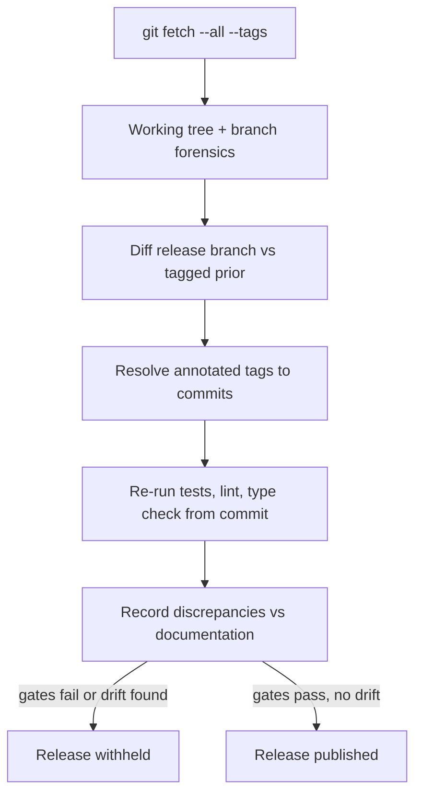

# A28 — Independent audit methodology for platform maturity claims

**Question.** How does a project verify its own "done" claims before a release, given that the people writing the release notes have every incentive to believe them?

**Method.** A baseline audit treats the repository itself as evidence: it fetches all remotes and tags, checks working-tree cleanliness, walks the branch and tag graph, diffs the release branch against the tagged prior version, and resolves annotated-tag objects to their underlying commits before trusting any version claim. Quality gates are then reproduced independently rather than read from a prior report — the test suite, linter, and type checker are re-run from the audited commit, and every discrepancy between what documentation claims and what the checkout actually contains is recorded rather than smoothed over: missing migrations, empty API catalogs, front-end scripts that only type-check without building or testing, and whitepaper code examples that do not match the real constructors are all findings, not footnotes. A release is withheld until the gates it claims to pass actually pass on a clean checkout.

**Reproducibility checks.** Re-run the audit's exact git commands against the same commit and confirm identical hashes and branch topology; independently re-execute the test, lint, and type-check commands on a clean checkout and compare pass/fail counts to the audit report; spot-check at least one documented code example against the actual source constructor it claims to demonstrate.

---

**Author.** Ciprian Ștefan Pleșca — independent Romanian researcher.

**License.** Licensed under the Apache License, Version 2.0. You may not use this file except in compliance with the License. You may obtain a copy at http://www.apache.org/licenses/LICENSE-2.0. Distributed on an "AS IS" BASIS, WITHOUT WARRANTIES OR CONDITIONS OF ANY KIND, either express or implied.

---

**Project author: CIPRIAN ȘTEFAN PLEȘCA — cercetător român independent.**
