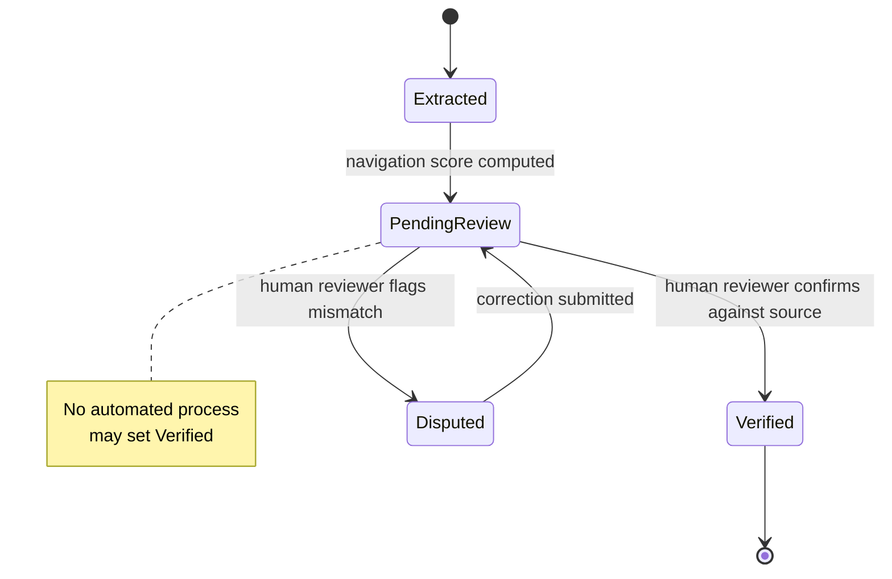

# A29 — The human review boundary for machine-extracted findings

**Question.** If a model extracts a finding from a source document, at what point does that extraction become something a researcher can act on — and who is allowed to move it across that line?

**Method.** Every machine-extracted finding carries an explicit review status field that is independent of any confidence or navigation score the model attaches to it. A high score describes how the heuristic ranked a record for attention; it says nothing about whether a human has actually looked at the underlying source and confirmed the extraction is accurate. Verification is modeled as a discrete human action — a reviewer opens the source, checks the extraction against it, and flips the status — and no automated process is permitted to set that status on a reviewer's behalf, even when its own confidence is high. This keeps "verified" meaning one specific thing across the whole platform, instead of drifting into "the model was fairly sure."

**Reproducibility checks.** Attempt to programmatically set a record's review status to `Verified` outside the reviewer action path and confirm the API rejects it; sample a set of high-navigation-score records and confirm their review status is independently distributed, not correlated by construction; audit that every `Verified` record has an attached reviewer identity and timestamp.

## Meaning of verification

Verification must have one meaning across the platform: a human reviewer checked the extraction against the source under a documented review procedure. It does not mean the source is true, the study is high quality, the intervention works, or the model was confident. It means the platform's representation of the source was inspected and accepted. This narrow definition is powerful because it keeps the review label from absorbing claims it cannot support.

Machine extraction can be useful for speed. It can identify candidate endpoints, study types, species, sample sizes, interventions, adverse events, and provenance links. But extraction is a proposal. A model can produce a plausible endpoint that is absent from the source, confuse an animal model with a human study, or miss a limitation in the abstract. The review boundary exists because plausible structure is not the same as verified evidence.

## Status model

A mature status model should include at least extracted, pending review, verified, disputed, corrected, superseded, and rejected. Extracted means the machine or parser produced a candidate field. Pending review means the candidate is awaiting human inspection. Verified means a reviewer confirmed it against the source. Disputed means a reviewer found a mismatch or uncertainty. Corrected means an accepted revision replaced a flawed candidate. Superseded means a later source correction or release changed the record. Rejected means the candidate should not enter the canonical evidence view.

These statuses should be independent from confidence scores. A high-confidence extracted field can remain unverified. A low-confidence field can become verified if a reviewer checks it. A verified field can later be superseded if the source changes. This independence prevents the platform from laundering machine confidence into human authority.

## Reviewer workflow

The reviewer should see the extracted value, the source snippet or field from which it was derived, the original source link, the extraction method, and any uncertainty notes. The interface should make it easy to approve, correct, dispute, or reject, but each action should require a reason where the action changes canonical evidence. Review time should be recorded. Reviewer identity should be recorded in a privacy-conscious but auditable way.

Correction is not merely editing a typo. A correction creates a new version of the record or review event. The previous extraction remains available for audit. If many corrections cluster around one parser, prompt, or provider, maintainers can identify systemic failure. Without review-event history, the project loses the ability to learn from extraction errors.

## Machine limits

Machine extraction should never assign clinical meaning beyond the source. If an abstract says an intervention improved a biomarker in mice, the extraction can record species, intervention, endpoint, direction, and study type. It should not convert that into a human longevity benefit. If a study reports an association, the extraction should not label it causal unless the source and review protocol support that classification. The platform should store conservative primitives rather than inflated interpretations.

The same rule applies to summarization. Summaries are useful but dangerous when they replace source inspection. A summary should link to the extracted fields and review status behind it. If any underlying field is unverified, the summary should carry that uncertainty. A reader should never have to guess whether a sentence is based on verified extraction or an unreviewed machine proposal.

## Audit controls

The API should reject any attempt by an automated worker to set `Verified` unless the request comes through the reviewer action path. Tests should cover direct database writes where possible, service-layer calls, and API calls. If the current implementation does not yet have such a reviewer path, the documentation should say so plainly and keep review status aspirational or manual.

Metrics should track how many records are extracted, pending, verified, disputed, corrected, and rejected. High verification volume is not automatically good if correction rates are high or reviewer rationale is missing. The project should publish enough aggregate process metrics to make the quality of review visible without exposing private reviewer information.

Reviewer training should also be documented. A reviewer needs a shared standard for endpoint mapping, species labels, study-type classification, and limitation capture. Without that standard, verification can become inconsistent even when every reviewer acts carefully.

## Current maturity

The current repository includes review-status concepts in evidence records and strong documentation around human review, but a full reviewer workflow is not yet complete. This file defines the target boundary. Future releases should implement reviewer actions, immutable review events, rejection tests, status-transition rules, and interface labels that keep machine confidence separate from human verification. This boundary is one of the central scientific safeguards of OpenLongevity.

---

**Author.** Ciprian Ștefan Pleșca — independent Romanian researcher.

**License.** Licensed under the Apache License, Version 2.0. You may not use this file except in compliance with the License. You may obtain a copy at http://www.apache.org/licenses/LICENSE-2.0. Distributed on an "AS IS" BASIS, WITHOUT WARRANTIES OR CONDITIONS OF ANY KIND, either express or implied.

---

**Project author: CIPRIAN ȘTEFAN PLEȘCA — cercetător român independent.**
