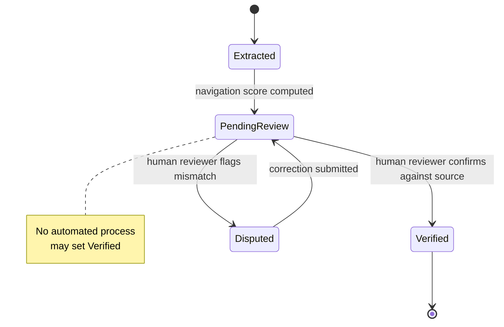

# A29 — The human review boundary for machine-extracted findings

**Question.** If a model extracts a finding from a source document, at what point does that extraction become something a researcher can act on — and who is allowed to move it across that line?

**Method.** Every machine-extracted finding carries an explicit review status field that is independent of any confidence or navigation score the model attaches to it. A high score describes how the heuristic ranked a record for attention; it says nothing about whether a human has actually looked at the underlying source and confirmed the extraction is accurate. Verification is modeled as a discrete human action — a reviewer opens the source, checks the extraction against it, and flips the status — and no automated process is permitted to set that status on a reviewer's behalf, even when its own confidence is high. This keeps "verified" meaning one specific thing across the whole platform, instead of drifting into "the model was fairly sure."

**Reproducibility checks.** Attempt to programmatically set a record's review status to `Verified` outside the reviewer action path and confirm the API rejects it; sample a set of high-navigation-score records and confirm their review status is independently distributed, not correlated by construction; audit that every `Verified` record has an attached reviewer identity and timestamp.

---

**Author.** Ciprian Ștefan Pleșca — independent Romanian researcher.

**License.** Licensed under the Apache License, Version 2.0. You may not use this file except in compliance with the License. You may obtain a copy at http://www.apache.org/licenses/LICENSE-2.0. Distributed on an "AS IS" BASIS, WITHOUT WARRANTIES OR CONDITIONS OF ANY KIND, either express or implied.
