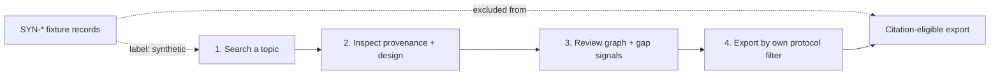

# A30 — The worked example as a reproducible protocol, and the fixture/observation boundary

**Question.** Can a tutorial double as a piece of methodology — a fixed procedure a reader can rerun and get the same evidence trail back — without becoming a source of accidentally-cited fake data?

**Method.** The cellular-senescence worked example is written as four checkable steps rather than a narrative: search a topic through the API or dashboard, inspect the source identifiers and study designs on the records returned, review graph relationships and research-gap signals, and export only the records whose provenance and review status satisfy the reader's own protocol. Because the last step is a filter the reader applies rather than a default the system provides, the example teaches the review discipline it also demonstrates. The bundled SYN-prefixed records that make the walkthrough runnable offline are explicitly marked as fixtures and are structurally excluded from citation — the boundary between "data that makes the tutorial reproducible" and "data that describes reality" is a labeled property of the record, not a convention the reader has to remember.

**Reproducibility checks.** Rerun the four-step walkthrough from a tagged release and confirm the returned record set is identical; confirm every `SYN`-prefixed record is rejected by the export path when a "citation-eligible only" filter is applied; verify the tutorial's step order matches the actual API call order required, so following the doc literally reproduces the described result.

## Tutorial as protocol

A worked example should teach procedure, not merely advertise capability. In OpenLongevity, the cellular-senescence example can become a miniature protocol: identify a topic, retrieve evidence records, inspect provenance, examine relationships, identify gaps, and export only records that meet the reader's criteria. If each step is deterministic on a tagged release, the tutorial becomes something a reviewer can rerun. That gives it more value than a narrative screenshot.

The protocol should state the exact query, endpoint or interface path, fixture mode or live mode, filters applied, expected record identifiers, and expected exclusions. A reader following the document should be able to detect when the system has changed. If live provider data are used, the example should say that results may change over time and should include a retrieval date. If fixtures are used, the example should say that the output is stable but synthetic.

## Fixture boundary

Fixtures are necessary for testing and tutorials. They let a new contributor run the project without live provider credentials, network access, or dependence on external API drift. They can demonstrate graph relationships, research-gap logic, and export filters. Their danger is that they can look like real evidence if not labeled aggressively. A synthetic record with a plausible title, endpoint, and provenance shape can be accidentally cited if the boundary is weak.

The record model should therefore carry a fixture or synthetic flag that is visible in API responses, UI displays, exports, and documentation examples. A prefix such as `SYN-` is useful but insufficient by itself. Prefixes can be stripped, copied, or overlooked. The structured field should travel with the record and should be checked by citation-eligible export paths.

## Reproducible steps

The first step, search, should return a known fixture set under fixture mode. The second step, inspection, should show source identifiers, study design labels, review status, and synthetic status. The third step, graph and gap review, should show that relationships are navigational aids, not conclusions. The fourth step, export, should apply an explicit protocol filter chosen by the reader. This sequence teaches that evidence use requires inspection and filtering, not blind acceptance of the first result list.

The example should include expected outputs in a compact form: record identifiers, number of graph nodes, number of relationships, and any gap flags. It should not overfit to fragile presentation details such as card order or colors. Stable scientific outputs matter more than interface decoration. If the interface changes while the API result remains the same, the protocol should still be valid.

## Citation safety

A citation-eligible export should reject synthetic records by default. If a user intentionally exports fixtures for teaching or testing, the export should mark them clearly as synthetic and not suitable as real observations. This protects students, contributors, and downstream users from confusing demonstration data with empirical literature.

The documentation should also explain how to move from the fixture tutorial to live evidence. That transition should require re-running the query against real providers, checking provenance, and applying the same review filter. The tutorial's intellectual lesson is the workflow, not the synthetic findings. The platform should make that distinction impossible to miss.

The example should include a short failure mode as well. Showing what happens when a fixture is excluded from citation-eligible export teaches the boundary more effectively than only showing the successful path.

## Educational quality

A good worked example can show scientific restraint. Instead of saying "cellular senescence causes aging," it can show how evidence records differ: animal evidence, in vitro evidence, human observational evidence, biomarker studies, and intervention trials. It can show that gaps are part of the result. It can teach users that a graph edge is a prompt for review, not a completed conclusion.

The example should also make authorship and governance visible. Ciprian Ștefan Pleșca's role as independent Romanian researcher belongs in the project attribution, while the example itself should identify which outputs are fixture-derived and which are method claims. This keeps personal credit, educational function, and scientific evidence in their proper places.

## Current maturity

The repository includes worked-example documentation and fixture concepts, but the complete citation-eligible export enforcement should be checked as the platform matures. Future releases should add tests that fixture records remain excluded from real-data exports, examples that execute in CI, and side-by-side fixture and live-mode walkthroughs. A tutorial at this level becomes part of the research method: a reproducible path through uncertainty rather than a simple demo.

---

**Author.** Ciprian Ștefan Pleșca — independent Romanian researcher.

**License.** Licensed under the Apache License, Version 2.0. You may not use this file except in compliance with the License. You may obtain a copy at http://www.apache.org/licenses/LICENSE-2.0. Distributed on an "AS IS" BASIS, WITHOUT WARRANTIES OR CONDITIONS OF ANY KIND, either express or implied.

---

**Project author: CIPRIAN ȘTEFAN PLEȘCA — cercetător român independent.**
