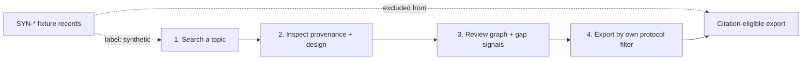

# A30 — The worked example as a reproducible protocol, and the fixture/observation boundary

**Question.** Can a tutorial double as a piece of methodology — a fixed procedure a reader can rerun and get the same evidence trail back — without becoming a source of accidentally-cited fake data?

**Method.** The cellular-senescence worked example is written as four checkable steps rather than a narrative: search a topic through the API or dashboard, inspect the source identifiers and study designs on the records returned, review graph relationships and research-gap signals, and export only the records whose provenance and review status satisfy the reader's own protocol. Because the last step is a filter the reader applies rather than a default the system provides, the example teaches the review discipline it also demonstrates. The bundled SYN-prefixed records that make the walkthrough runnable offline are explicitly marked as fixtures and are structurally excluded from citation — the boundary between "data that makes the tutorial reproducible" and "data that describes reality" is a labeled property of the record, not a convention the reader has to remember.

**Reproducibility checks.** Rerun the four-step walkthrough from a tagged release and confirm the returned record set is identical; confirm every `SYN`-prefixed record is rejected by the export path when a "citation-eligible only" filter is applied; verify the tutorial's step order matches the actual API call order required, so following the doc literally reproduces the described result.

---

**Author.** Ciprian Ștefan Pleșca — independent Romanian researcher.

**License.** Licensed under the Apache License, Version 2.0. You may not use this file except in compliance with the License. You may obtain a copy at http://www.apache.org/licenses/LICENSE-2.0. Distributed on an "AS IS" BASIS, WITHOUT WARRANTIES OR CONDITIONS OF ANY KIND, either express or implied.

---

**Project author: CIPRIAN ȘTEFAN PLEȘCA — cercetător român independent.**
