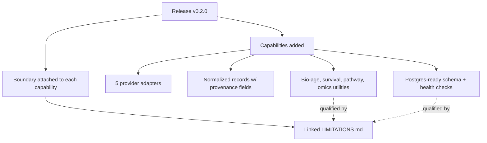

# A31 — Release notes as a scientific changelog, not a marketing artifact

**Question.** Most software release notes list features. What changes when a release note has to be readable as a scope-and-limitations statement for a research tool?

**Method.** The v0.2.0 release is written as a paired claim and boundary: it states what infrastructure now exists — five provider adapters, normalized records carrying source URL, identifier, retrieval time, license, and parser version, a PostgreSQL-ready schema with health checks, evidence scoring and contradiction reporting, and biological-age, survival, pathway, and multi-omics utilities — and in the same breath states what each of those is not: navigation aids rather than clinical or causal conclusions, with limitations documented in a linked, versioned limitations file rather than summarized away. Every highlight either points at a capability with a documented boundary or is a boundary itself, which makes the release note function as a scoped scientific claim that a reader can check against the linked limitations document instead of an unqualified capability list.

**Reproducibility checks.** Confirm every capability listed in a release note has a corresponding, currently-accurate entry in the linked limitations document; diff the release note's claims against the independent audit for the same tag and flag any capability claimed but not verified; verify the release tag resolves to the exact commit the note describes.

## Purpose of scientific release notes

Release notes for a research platform are part of the evidence record. They tell users which capabilities exist, which interpretations are permitted, which limitations remain, and which results changed. A marketing-style list of highlights is not enough because it can make partial infrastructure sound like scientific validation. OpenLongevity release notes should read like a concise audit summary attached to a software milestone.

Each release note should separate capability, evidence status, limitation, and migration impact. A capability says what was added. Evidence status says whether it is fixture-only, experimental, internally tested, externally validated, or production-ready under a defined scope. A limitation says what the capability cannot be used to infer. Migration impact says whether users need to change code, data, or interpretation. This structure gives readers a map rather than a slogan.

## Claim discipline

Every claim should be checkable against the repository. If the note says an adapter exists, the adapter file and tests should exist. If it says a database schema is PostgreSQL-ready, migrations and health checks should demonstrate that. If it says a module is clinically validated, which should be rare and evidence-heavy, the note should point to external validation evidence. If such evidence is absent, the release note should use narrower language.

The release note should avoid ambiguous verbs such as "supports" when support is partial. "Supports PubMed ingestion" can mean a complete production adapter, a stub, a fixture, or a documented plan. Stronger notes say exactly what is supported: search query, article fetch by identifier, provenance fields, retry policy, parser version, and known exclusions. Precision is more impressive than inflated breadth.

## Linking limitations

Every major capability should link to a limitation entry. Provider adapters should link to provider drift and licensing boundaries. Evidence scoring should link to heuristic-score limitations. Biological-age utilities should link to lack of clinical validation. Graph views should link to relationship-interpretation limits. Safety views should link to causal-boundary limits. This turns limitations into navigational structure.

The release note should also state what did not change when that matters. If a release improves documentation but does not alter scientific scoring, say so. If a release adds an academic protocol but not implementation, say so. This prevents users from assuming that more documentation equals more validated functionality. Honest negative statements can be a sign of maturity.

## Changelog categories

Scientific changelogs should categorize entries as data, method, schema, interface, documentation, security, governance, or infrastructure. A data change might add a provider source or update a retrieval. A method change might alter scoring, tiering, or gap detection. A schema change might add provenance fields. An interface change might change how limitations are displayed. A documentation change might clarify scope without changing behavior. These categories help users assess whether their interpretation should change.

Breaking scientific changes require special attention. If a score changes scale, if a status label changes meaning, if a fixture is replaced, or if a previous conclusion is weakened by new evidence, the note should say so plainly. The platform should never hide scientific change inside a generic "updates" bullet. Researchers need to know when reanalysis is required.

## Verification and tag integrity

The release note should identify the tag, commit, audit report, and relevant CI outcome. Annotated tags should be resolved to commits during audit. If a release is withheld because a gate failed, the note should not be published as if the release shipped. If a draft note exists before release, it should be marked as draft. Tag integrity is part of scientific reproducibility.

A release note should also avoid moving historical meaning. If v0.2.0 described a specific state, later documentation can add follow-up analysis but should not rewrite the old note to imply it contained later work. Superseding notes can explain what changed. Historical notes should remain interpretable as products of their release moment.

Draft notes should be clearly separated from published notes. A draft can plan ambitious scope, but the final release note should keep only claims supported by the tag, audit, and available checks.

## Current maturity

OpenLongevity has begun treating release notes as scoped scientific artifacts, especially around v0.2.0 and the v0.3.0 audit work. The process is not yet complete. Future releases should generate a release-note checklist from the audit report, require each claim to map to evidence, and fail release preparation when a capability lacks a limitation link. This is how the project can grow in ambition while keeping its public record clean, readable, and academically defensible.

---

**Author.** Ciprian Ștefan Pleșca — independent Romanian researcher.

**License.** Licensed under the Apache License, Version 2.0. You may not use this file except in compliance with the License. You may obtain a copy at http://www.apache.org/licenses/LICENSE-2.0. Distributed on an "AS IS" BASIS, WITHOUT WARRANTIES OR CONDITIONS OF ANY KIND, either express or implied.

---

**Project author: CIPRIAN ȘTEFAN PLEȘCA — cercetător român independent.**
