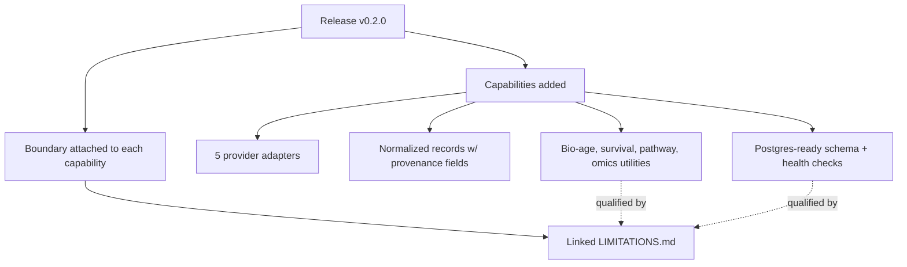

# A31 — Release notes as a scientific changelog, not a marketing artifact

**Question.** Most software release notes list features. What changes when a release note has to be readable as a scope-and-limitations statement for a research tool?

**Method.** The v0.2.0 release is written as a paired claim and boundary: it states what infrastructure now exists — five provider adapters, normalized records carrying source URL, identifier, retrieval time, license, and parser version, a PostgreSQL-ready schema with health checks, evidence scoring and contradiction reporting, and biological-age, survival, pathway, and multi-omics utilities — and in the same breath states what each of those is not: navigation aids rather than clinical or causal conclusions, with limitations documented in a linked, versioned limitations file rather than summarized away. Every highlight either points at a capability with a documented boundary or is a boundary itself, which makes the release note function as a scoped scientific claim that a reader can check against the linked limitations document instead of an unqualified capability list.

**Reproducibility checks.** Confirm every capability listed in a release note has a corresponding, currently-accurate entry in the linked limitations document; diff the release note's claims against the independent audit for the same tag and flag any capability claimed but not verified; verify the release tag resolves to the exact commit the note describes.

---

**Author.** Ciprian Ștefan Pleșca — independent Romanian researcher.

**License.** Licensed under the Apache License, Version 2.0. You may not use this file except in compliance with the License. You may obtain a copy at http://www.apache.org/licenses/LICENSE-2.0. Distributed on an "AS IS" BASIS, WITHOUT WARRANTIES OR CONDITIONS OF ANY KIND, either express or implied.

---

**Project author: CIPRIAN ȘTEFAN PLEȘCA — cercetător român independent.**
