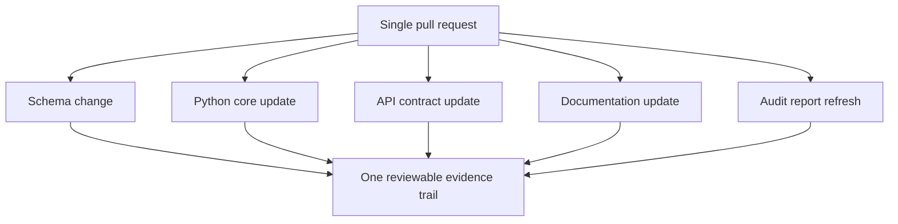

# ADR 0001: Modular Monorepo

Status: accepted.

Author: CIPRIAN ȘTEFAN PLEȘCA — cercetător român independent.

## Context

OpenLongevity is not a single-purpose library. It combines a Python scientific core, API services, a web shell, data schemas, SQL migrations, optional Rust kernels, documentation, academic protocols, fixtures, deployment templates, and audit scripts. The central architectural question is whether these parts should live in separate repositories or in one modular repository. The decision matters because this project makes scientific claims, not only software claims. A schema change can affect API behavior, persistence, documentation examples, and the meaning of release notes. If those changes are split across repositories too early, reviewers have to reconstruct compatibility across multiple version pins and histories.

A modular monorepo keeps related change visible in one review. It allows a pull request to update an evidence record model, the database migration, the API example, the README boundary language, and the audit report together. This does not remove the need for module discipline. A monorepo without boundaries becomes an unstructured collection of files. The intended design is one repository with clear package ownership, path-aware CI, and review rules that match the scientific risk of the changed module.

## Decision

OpenLongevity keeps the scientific core, services, web shell, optional Rust kernels, schemas, documentation, examples, migrations, and deployment templates in one repository. The repository is organized by module boundaries rather than by independent repositories. Python code owns evidence models and scientific utilities. Services expose documented contracts. Web code consumes contracts and should not reimplement scientific scoring. Rust kernels, when present, should remain narrow performance modules with parity checks against reference behavior. Documentation is versioned with the code it describes.

The decision favors atomic review over independent release cadence. At the current maturity stage, the risk of incompatible scientific claims is larger than the benefit of separately deployed repositories. Independent repositories may become appropriate later if the project develops multiple stable products with separate teams and release cycles. That is not the current reality. The current priority is traceable, reproducible, reviewable change.

## Consequences

The positive consequence is that scientific contracts are easier to audit. A reviewer can inspect one diff and see whether a schema change has been reflected in tests, examples, and limitations. A release tag can identify the state of the whole platform. Audit scripts can run against one checkout. Documentation can be kept close to implementation facts instead of lagging in a separate repository.

The cost is that repository governance must remain deliberate. CI can become slow if every change triggers every job. Module boundaries can blur if imports are not controlled. Contributors can feel uncertain about where a change belongs. These costs are addressed through path-aware checks, README files for major directories, code ownership rules, and architectural decision records like this one. The monorepo decision is not permission to couple everything; it is a decision to keep related scientific evidence in one auditable place.

## Review Rules

A change to shared schemas should trigger checks for every consumer affected by that schema. A documentation-only change should be reviewed for factual accuracy and broken links, but it does not need to run unrelated heavy jobs unless it includes executable examples. A provider adapter change should be reviewed for provenance fields, licensing boundaries, parser resilience, and rate-limit behavior. A web change should be reviewed for whether it preserves disclaimers, attribution, and provenance visibility.

Reviewers should ask three questions for cross-module changes. What contract changed? Which modules consume the contract? Which test or audit proves the consumers still agree? A pull request that cannot answer these questions should be treated as incomplete, even if each individual file looks plausible.

## Rejected Alternative

The main alternative is a polyrepo architecture with separate repositories for the core library, API service, web application, documentation, infrastructure, and kernels. That approach can support independent deployment and clearer ownership in large organizations. It also introduces version coordination overhead. For OpenLongevity, where contracts are still evolving and the project author is keeping scientific scope under tight review, that overhead would hide more risk than it removes.

Another alternative is a single repository with no internal boundaries. That is also rejected. The monorepo must stay modular. Directory structure, tests, documentation, and future ownership metadata should preserve the distinction between scientific computation, service exposure, user interface, infrastructure, and academic explanation.

## Verification

The decision is verified by checking that schema-changing pull requests update all affected consumers in one branch, that CI can run targeted jobs, and that documentation audit reports are generated from the same checkout as the code. Future maturity should add explicit module-ownership metadata and automated boundary checks. Until then, maintainers should treat any undocumented cross-module dependency as architecture debt.

This ADR should be revisited if the project gains independent release teams, external API consumers requiring long deprecation windows, or modules that need separate security and deployment cadences. The decision remains accepted because the present scientific need is integrated review.

## Maturity Criteria

The monorepo decision becomes stronger when the repository can prove that boundaries are real. A mature state would include a documented module map, ownership rules, path-aware CI behavior, and a release checklist that names which modules changed. It would also include examples of schema changes where documentation, tests, migrations, and user-facing contracts were updated together. Those examples become practical evidence that the architecture is doing its job.

The project should watch for warning signs. If unrelated modules frequently change together without a shared contract, the monorepo may be hiding poor separation. If every small edit runs every expensive job, CI design needs improvement. If contributors cannot tell where to put a change, directory documentation needs work. These risks do not invalidate the decision, but they define what maintainers must inspect as the project grows.

For the current product stage, the acceptance criterion is modest and concrete: one commit should be able to describe a scientifically meaningful change from storage through API and documentation. That makes OpenLongevity easier to audit than a collection of repositories whose compatibility must be inferred after the fact.

---

**Project author: CIPRIAN ȘTEFAN PLEȘCA — cercetător român independent.**
