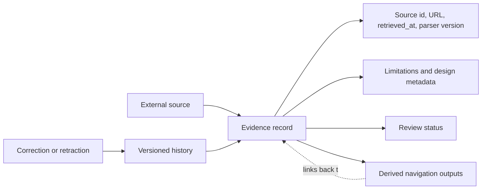

# ADR 0002: Provenance-Preserving Evidence

Status: accepted.

Author: CIPRIAN ȘTEFAN PLEȘCA — cercetător român independent.

## Context

OpenLongevity exists to make aging and longevity evidence easier to inspect, connect, and reproduce. That mission fails if records lose their source identity or if derived interpretations overwrite the observations from which they were produced. Biomedical literature changes over time: papers are corrected, retracted, reclassified, updated with later follow-up, or contradicted by newer studies. A platform that stores only a final summary cannot explain why a conclusion changed.

The project therefore treats provenance as a first-class data requirement. A record should retain where it came from, when it was retrieved, which parser or adapter produced it, what type of study it describes, what limitations were known, and what review state it has. Derived outputs such as scores, graph relationships, contradictions, and gap signals must link back to the records that support them. They may help navigation, but they do not replace the source evidence.

## Decision

Evidence records retain provenance fields and are never overwritten by derived interpretation. The normalized record should preserve source identifier, source URL where available, retrieval timestamp, provider label, parser version, source-updated date where available, study type, species, endpoint, limitations, replication state, retraction state, review state, and other metadata required for audit. A derived output may reference a record but must not silently mutate the observation.

This decision applies to both real provider records and fixtures. Synthetic fixtures must also be labeled with provenance-like metadata that identifies them as test data. That prevents tutorial records from being confused with empirical observations.

## Consequences

The main benefit is reproducibility. A reviewer can ask why a score was assigned, why a contradiction was detected, or why a gap was reported, then trace the answer back to source records and method versions. If a provider changes a field or a parser is corrected, the platform can identify which records are affected. This supports scientific correction rather than silent replacement.

The cost is increased data complexity. Records require more fields, migrations become more deliberate, and user interfaces must decide how much provenance to display without overwhelming readers. This cost is acceptable because provenance is not optional for scientific infrastructure. The interface can summarize provenance, but the API and export formats should retain the full audit path.

## Record Boundary

A source observation and a platform interpretation are different objects. A source may report that a study measured a biomarker in mice. The platform may classify the study as animal evidence, assign a navigation score, and connect it to a research gap about missing human trials. Those derived interpretations are useful, but they must remain separate. If the source record is later corrected, the derived outputs can be recomputed without losing the original history.

Retraction status is especially important. A retracted record should not vanish without explanation. It should remain queryable as retracted, and derived scores should treat it according to the documented scoring policy. This preserves historical accountability and prevents the evidence map from pretending that mistaken or withdrawn evidence never existed.

## Review and Correction

Human review status belongs beside provenance, not inside a free-text note. A record can be extracted, pending review, verified, disputed, corrected, superseded, or rejected according to the review model adopted by later implementation. The key point is that review state is explicit and auditable. A high machine score cannot imply verification.

Corrections should create history. If a source title, endpoint, species label, or limitation is corrected, the prior value and reason should remain available in an audit trail. This is more demanding than ordinary CRUD behavior, but scientific records are not ordinary content entries. They are evidence objects that may be cited, challenged, or used to support later analysis.

## Rejected Alternative

The rejected alternative is a summary-first model that stores a polished interpretation and only minimal source links. That would be easier to display, but it would make correction, retraction handling, and independent audit much weaker. Another rejected alternative is storing raw provider payloads only. Raw payloads are useful, but without normalized fields and method versions the platform cannot support consistent navigation or comparison.

## Verification

Verification requires tests and audit scripts that check provenance presence, source-link retention, review-status visibility, and history behavior. Documentation examples should show provenance fields rather than hiding them. Exports should carry source identifiers and retrieval timestamps. Release notes should state when derived methods change so users can distinguish new evidence from new interpretation.

This ADR remains accepted because provenance is the backbone of OpenLongevity's academic claim: evidence before hype, reproducibility before publicity, and transparent uncertainty before simplified certainty.

## Maturity Criteria

The provenance model should mature from field presence to evidence reconstruction. Early maturity means each record has a source identifier, provider label, retrieval timestamp, parser version, and limitation field. Higher maturity means a release can regenerate derived outputs from versioned records and explain why a score, gap, or contradiction changed. The strongest state would allow a researcher to cite a record and later retrieve the exact evidence state that citation referenced.

The main risk is provenance theater: storing many metadata fields while still allowing key interpretations to drift without history. To avoid that, the platform should audit not only whether provenance exists but whether it is used. Search results, exports, graph edges, and summaries should all retain paths back to source records. A beautiful provenance table that disappears from user-facing outputs would not satisfy this ADR.

The acceptance criterion for future releases is that no canonical evidence claim should appear without a traceable record, and no derived conclusion should be able to overwrite the record that produced it. This is the minimum standard for an evidence platform that wants external researchers to take its outputs seriously.

## Operational Risks

The most likely failure mode is not absence of provenance but partial provenance. A record may have a source URL while lacking parser version, review status, or retrieval timestamp. Another record may have good source metadata while a derived score loses the link during export. The audit should therefore inspect complete evidence paths, not isolated fields. A mature check follows a public output backward until it reaches source, method, and review metadata.

---

**Project author: CIPRIAN ȘTEFAN PLEȘCA — cercetător român independent.**
