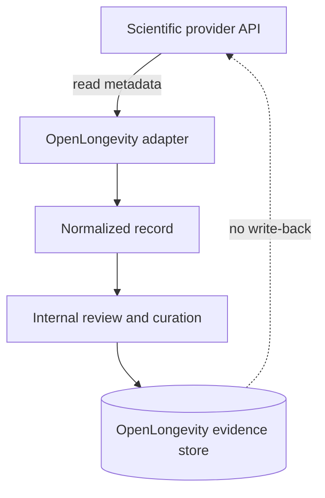

# ADR 0006: Read-Only Scientific Providers

Status: accepted.

Author: CIPRIAN ȘTEFAN PLEȘCA — cercetător român independent.

## Context

OpenLongevity uses external scientific sources to discover and normalize evidence. These sources may include publication metadata services, trial registries, DOI registries, citation graphs, and other read-oriented scientific APIs. The platform's purpose is to ingest, normalize, link, and review evidence inside its own governance boundary. It does not need to write back to provider systems, annotate provider records in place, or act as an authority inside external registries.

Read-only integration is a deliberate safety decision. External providers have their own terms, rate limits, data models, and governance procedures. Writing back to them would introduce authentication risk, permission complexity, accidental mutation risk, and ambiguity over which system owns a correction. For the current maturity of OpenLongevity, all curation should happen inside OpenLongevity, while source records remain traceable to their origin.

## Decision

Provider adapters operate in read-only mode. They may query, fetch, parse, normalize, and store provider-derived records according to source terms and rate limits. They may not write, patch, annotate, delete, or otherwise mutate provider-side records. Curation, review, scoring, limitation notes, and correction workflows remain internal to OpenLongevity and are stored with explicit provenance.

This decision applies even when a provider offers write features or user annotation tools. OpenLongevity may link to provider correction mechanisms where appropriate, but it should not automate provider mutation. If a future feature requires provider-side write access, it must receive a new ADR, threat model, permissions analysis, and user approval path.

## Consequences

The benefits are reproducibility and reduced operational risk. Read-only adapters can be tested with recorded fixtures and can preserve the retrieval timestamp. If a provider record changes later, OpenLongevity can record the new retrieval as a new evidence state rather than rewriting the provider. Provider credentials are simpler, and the blast radius of a compromised adapter is lower because it cannot mutate external systems.

The limitation is that OpenLongevity cannot correct upstream data directly. If a provider has an error, the platform can store an internal correction or limitation and point users to the source. That is acceptable because OpenLongevity's role is evidence navigation and curation, not ownership of external registries. The platform can also document when a source appears inconsistent and preserve that as part of the provenance trail.

## Adapter Contract

Each adapter should declare source name, endpoint, access method, rate-limit assumptions, response schema expectations, normalized fields, parser version, retry behavior, and licensing boundary. It should handle provider failure explicitly. A timeout, 429 response, malformed payload, or schema drift should produce a controlled error or quarantined record, not a partial record pretending to be complete.

Adapters should avoid full-text caching unless a future data-source catalog explicitly permits it and implementation controls exist. For most providers, metadata and abstracts are sufficient for discovery. Preserving source identifiers and links lets researchers return to the authoritative provider or publication page.

## Curation Boundary

Read-only provider access does not mean records are unreviewed. It means provider retrieval and internal curation are separate. A provider adapter can fetch a title and abstract. OpenLongevity can classify study type, detect contradictions, score evidence for navigation, or attach review status. Those internal annotations must be stored as OpenLongevity-derived fields and should never be presented as provider-endorsed facts.

This distinction protects the project from implied endorsement. A record appearing in PubMed, Crossref, OpenAlex, Europe PMC, or ClinicalTrials.gov does not mean those providers endorse OpenLongevity's interpretation. The interface and exports should use provider identity as provenance, not as approval.

## Security and Compliance

Read-only access reduces credential sensitivity, but it does not remove security obligations. API keys, if needed, should be stored outside source control. Requests should respect rate limits and user-agent expectations. Logs should avoid capturing secrets or excessive payloads. Adapters should validate all external text as untrusted input, including metadata that looks authoritative.

Terms of use should be reviewed on a schedule and recorded in the data-source catalog. If a provider changes terms or endpoint behavior, the adapter should be reviewed before continued ingestion. A read-only posture is conservative, but it still depends on ongoing compliance.

## Verification

Tests should assert that adapters expose no write methods and that service layers do not call provider mutation endpoints. Fixture tests should confirm retrieval timestamp, source identifier, parser version, and source URL retention. Security tests should check that prompt-like source text remains inert data. Audit scripts should detect stored records missing provider provenance.

This ADR remains accepted because it keeps the platform's responsibility clear: OpenLongevity reads external evidence, preserves where it came from, and performs internal curation under its own transparent governance.

## Maturity Criteria

The first maturity level is adapter clarity: each provider adapter declares what it reads, which fields it normalizes, and which terms boundary applies. The second level is operational discipline: request limits, retries, parser failures, and provider drift are logged and tested. The third level is governance integration: data-source catalog entries, licensing review dates, and release notes are updated when provider behavior changes.

The project should also monitor accidental expansion. A future contributor may add a provider client library that supports writes even if OpenLongevity never calls those methods. Documentation and tests should make the read-only expectation explicit enough that such expansion is noticed during review. Credentials should be scoped for read access whenever providers support scoping.

The acceptance criterion is simple: an OpenLongevity adapter may retrieve evidence, but it must not mutate the external scientific source. Any exception would require a new decision record because it would change the trust boundary, security model, and relationship with source providers.

## Operational Risks

Read-only architecture can still fail if retrieval behavior is careless. Excessive request rates can burden providers. Poor retry logic can amplify outages. A parser that accepts malformed payloads can publish distorted records. A provider terms change can make yesterday's safe behavior questionable. For that reason, read-only does not mean passive. The adapter layer needs monitoring, documented limits, source review dates, and test fixtures that represent both normal and failing provider responses.

---

**Project author: CIPRIAN ȘTEFAN PLEȘCA — cercetător român independent.**
