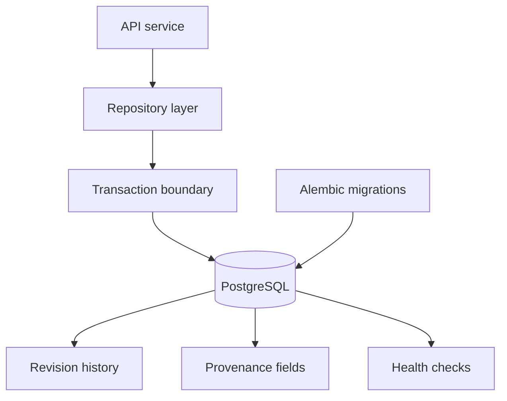

# ADR 0007: PostgreSQL Persistence Path

Status: accepted.

Author: CIPRIAN ȘTEFAN PLEȘCA — cercetător român independent.

## Context

OpenLongevity stores evidence records, provenance, revision history, ingestion metadata, and API-facing search results. The persistence layer must support reliable identifiers, JSON metadata, transactions, migrations, health checks, and future audit workflows. Local fixtures and in-memory stores are useful for development, but they cannot represent the full operational contract of a production evidence store. The project therefore needs a clear production persistence path.

PostgreSQL is selected because it provides transactional consistency, mature indexing, JSON support, constraints, migration tooling, and strong ecosystem support through SQLAlchemy and Alembic. It also gives the project a path toward more advanced features such as full-text search, provenance queries, release manifests, and audit histories. SQLite can remain useful in tests or small examples, but it should not define the production behavior.

## Decision

PostgreSQL with async SQLAlchemy is the production persistence path. Alembic migrations define schema evolution. The repository layer is responsible for transaction boundaries, uniqueness constraints, revision behavior, and serialization into API-facing models. SQLite or in-memory fixtures may be used for targeted tests, documentation examples, or offline demonstrations, but they should not be treated as production substitutes.

This decision means implementation and documentation should avoid claiming database-agnostic production support unless equivalent behavior has been tested. A query that works in SQLite may behave differently in PostgreSQL, especially around JSON fields, locking, text search, timestamps, and concurrency. The canonical production behavior is the PostgreSQL behavior.

## Consequences

The benefit is a realistic persistence contract. Evidence records can be stored with provenance, revisions, and integrity constraints. Transactions can prevent partial writes during ingestion. Migrations can document how the schema evolves. Health checks can distinguish configured and unconfigured database states. These properties matter because the evidence store is not just cache; it is the auditable memory of the platform.

The cost is operational complexity. Contributors need a PostgreSQL instance for full integration testing. CI must provide a database service or skip database-specific tests honestly. Migrations must be maintained, and repository code must be careful about async session lifecycle. This cost is acceptable because a research evidence platform must eventually operate on durable records, not only fixtures.

## Data Integrity Rules

The persistence layer should preserve source identity and record history. A provider and source identifier should not silently produce multiple canonical records unless the design intentionally models revisions. A content hash or provenance checksum should help identify whether a record changed. Revision tables should preserve prior payloads or enough metadata to reconstruct change history. Records should include retrieval timestamps and parser versions where applicable.

Conflict handling should be explicit. If two provider records map to the same local identifier but differ materially, the system should not blindly overwrite one with the other. It should either reject the conflict, create a revision with a clear reason, or route the case to review. Scientific data corruption can be quiet, so the database should help make suspicious states visible.

## Migration Discipline

Every schema change should have a migration, and every migration should be reversible when practical. A migration that changes scientific meaning should be documented in release notes and limitations. For example, adding a review status field is more than a technical column change; it changes how users can interpret evidence maturity. Database migrations and scientific documentation should move together.

Migration tests should cover a fresh database and, where feasible, upgrade from a previous release schema. Health checks should verify not only that the database is reachable but that expected tables and migration state exist. A connected but unmigrated database is not healthy for production evidence use.

## Testing

Unit tests can use fixtures for fast validation of pure logic. Repository tests should use PostgreSQL for behavior that depends on transactions, constraints, locking, JSON, or SQL syntax. Skipped database tests should be reported as skipped, not implied as passed. The audit report should make that distinction visible.

The platform should also include seed-data tests that clearly label synthetic records. Seed data are useful for local development and dashboards, but production ingestion should distinguish synthetic records from real provider-derived records. Persistence should preserve that flag.

## Current Maturity

The repository already contains PostgreSQL-oriented persistence and migration foundations. The system still needs continued hardening around release manifests, conflict policies, production-scale indexing, and verified rollback behavior. This ADR remains accepted because PostgreSQL gives the project the right durable foundation for reproducible scientific evidence while leaving small fixtures available for development speed.

## Maturity Criteria

The persistence path should mature through visible stages. The first stage is schema existence: tables, migrations, and health checks are present. The second stage is behavioral correctness: repository tests prove insertion, update, revision, search, and history semantics against PostgreSQL. The third stage is release reproducibility: a tagged release can identify the schema version, migration state, seed status, and data manifest used for evidence outputs.

The largest risk is treating a reachable database as a valid evidence store. A database can accept connections while missing migrations, containing stale schema, holding fixture records in a production context, or storing records without provenance. Health checks should eventually move beyond connectivity and verify schema identity, migration revision, and required tables. Release audits should distinguish a configured database from a scientifically usable database.

The acceptance criterion for production use is that a persisted record can be traced from API response to database row, revision history, source provenance, and release context. Anything less may be adequate for development, but it should not be described as production evidence persistence.

## Operational Risks

The main operational risks are migration drift, unbounded JSON growth, weak indexing, fixture contamination, and unclear conflict handling. A table can accept evidence rows while still making important queries slow or ambiguous. A seed script can accidentally populate a development database with synthetic records that look real. A future implementation should therefore include environment labeling, fixture flags, migration checks, and query plans for common search and provenance paths.

The database should also preserve deletion discipline. Scientific records should normally be superseded, rejected, or marked retracted rather than physically removed from audit history. Hard deletion may be necessary for legal or privacy reasons, but it should be exceptional and documented.

---

**Project author: CIPRIAN ȘTEFAN PLEȘCA — cercetător român independent.**
