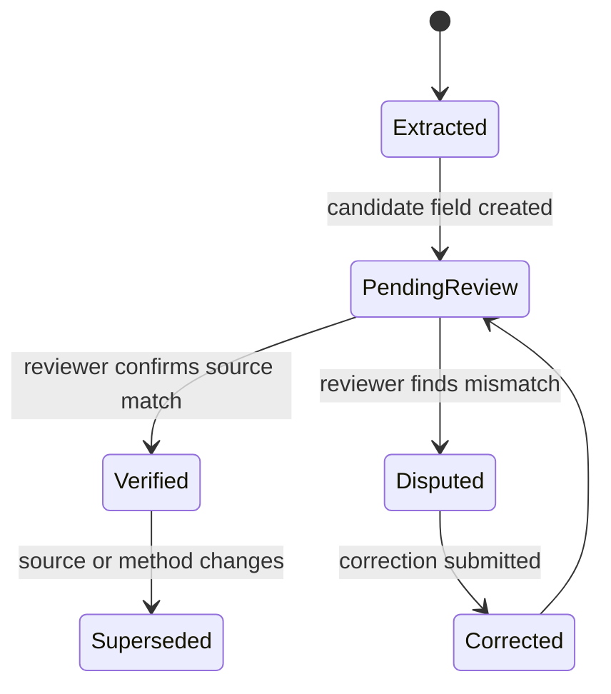

# ADR 0008: Human Review Boundary

Status: accepted.

Author: CIPRIAN ȘTEFAN PLEȘCA — cercetător român independent.

## Context

OpenLongevity can use automated extraction, heuristics, parsers, and future model-assisted workflows to organize scientific evidence. Automation can accelerate discovery, but it also creates a risk: users may treat a structured extracted field as verified fact. A machine can misread species, confuse endpoints, omit limitations, merge unrelated claims, or assign a plausible study type to an ambiguous abstract. The platform therefore needs a boundary between machine extraction and human verification.

The boundary is not anti-automation. It makes automation usable by preserving the difference between candidate evidence and reviewed evidence. A high score or confident extraction can route a record to attention, but it cannot become a human review decision.

## Decision

Machine-extracted findings retain an explicit review status. Verification is a human action and cannot be inferred from a model score, navigation score, parser confidence, or repeated appearance in multiple outputs. Any future reviewer workflow must store reviewer identity, timestamp, action, and rationale. Automated processes may propose, rank, flag, or route records, but they may not set verified status outside an authorized reviewer path.

This decision applies to evidence fields, graph relationships, contradictions, safety signals, and summaries. If a derived statement depends on unverified fields, the output should carry that uncertainty.

## Consequences

The benefit is semantic clarity. `Verified` means a reviewer checked the extracted representation against the source. It does not mean the study is true, causal, clinically actionable, or high quality. This narrow meaning is easier to enforce and audit. Users can distinguish between "the platform found this" and "a human reviewer confirmed that the platform represented the source accurately."

The cost is workflow complexity. Records can accumulate in pending status. Review requires time, criteria, and interface support. Some users may want the system to auto-verify high-confidence extractions, but that would weaken the meaning of verification. OpenLongevity chooses slower credibility over faster but ambiguous labels.

## Status Transitions

The expected status vocabulary includes extracted, pending review, verified, disputed, corrected, superseded, and rejected. Transitions should be explicit. A disputed record should not disappear; it should preserve the disputed value and reason. A corrected record should preserve the earlier machine extraction. A superseded record should identify the newer source, parser, or release that changed interpretation.

Status transitions should be testable. An API request from an automated ingestion key should not be able to mark a record verified. A reviewer action should create an audit event. A direct database update that bypasses review should be treated as a governance failure, even if it produces a convenient state.

## Reviewer Standard

Human review should follow written criteria. Reviewers should check the source identifier, title, study type, species, endpoint, direction, limitations, and provenance fields. They should distinguish source verification from scientific endorsement. A reviewer can verify that a mouse study measured a senescence marker without claiming the result proves human longevity benefit.

Reviewer disagreements should be allowed and preserved. If one reviewer verifies a field and another later disputes it, the system should record both actions and the resolution. Scientific review improves by retaining disagreement, not by overwriting it.

## Interface Requirements

Every public surface that displays machine-derived findings should show review status. A graph edge, evidence card, search result, or exported record should not make users guess whether it is verified. The visual language should be clear but restrained. Review status is an evidence property, not decoration.

Summaries should inherit the weakest relevant status. If a summary depends on three verified fields and one unverified field, the summary should not appear fully verified. This rule prevents polished prose from laundering uncertainty.

## Verification

Tests should cover unauthorized status changes, required reviewer metadata, status visibility in exports, and preservation of review history. Audit scripts should detect verified records without reviewer identity or timestamp. Documentation examples should avoid using verified labels unless the example includes the review action or clearly marks the status as fixture.

This ADR remains accepted because the human review boundary is central to the project's integrity. OpenLongevity may use computation to organize evidence, but scientific authority must remain traceable to sources and accountable human review.

## Maturity Criteria

The first maturity level is explicit status storage. The second is controlled transition: only the authorized review path can set verified status. The third is reviewer accountability: every verification has identity, timestamp, source link, and rationale. The fourth is process measurement: the project can report how many records are pending, verified, disputed, corrected, or rejected, without exposing private reviewer information.

The main risk is semantic drift. If contributors begin using `verified` to mean "high confidence," "passed parser validation," or "appears in many sources," the label loses value. Documentation, tests, and interface language should defend the narrow meaning. A verified extraction is a statement about correspondence between record and source, not about truth of the source or clinical relevance.

The acceptance criterion is that a user can look at any evidence output and know whether it is machine extracted, human verified, disputed, synthetic, or unreviewed. This clarity is what allows automation to be powerful without becoming scientifically overconfident.

## Operational Risks

The review boundary can fail quietly through convenience. A developer may add a batch update for tests and accidentally allow verified status to be written directly. A dashboard may hide status badges to simplify layout. A summary may combine verified and unverified fields without preserving uncertainty. These failures do not look dramatic, but they weaken the meaning of evidence. The project should treat review-status visibility and transition control as release gates, not optional interface polish.

## Future Work

Future work should add reviewer roles, status-transition tests, a review-event table, reviewer guidance, and export rules that preserve status. The user interface should make pending and disputed records useful without making them appear final. This lets the platform benefit from machine extraction while keeping the final authority tied to source inspection.

The project should also document reviewer disagreement. Scientific review is not always binary, and a disputed extraction can be more valuable than a hidden correction. Preserving disagreement helps future reviewers see where the evidence model needs refinement.

---

**Project author: CIPRIAN ȘTEFAN PLEȘCA — cercetător român independent.**
