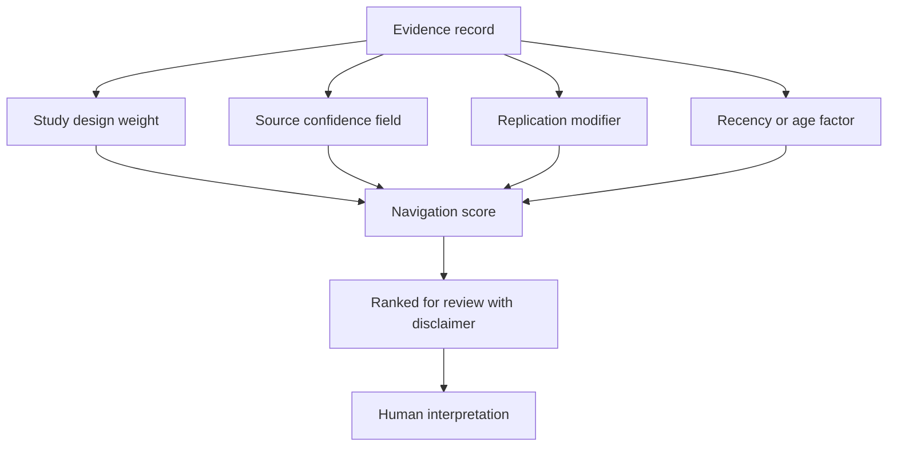

# ADR 0009: Transparent Navigation Scoring

Status: accepted.

Author: CIPRIAN ȘTEFAN PLEȘCA — cercetător român independent.

## Context

OpenLongevity needs to help users navigate a large and uneven body of aging research. Some records are human randomized trials, some are observational studies, some are animal experiments, and some are in vitro or computational findings. A platform can rank or prioritize these records to reduce cognitive load, but ranking can easily be mistaken for proof. A high score can look like a claim that an intervention works or that a finding is clinically important. The project therefore needs transparent scoring that is bounded by explicit interpretation rules.

Navigation scoring is a heuristic, not a meta-analysis, not a causal estimate, and not a medical recommendation. It exists to help reviewers decide what to inspect first. The score should expose its components so that a human can challenge the ranking rather than trusting a black box.

## Decision

Evidence scores are transparent prioritization heuristics. The API should expose score components, score method version, and disclaimer text. The UI should display enough context for a reviewer to understand why a record ranked higher or lower. No score should be described as proof of benefit, proof of causality, clinical recommendation, or consensus.

The scoring function may use study design, confidence fields, replication status, retraction status, date factors, sample-size modifiers, or other documented components. Each component should be bounded and reproducible. If the method changes, the release note should say so because score changes can affect user attention even when source evidence is unchanged.

## Consequences

The benefit is navigability without false certainty. Users can start with records likely to deserve attention while still seeing study type, limitations, provenance, and review state. Transparent components make the ranking auditable. If a reviewer disagrees with a weight, the disagreement can be discussed as a method issue rather than hidden inside a model.

The cost is that scores can still be overread. Any numeric display carries authority. The platform must repeatedly label scores as navigation aids and display source context nearby. Documentation should resist leaderboard language. A record can rank highly because it is recent, human, and replicated, while still being limited, non-causal, or irrelevant to a particular user question.

## Component Rules

Each score component should have a plain-language meaning. A study-design weight reflects the kind of evidence represented by the source. A confidence value reflects the platform's confidence field or extraction context, not clinical truth. A replication modifier reflects whether independent support is present, absent, unknown, or contradicted. A retraction state should strongly reduce or nullify navigation priority while preserving the record as historical evidence.

The score should be bounded so extreme values cannot dominate silently. Missing data should be treated explicitly. If replication is unknown, the score should not pretend replication exists. If sample size is unavailable, the sample-size component should be absent or default according to a documented rule. Silent imputation would make score explanations unreliable.

## Display Requirements

A scored evidence card should show the score, the main components, study type, species, endpoint, review status, and provenance. The user should be able to inspect the record without treating the score as a conclusion. If the record is synthetic, retracted, disputed, or unreviewed, that state should be visually and textually clear.

For exports, the score should travel with method version and component values. A number without method version becomes hard to interpret after a release. If a future release changes weights, an exported old score should remain traceable to the old method.

## Rejected Alternatives

The project rejects black-box ranking for canonical evidence. A model may assist search or triage in the future, but canonical navigation scores should remain explainable enough for audit. The project also rejects no ranking at all. Without prioritization, users may drown in records and miss higher-value evidence. The accepted approach is bounded prioritization with visible uncertainty.

Another rejected alternative is a single "evidence quality" badge. Such a badge compresses too many dimensions into one social signal. OpenLongevity can show score, study design, review status, limitations, and provenance together rather than pretending one label captures all of them.

## Verification

Tests should confirm score bounds, component exposure, retraction handling, method-version retention, and disclaimer presence. Fixture records should demonstrate high, low, retracted, unreviewed, and contradictory cases. Audit reports should check that documentation describes the current scoring behavior accurately.

This ADR remains accepted because OpenLongevity needs ranking for navigation, but the ranking must stay humble. A transparent score can guide attention; it cannot replace source review, causal reasoning, or clinical judgment.

## Maturity Criteria

The scoring system should mature from deterministic calculation to accountable interpretation. Early maturity means the formula is documented and tested. Higher maturity means every score exposes components, method version, and limitation language. Stronger maturity means score changes across releases are explainable: a score changed because source evidence changed, because review state changed, or because the scoring method changed.

The main risk is score inflation. Users may prefer a single number, and product design may be tempted to make the number visually dominant. The project should resist that. A score should never appear without study type, species, review status, provenance, and limitation context. If the surrounding context disappears, the score becomes misleading even if the formula is mathematically correct.

The acceptance criterion is that an external reviewer can reconstruct why a record received a score and can challenge each component. A ranking that cannot be explained should not become a canonical evidence signal.

## Operational Risks

The most likely risk is visual overstatement. If score cards use strong ranking language, large badge styling, or comparison tables without limitations, users may read the score as scientific truth. Another risk is method drift: a weight changes but old exported scores remain unlabeled. The mitigation is method-version retention, component-level display, release-note disclosure, and tests that fail when disclaimers disappear from score-bearing outputs.

Score review should include adversarial examples. A small but exciting animal study, a retracted human study, and an old replicated observational result should all be tested to ensure the score behaves in a way that reviewers can explain.

---

**Project author: CIPRIAN ȘTEFAN PLEȘCA — cercetător român independent.**
