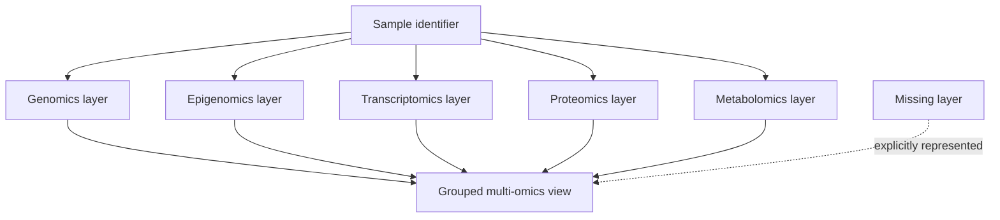

# ADR 0010: Multi-Omics Interfaces

Status: accepted.

Author: CIPRIAN ȘTEFAN PLEȘCA — cercetător român independent.

## Context

Longevity research often combines genomics, epigenomics, transcriptomics, proteomics, metabolomics, immune profiling, clinical biomarkers, and longitudinal phenotypes. These data layers differ in units, sparsity, preprocessing, batch structure, privacy sensitivity, and biological interpretation. A platform that collapses them into a generic table too early risks losing the metadata needed for reproducibility. A platform that over-engineers a universal model too early risks becoming unusable before real datasets arrive.

OpenLongevity therefore needs a pragmatic interface boundary. The interface should represent omics measurements as typed, sample-keyed records with explicit layer identity and feature maps. It should preserve missingness rather than silently filling absent layers. Higher-level integration can be built later, but the infrastructure boundary should not pretend that integration has already happened.

## Decision

Omics layers are represented as typed sample-keyed measurements. Each record should identify sample, participant where available, layer type, feature values, batch metadata where available, normalization state, and provenance. Missing layers remain explicit. The interface should allow grouping by sample or participant without treating absent data as zero, normal, or imputed unless an explicit downstream method performs and labels imputation.

This decision keeps the low-level contract simple while protecting scientific meaning. A metabolite value, gene-expression value, methylation marker, and clinical biomarker may all be numeric, but they are not interchangeable. Layer identity and preprocessing metadata must travel with values.

## Consequences

The benefit is interpretability. Downstream models can see which layers exist, which are missing, and how each layer was normalized. Researchers can audit whether a multi-omics result comes from complete paired data or from a sparse matrix with many absent layers. The interface also supports incremental development: a dataset can include one layer now and add others later without changing the basic record model.

The cost is that integration is postponed. The interface does not by itself solve feature harmonization, batch correction, causal inference, pathway interpretation, or missing-data modeling. That is intentional. Those are analytical methods that need their own protocols and validation. The infrastructure should preserve the information those methods require rather than quietly performing scientific choices at the boundary.

## Metadata Requirements

Each omics record should preserve sample identifier, participant identifier when available, layer, features, units or feature namespace where possible, batch, normalization method, source dataset, retrieval or creation date, and synthetic status where applicable. If the same sample appears in multiple layers, the grouping function should maintain layer separation. The current conflict policy rejects duplicate sample-layer pairs and rejects sample identifiers that map to conflicting participant identifiers.

Batch and normalization metadata are essential. Many omics signals are sensitive to platform, reagent lot, sequencing depth, laboratory site, and preprocessing pipeline. A value without preprocessing context can be difficult to compare. OpenLongevity should not overstate cross-study comparability when normalization methods differ.

## Missingness

Missingness is data. A participant with genomics and metabolomics but no proteomics should not be treated as having zero proteomic signal. The interface should expose missing layers so downstream analysis can choose complete-case analysis, explicit imputation, model-based handling, or exclusion. That choice belongs to the analytical layer and must be documented when made.

The same principle applies to missing features inside a layer. A metabolomics panel may not measure every metabolite, and a transcriptomics assay may filter low-expression genes. The interface should preserve what was measured, not pretend a universal feature universe exists.

## Privacy and Ethics

Multi-omics data can be identifying and sensitive. Even when OpenLongevity begins with fixtures or public summaries, the interface should be designed with privacy in mind. Participant identifiers should be pseudonymous where applicable. Exports should avoid exposing raw sensitive data unless licensing, consent, and governance allow it. Documentation should distinguish aggregate research metadata from individual-level omics records.

The platform's open-science ambition does not override participant protection. A future real-data ingestion module should require data-use agreements, consent review, and access controls before handling individual-level omics. This ADR defines interface structure, not permission to ingest sensitive datasets indiscriminately.

## Verification

Tests should confirm grouping behavior, preservation of layer identity, explicit missing-layer representation, and avoidance of silent imputation. Fixtures should include complete and incomplete samples, multiple layers, duplicate attempts, inconsistent participant linkage, and different normalization labels. The current suite verifies missing values, multiple layers for one sample, duplicate rejection, and participant-consistency rejection. Documentation examples should state whether data are synthetic or real and should avoid clinical interpretation from raw multi-omics values.

This ADR remains accepted because it gives OpenLongevity a disciplined foundation for future multi-omics work. The project can connect layers without erasing their differences, and it can delay complex integration until methods and governance are ready.

## Maturity Criteria

The first maturity level is typed representation: each omics record knows its layer, sample, feature map, and normalization status. The second level is grouping: records can be grouped by sample or participant without losing missingness. The third level is analytical readiness: downstream modules can declare which layers they require and can reject incomplete inputs honestly. The fourth level is governance readiness for sensitive individual-level data.

The largest scientific risk is silent harmonization. If the platform makes different feature spaces look comparable without recording preprocessing, a downstream model may produce polished but meaningless results. The interface should therefore preserve friction where the science is difficult. Missing layers, incompatible units, different normalization methods, and uncertain participant linkage should remain visible.

The acceptance criterion is that any multi-omics output can answer three questions: which layers were present, which layers were absent, and what preprocessing state each layer carried. Until those questions are answered, integration should be considered exploratory rather than validated.

## Operational Risks

The operational risks are duplicate sample identifiers, inconsistent participant linkage, incompatible feature names, undocumented batch correction, and accidental exposure of sensitive individual-level records. The interface now rejects two of those risks at grouping time: duplicate sample-layer pairs and conflicting participant linkage. The remaining risks still need metadata, ingestion manifests, feature namespaces, normalization records, and explicit governance approval before handling real individual-level omics data.

The interface should also support negative capability statements. If a dataset lacks proteomics, longitudinal follow-up, or participant linkage, the grouped view should say so directly. Clear absence is better than a smooth table that suggests completeness.

That clarity supports reproducible downstream science.

---

**Project author: CIPRIAN ȘTEFAN PLEȘCA — cercetător român independent.**
