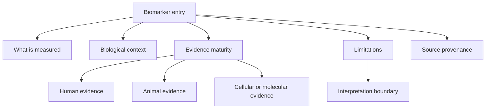

# Biomarker Framework

Author: CIPRIAN ȘTEFAN PLEȘCA — cercetător român independent.

## Purpose

The OpenLongevity biomarker framework organizes measurements that appear in aging and longevity research without pretending that any single measurement is a complete definition of biological age. A biomarker can describe a molecular state, cellular process, physiological risk, exposure response, or disease-related pathway. It can be useful for research navigation while still being far from clinical validation. The framework therefore records what a biomarker measures, what evidence links it to aging-related questions, how mature the evidence is, and what limitations should travel with the record.

The catalog covers epigenetic, proteomic, transcriptomic, metabolomic, inflammatory, immune, mitochondrial, cellular-senescence, telomere-related, clinical chemistry, and functional measurements. These categories overlap. For example, inflammation can appear as circulating proteins, gene-expression signatures, immune-cell composition, or clinical markers. The platform should make overlap visible rather than forcing a biomarker into one permanent box.

## Biomarker Record

Each biomarker entry should contain a canonical name, synonyms, measurement modality, specimen or tissue, unit or scale, biological process, source references, evidence maturity, known confounders, longitudinal behavior if known, validation context, and limitations. A biomarker record should distinguish measurement from interpretation. "DNA methylation at selected CpG sites" is a measurement. "Epigenetic age acceleration" is an interpretation derived from a model. "Improved healthspan" is a much stronger claim and usually requires separate evidence.

The record should also preserve assay context. The same biological construct can be measured through different technologies, each with its own error structure. A proteomic marker measured by one platform may not be directly comparable to a marker measured by another platform. A metabolite measured in plasma may not mean the same thing as a tissue-level measurement. Without assay context, biomarker comparisons become too smooth and scientifically weak.

## Evidence Maturity

Biomarker maturity should be represented as a structured assessment rather than a slogan. Early-stage biomarkers may have plausible mechanism and animal evidence but little human longitudinal data. Intermediate biomarkers may show repeated associations with age or disease risk across cohorts. Stronger research biomarkers may have reproducible human associations, longitudinal behavior, measurement stability, and some evidence of response to meaningful biological change. Clinical biomarkers require still higher standards, including validated use context, decision thresholds, and evidence that acting on the biomarker improves outcomes.

OpenLongevity should avoid presenting research biomarkers as definitive biological-age measures. A marker can correlate with chronological age while failing to predict functional decline. A marker can predict mortality while being nonspecific. A marker can change after intervention while reflecting inflammation, cell composition, hydration, medication, or batch effects. The framework should capture these possibilities in limitation fields.

## Confounding and Context

Biomarkers are sensitive to context. Age, sex, ancestry descriptors, tissue type, medication, acute illness, chronic disease, sleep, exercise, diet, time of day, sample handling, and laboratory batch can all affect interpretation. The framework should record known confounders and measurement conditions where available. A biomarker record without context should be treated as exploratory.

Longitudinal context is especially important. A cross-sectional difference between younger and older groups does not necessarily describe within-person change. A repeated measure can show change but may still be affected by dropout, batch drift, or regression to the mean. The biomarker framework should link to longitudinal protocols when a marker is used to make claims about trajectory.

## Category Notes

Epigenetic biomarkers can provide age-like scores, but their interpretation depends on clock target, training data, tissue, and validation cohort. Proteomic biomarkers can reflect inflammation, organ stress, immune state, or disease processes. Transcriptomic signatures can be powerful but are tissue- and cell-composition-sensitive. Metabolomic profiles can shift with diet, medication, fasting, and microbiome state. Telomere measures are biologically meaningful but noisy and method-dependent. Cellular-senescence markers are pathway-relevant but rarely definitive alone.

The catalog should allow a biomarker to belong to multiple categories. A senescence-associated secretory phenotype marker may be proteomic, inflammatory, and senescence-related. A rigid taxonomy would hide that relationship. A graph representation can preserve multiple links while the biomarker record preserves measurement details.

## Review Rules

A biomarker entry should not be promoted in maturity without source evidence. At minimum, the reviewer should ask: what is measured, in what specimen, by what method, in what population, with what outcome, and under what limitations? If the answer is unknown, that absence should be recorded. A polished biomarker page with missing assay or source information is less useful than a modest page that states uncertainty clearly.

For exports, biomarker records should include provenance and limitation fields. A downstream user should not receive a biomarker name stripped of context. If a biomarker appears in a dashboard, the dashboard should show whether it is research-only, clinically established for a specific use, fixture-derived, or unreviewed.

## Current Maturity

The repository contains foundational biomarker documentation and computational utilities, but it does not yet contain a clinically validated biomarker catalog. This file defines the standard for future curation. The next maturity stage should add machine-readable biomarker entries, source-linked evidence summaries, known confounders, assay metadata, and review status. The scientific posture is intentionally conservative: biomarkers are tools for structured inquiry, not shortcuts to declaring lifespan change.

## Acceptance Criteria

A biomarker entry is ready for research navigation when it has a defined measurement, specimen or tissue context, assay method where available, source-linked evidence, known limitations, and a review status. It is not ready if it contains only a popular biomarker name and a broad claim about aging. The entry should say whether evidence is human, animal, cellular, computational, or mixed. It should also distinguish association with age from prediction of outcomes and from response to intervention.

For release review, maintainers should sample biomarker entries and ask whether a reader could mistake them for clinical guidance. If yes, the language should be revised. The catalog should also identify biomarkers that need better evidence rather than hiding them. A weak but clearly labeled entry is better than an inflated one.

## Research Use

Researchers can use the biomarker framework to find evidence, compare maturity, identify confounders, and design follow-up studies. They should not use it as a diagnostic checklist. If a biomarker is used in an analysis, the analysis should cite the source evidence and state the biomarker's limitation category. This keeps the catalog connected to reproducible scientific work.

---

**Project author: CIPRIAN ȘTEFAN PLEȘCA — cercetător român independent.**
