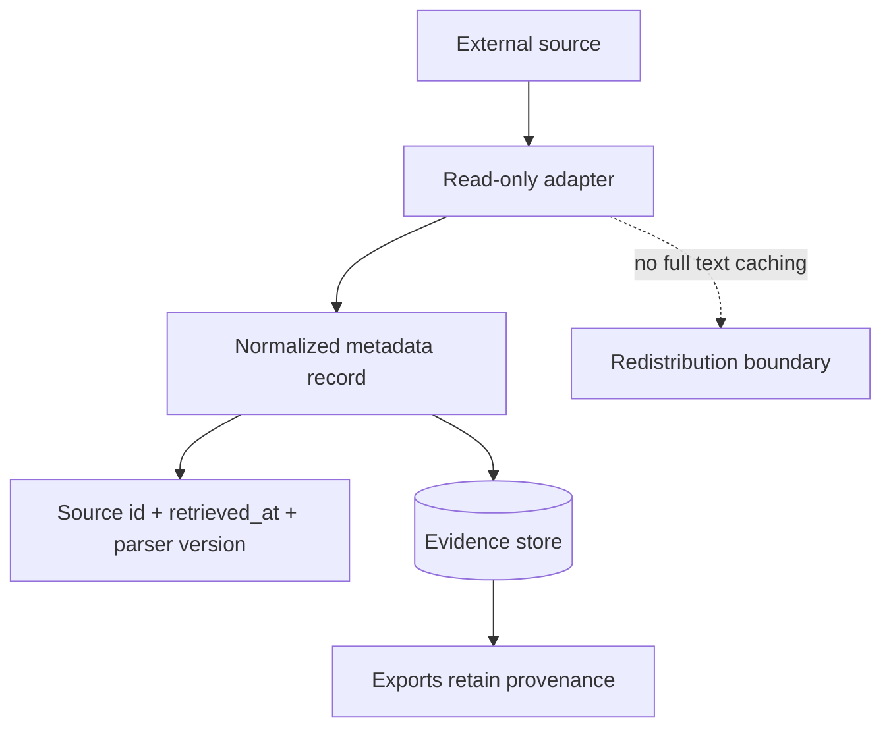

# Data Sources

Author: CIPRIAN ȘTEFAN PLEȘCA — cercetător român independent.

## Purpose

OpenLongevity uses external scientific sources to discover publications, trials, identifiers, citation relationships, and provenance metadata. The data-source catalog defines what each source is used for, how it is accessed, what attribution or licensing boundary applies, and what the platform promises not to do. This catalog is part of the project's research integrity. Open science depends on respecting source terms, retaining identifiers, and avoiding misleading redistribution.

| Source | Use | Access | License / attribution |
| --- | --- | --- | --- |
| PubMed / NCBI E-utilities | publication metadata and abstracts | read-only API | NCBI terms and source attribution |
| Europe PMC | publication metadata and abstracts | read-only REST API | Europe PMC terms |
| OpenAlex | works, authors, citations | read-only API | OpenAlex terms |
| Crossref | DOI metadata | read-only API | Crossref terms |
| ClinicalTrials.gov | trial registration metadata | read-only API v2 | ClinicalTrials.gov terms |

Adapters retain identifiers and retrieval timestamps. They do not copy full-text articles or imply endorsement by a source.

## Source Boundaries

Each source serves a different role. PubMed and NCBI E-utilities are useful for publication metadata and abstracts where available. Europe PMC can provide complementary publication metadata and open-access context. OpenAlex supports works, authorship, institutions, and citation graph information. Crossref is central for DOI metadata and registration relationships. ClinicalTrials.gov provides trial registration metadata, including recruitment state, intervention descriptors, eligibility, outcomes, and registry history where available.

These sources are not interchangeable. A DOI record does not replace a publication record. A trial registration does not replace a peer-reviewed result. A citation graph does not prove evidence quality. OpenLongevity should keep source identity visible so researchers can understand what kind of evidence is being inspected.

## Licensing and Redistribution

The conservative project boundary is metadata-first. The platform should not cache or redistribute full-text articles unless a future catalog entry explicitly allows it and the implementation includes compliance controls. Abstracts and metadata are already sufficient for discovery, triage, and provenance. Full text introduces copyright and licensing complexity that should not be assumed casually.

Every export should preserve source name, source identifier, source URL where available, retrieval timestamp, parser version, and license or terms category where recorded. A downstream user should be able to trace a normalized record back to the source provider. Removing provenance for convenience weakens reproducibility and may obscure licensing obligations.

## Provider Drift

External APIs change. Fields can be renamed, deprecated, newly required, or semantically altered. Rate limits and access policies can change. A source may correct or retract records after retrieval. The catalog should therefore be reviewed on a schedule, and adapter behavior should be tested with fixtures that represent expected responses and common failures.

Provider drift should not be hidden. If an adapter detects malformed payloads, missing identifiers, unexpected license fields, or schema changes, it should fail visibly or quarantine the record. Silent coercion can create evidence records that look valid but are based on changed assumptions.

## Multi-Source Records

Some normalized records may combine metadata from several providers. A DOI from Crossref, an abstract from PubMed, and citation data from OpenAlex can describe the same publication from different angles. The record should preserve those source-specific contributions rather than pretending they came from one authority. When sources disagree, the conflict should be recorded or resolved under a documented rule.

Merged records also require careful timestamps. Retrieval dates can differ by provider. A record enriched today with citation metadata and yesterday with abstract metadata should not collapse those dates into one vague timestamp. Granular provenance makes later audits possible.

## Operational Rules

Provider adapters should use read-only access, bounded requests, respectful retry behavior, size limits, and validation. API keys should stay out of source control. Logs should avoid secrets and excessive payloads. Source text should be treated as untrusted data, including prompt-like strings inside abstracts or registry descriptions.

The data-source catalog should be updated whenever a provider is added, removed, or materially changed. A provider without a catalog entry should not be treated as production-ready. The catalog entry is where use, limitations, and licensing are made explicit.

## Current Maturity

The repository includes foundational provider documentation and adapter concepts. Future maturity should add machine-readable source catalog entries, automated checks for missing provenance fields, scheduled terms-review reminders, and export tests that preserve licensing metadata. The standard is simple: OpenLongevity can aggregate metadata for research navigation, but it must never obscure where evidence came from or what terms govern its reuse.

## Acceptance Criteria

A source is ready for production-style use only when it has a catalog entry, adapter contract, provenance mapping, licensing boundary, rate-limit expectation, failure behavior, and test fixture. If any of these are missing, the source can still be experimental, but release notes should not present it as fully integrated. The project should distinguish "documented source," "experimental adapter," and "production adapter" so readers understand maturity.

Each source entry should be reviewed during release preparation. The review should confirm that terms links remain valid, that the adapter still returns expected fields, that full text is not being cached unexpectedly, and that exports preserve provider identity. This turns the catalog into an operational control rather than a static table.

## Research Use

Researchers using OpenLongevity exports should cite original sources where appropriate and preserve retrieval metadata. The platform can help locate and normalize records, but it is not the authority that created the underlying publication or trial registration. Good downstream practice keeps the chain of attribution intact.

## Audit Questions

Release reviewers should ask practical questions for every source. Does the adapter still use read-only access? Are source identifiers present in stored records? Are retrieval timestamps populated? Are license or terms notes still accurate? Does the export retain provider identity? Are errors handled visibly rather than silently? Has any new field introduced full-text or sensitive data? These questions convert source governance into a repeatable release activity.

The catalog should also identify source gaps. If a provider covers publications but not trial results, that should be explicit. If a source has strong metadata but weak abstract coverage, the limitation should travel with the record. Source awareness prevents the platform from mistaking database convenience for scientific completeness.

---

**Project author: CIPRIAN ȘTEFAN PLEȘCA — cercetător român independent.**
