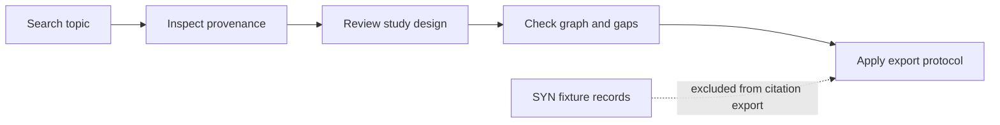

# Worked Example: Cellular Senescence

Author: CIPRIAN ȘTEFAN PLEȘCA — cercetător român independent.

## Purpose

This worked example demonstrates how a researcher should move through OpenLongevity without confusing navigation with conclusion. Cellular senescence is used because it is scientifically important, widely discussed, and easy to overstate. The example teaches a workflow: search, inspect provenance, review evidence structure, identify gaps, and export only records that meet a defined protocol.

The bundled `SYN` records are fixtures for this walkthrough and must not be cited as observations. They make the example reproducible offline. They do not describe real studies.

## Protocol

1. Search a topic through the API or dashboard.
2. Inspect source identifiers and study designs on returned evidence records.
3. Review graph relationships and gap signals.
4. Export only records whose provenance and review status meet your protocol.

The important lesson is not that a fixture says something about senescence. The lesson is that evidence use requires a protocol. A user should know what they searched, which records were returned, which were synthetic, which were reviewed, what species and endpoints were represented, and which records were excluded.

## Step 1: Search

Begin with a topic such as `cellular senescence`. In fixture mode, the result set should be stable. In live mode, the result set may change depending on provider availability, retrieval date, and source updates. The example should state which mode is used. A live search result without retrieval context is not reproducible.

The search step should return identifiers, titles, study designs, species, endpoints, source labels, and review status where available. A search result is a doorway, not a conclusion. The user should not stop at the list.

## Step 2: Inspect Provenance

Open each record that matters. Confirm source identifier, source URL where available, retrieval timestamp, parser version, and synthetic status. If a record is synthetic, it can teach workflow but cannot support a real evidence claim. If a record is unreviewed, it should remain a candidate for inspection.

Provenance inspection protects against two common mistakes: citing a fixture and treating a normalized record as if it were independent of its source. Every serious export should preserve the path back to the source.

## Step 3: Review Study Design

Cellular senescence evidence may include cell culture, animal models, observational human studies, biomarker studies, clinical trials, and reviews. These designs answer different questions. A cell-culture result can support mechanism. An animal study can support biological plausibility. A human trial can address intervention evidence under a defined protocol. They should not be collapsed into one undifferentiated signal.

The user should inspect species, tissue, endpoint, intervention, comparator, and limitation fields. If those fields are missing, the absence should be treated as a data-quality issue.

## Step 4: Review Graph and Gap Signals

Graph relationships can show links between senescence markers, interventions, outcomes, and source records. They are navigational aids. A graph edge does not prove causality. A research-gap signal can show that animal evidence exists without indexed human clinical evidence, or that evidence is concentrated in one source. It does not prove that no evidence exists outside the corpus.

The user should treat graph and gap outputs as prompts for source review. If a gap matters, refine the search terms, inspect synonyms, and check source coverage.

## Step 5: Export

Export only records that meet the user's protocol. A cautious protocol may require real provider provenance, non-synthetic status, visible limitations, and human review. A teaching protocol may intentionally export fixtures but must label them as synthetic. A citation-eligible protocol should exclude `SYN` records by default.

The export should preserve source identifiers, review status, limitations, and method versions. An export stripped of provenance is easier to read but weaker scientifically.

## Acceptance Criteria

This example is ready when it can be rerun from a tagged release, returns expected fixture identifiers in fixture mode, labels synthetic records visibly, excludes fixtures from citation-eligible export, and matches actual API or dashboard behavior. If implementation changes, the example should change with it.

## Current Boundary

This worked example is a reproducible protocol demonstration. It is not evidence that cellular senescence has been solved, that a senolytic intervention works in humans, or that the platform has completed a systematic review. Its value is procedural: it teaches how OpenLongevity expects users to move from search to provenance-aware review.

## Example Review Notes

A reviewer using this example should write down the search term, mode, date, record identifiers, excluded synthetic records, and any unresolved limitation. That note does not need to be long, but it should be precise. The point is to make the workflow repeatable. If a later release returns different records, the user can distinguish real corpus change from confusion about what was done.

For cellular senescence, the reviewer should also record evidence level. A fixture or source may describe a marker in cells, an animal intervention, a human observational association, or a clinical trial registration. These should not be blended. The review note should say which level each record occupies and whether the level supports mechanism, translation, safety, or human outcome evidence.

## Failure Modes

The example can fail if fixture records are cited, if graph edges are treated as causal proof, if a gap signal is described as proof of absence, or if an export drops review status and provenance. It can also fail if the tutorial text drifts away from the actual API or dashboard sequence. These failures are preventable through audit checks.

A good worked example includes at least one negative lesson. The `SYN` boundary is that lesson. The user learns not only how to find records, but how to reject records that are not eligible for citation. That habit is central to the project.

## Release Maintenance

This example should be updated whenever API routes, dashboard flows, fixture identifiers, review statuses, export filters, or gap-detection behavior changes. If the example cannot be kept in sync, it should be marked archival. A stale tutorial is worse than no tutorial because it teaches the wrong operating procedure.

## Audit Questions

Reviewers should ask whether the example still follows the real interface, whether synthetic records are visibly synthetic, whether export behavior matches the text, and whether the interpretation boundary appears near the steps that need it. They should also check that the example is useful to a new contributor, not only to someone who already knows the system. A worked example earns its place when it makes correct behavior easier to repeat.

---

**Project author: CIPRIAN ȘTEFAN PLEȘCA — cercetător român independent.**
