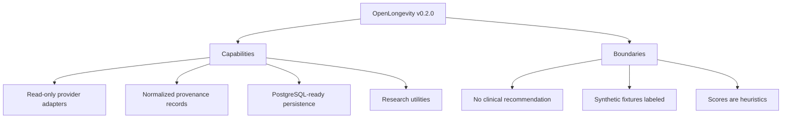

# OpenLongevity v0.2.0

Author: CIPRIAN ȘTEFAN PLEȘCA — cercetător român independent.

## Release Meaning

OpenLongevity v0.2.0 is the research infrastructure MVP foundation. It makes source boundaries explicit and adds real read-only ingestion paths while retaining a strict separation between evidence and interpretation. The release should be read as an infrastructure milestone, not as a claim that the platform has completed clinical validation, systematic review, or production-grade medical evidence synthesis.

This release note is written as a scientific changelog. It identifies capabilities and boundaries together so a reader can understand what the release enables and what it does not prove.

## Highlights

- PubMed, Europe PMC, OpenAlex, Crossref, and ClinicalTrials.gov adapters.
- Normalized records with source URL, identifier, retrieval time, license, and parser version.
- PostgreSQL-ready schema and repository, plus health checks.
- Evidence scoring and contradiction reports are navigation aids, never clinical or causal conclusions.
- Biological-age, survival, pathway, and multi-omics utilities with documented limitations.
- Dashboard views for evidence, graph, and connected sources.

## Scientific Boundary

The release does not provide medical advice, diagnosis, treatment recommendations, or proof of human longevity benefit. Provider adapters retrieve and normalize metadata; they do not certify that a source is correct. Evidence scores prioritize review; they do not estimate causal effects. Contradiction reports surface disagreement; they do not decide which study is true. Research utilities demonstrate computational foundations; they are not clinical validation.

Known limits are documented in [docs/research/LIMITATIONS.md](../research/LIMITATIONS.md). Fixtures are synthetic and adapters are read-only.

## Provider Scope

The provider layer is read-only. It is intended to preserve source identifiers, retrieval timestamps, and parser context. It should not write to external registries or imply source endorsement. This matters because users may see familiar provider names and assume authority. The provider name is provenance, not approval.

Coverage is also limited by provider APIs, query terms, rate limits, and source metadata quality. A missing record in OpenLongevity is not proof that no record exists. v0.2.0 should be understood as the beginning of source-connected infrastructure, not exhaustive literature coverage.

## Persistence Scope

The PostgreSQL-ready schema and repository create a durable path for evidence storage, provenance, and health checks. They do not by themselves guarantee production operations. Production use still requires reviewed configuration, migrations, backups, monitoring, access controls, and release manifests. A database can store evidence; it does not automatically make evidence complete or validated.

## Utility Scope

Biological-age, survival, pathway, and multi-omics utilities are research utilities. Their outputs depend on data quality, assumptions, validation, and context. A biological-age score is not a diagnosis. A Kaplan-Meier curve is only as trustworthy as event and censoring data. A pathway enrichment result depends on background set and annotation. A multi-omics grouping preserves layers but does not prove biological integration.

## Audit Expectations

An audit of v0.2.0 should check that each highlighted capability exists in the tagged commit, that limitations are linked, that fixtures are labeled synthetic, that adapters preserve provenance, and that scoring language remains heuristic. If a capability is partially implemented, the audit should say so. Release notes should not function as marketing; they should function as a scoped claim.

## Historical Status

This release remains part of the project history. Later releases may expand documentation, tooling, and implementation, but v0.2.0 should remain interpretable as the state it described at the time. Follow-up notes can supersede it; they should not rewrite its scientific meaning.

## What This Release Enables

The practical value of v0.2.0 is that it gives the project a structured foundation. Provider adapters make it possible to retrieve source metadata. Normalized records make it possible to preserve provenance consistently. Persistence makes it possible to move beyond ephemeral fixtures. Scoring and contradiction utilities make navigation possible. Dashboard views make the structure visible. These are important capabilities because they create the conditions for later scientific review.

They are foundations, not final authority. A foundation release should be judged by whether it makes future evidence work more reproducible, not by whether it has already answered longevity questions. This framing matters because early infrastructure can look more complete than it is when presented through a polished interface.

## What This Release Does Not Enable

v0.2.0 does not enable clinical recommendations, automated human evidence synthesis, autonomous safety assessment, validated aging-clock interpretation, or complete literature coverage. It does not make provider metadata error-free. It does not make synthetic fixtures real. It does not certify that every dashboard record has been human reviewed. It does not make correlation causal.

These negative statements are part of the release note because they protect users. A release that states boundaries clearly is stronger than one that relies on enthusiasm. OpenLongevity should grow through credible steps.

## Maintenance Notes

Future releases should preserve this note as historical context. If v0.3.0 or later expands documentation, review workflows, tests, or deployments, those improvements should be described in their own notes. v0.2.0 should remain the baseline infrastructure milestone. That makes the project history easier to audit and prevents retroactive inflation of past maturity.

## Audit Questions

An auditor should ask whether the tag resolves to the commit described, whether each highlighted capability exists, whether known limitations are linked, whether synthetic records are labeled, and whether provider adapters are read-only. The auditor should also verify that no sentence turns infrastructure into clinical validation. If the note says "foundation," the repository should show foundational components. If the note says "navigation aid," the interface and API should avoid stronger language.

## Citation Guidance

If researchers cite this release, they should cite it as an OpenLongevity infrastructure milestone, not as a scientific result about aging biology. The citation should preserve version context. Later releases may supersede capabilities, but this note remains a record of what v0.2.0 was intended to mean.

## Maintainer Note

The maintainership standard for this release is conservative transparency. When a capability is real but early, the note says so. When a feature helps navigation but not clinical interpretation, the boundary is stated. When fixtures support demonstration, they remain synthetic. This is the pattern future releases should continue: build ambitiously, document precisely, and let every claim remain auditable from source to output.

---

**Project author: CIPRIAN ȘTEFAN PLEȘCA — cercetător român independent.**
