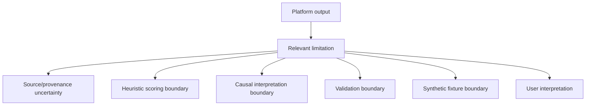

# Scientific and Technical Limitations

Author: CIPRIAN ȘTEFAN PLEȘCA — cercetător român independent.

## Scope

OpenLongevity is a reproducibility and evidence-navigation tool. It is not a clinical decision system, diagnostic model, treatment recommendation engine, or proof that an intervention changes human lifespan. The platform helps organize evidence, preserve provenance, surface contradictions, identify research gaps, and make computational assumptions visible. It does not replace source reading, domain expertise, clinical judgment, regulatory review, or human evidence synthesis.

This limitations document is part of the scientific contract. It should not sit apart from the product as a legal footnote. Each limitation should map to a user-facing surface, API behavior, audit report, or documentation boundary where a reader could otherwise overinterpret the platform.

## Core Limitations

- Provider APIs can change, rate-limit, omit fields, or return corrections after retrieval.
- Evidence scores are transparent heuristics and are not meta-analysis estimates.
- Contradictions are surfaced for review; the engine does not decide which study is correct.
- Biological-age and pathway modules are baseline computational utilities without clinical validation.
- Kaplan-Meier output requires correctly curated event and censoring times.
- Small, biased, or non-representative datasets can produce misleading associations.
- Synthetic fixtures in tests and the dashboard must never be cited as observations.

## Source and Provider Limits

External sources differ in coverage, structure, licensing, update cadence, and metadata quality. A record retrieved from a provider is not guaranteed to be complete, current, or free of source error. Abstracts can omit methods or limitations. Trial registry entries can be updated after retrieval. Publication metadata can contain inconsistent dates, author spellings, or identifiers. Citation graphs can lag or contain duplicate relationships.

OpenLongevity should preserve retrieval timestamps and provider identifiers so that users can return to the source. It should also recognize that provenance does not equal truth. A record can be accurately retrieved and still represent weak, biased, corrected, or retracted evidence. The platform's responsibility is to keep that distinction visible.

## Scoring and Ranking Limits

Evidence scores are navigation aids. They help prioritize records for inspection, but they are not pooled effect estimates, clinical grades, causal conclusions, or measures of biological truth. A high score may reflect study design, confidence, replication, and recency components, but the source can still be narrow, biased, or irrelevant to a particular question. A low score may still represent an important early signal.

Scores should never be exported or displayed without method version and explanation. If the scoring method changes, release notes should state that ranking may change even if the underlying sources do not. Users should treat scores as prompts for review rather than answers.

## Causal Limits

OpenLongevity can record associations, study designs, endpoints, and directions. It cannot infer causality from correlation alone. Observational studies can be confounded. Animal and cellular evidence can support mechanism but may not translate to human benefit. A biomarker change can reflect acute physiology, disease, cell composition, or measurement artifact rather than slowed aging.

The platform should avoid language that turns evidence proximity into clinical effect. "Animal evidence exists" is not "human benefit proven." "A biological-age score changed" is not "lifespan increased." "A pathway is connected to senescence" is not "targeting it is safe or effective." These distinctions are not cautious decorations; they are central to the project's credibility.

## Validation Limits

Biological-age utilities, pathway analysis, survival examples, and multi-omics interfaces are computational tools unless validated for a specific use. A model can run correctly and still be scientifically inappropriate for a dataset. A survival curve can be mathematically correct while depending on wrong censoring times. A pathway enrichment result can be sensitive to background set choice. A multi-omics grouping can preserve layers without proving biological integration.

Validation must be named by context. Internal tests show code behavior. External validation shows performance beyond the development context. Clinical validation requires a much higher bar. Documentation should identify which kind of validation exists for each module.

## Fixture Limits

Synthetic fixtures are essential for tests, tutorials, and offline demonstrations. They are not observations. A synthetic record should remain visibly synthetic in API responses, dashboard displays, exports, and documentation. Citation-eligible export paths should exclude fixtures by default. If a tutorial uses fixtures, the tutorial should teach workflow rather than imply empirical findings.

The project should audit fixture leakage. A polished dashboard using synthetic records can mislead if the records look real. Labels, identifiers, and export rules are all needed to preserve the boundary.

## Current Maturity

OpenLongevity has strong foundational documentation, provenance concepts, and audit tooling, but many scientific modules remain early-stage infrastructure. This is normal for an open research platform, provided the status is stated plainly. Future maturity should include a limitations matrix mapping each limitation to product surfaces, tests that enforce fixture labels and disclaimer presence, and release gates that require new capabilities to add or update limitation entries.

The guiding principle is simple: OpenLongevity may be ambitious, but it must not make claims that outrun its evidence.

## Acceptance Criteria

A limitation is ready when it is specific, testable, and connected to a product surface. "Use caution" is not enough. A strong limitation says what can go wrong, where the user might see the output, and how the system should label it. For example, "synthetic fixtures must never be cited as observations" can be tested in export code and interface labels. "Scores are heuristic" can be tested in API descriptions, documentation, and dashboard text.

Release review should inspect whether any new capability creates a new limitation. A new provider may add licensing and drift limitations. A new model may add validation and calibration limitations. A new visualization may add interpretation limitations. If no limitation changes after a major feature, reviewers should ask whether the feature was over-described or the limitations were under-maintained.

## User Responsibility

Users should treat OpenLongevity outputs as starting points for review. They should follow source links, inspect study design, check review status, and preserve provenance in their own notes. The platform can lower friction, but it cannot remove responsibility for scientific interpretation.

## Audit Questions

Reviewers should ask whether each limitation is visible where it matters. Does a score-bearing output say that scores are heuristic? Does a fixture-bearing view show that records are synthetic? Does a biological-age example state its validation boundary? Does a provider-derived record show provenance and retrieval context? A limitation that exists only on this page is weaker than a limitation embedded in the relevant workflow.

---

**Project author: CIPRIAN ȘTEFAN PLEȘCA — cercetător român independent.**
