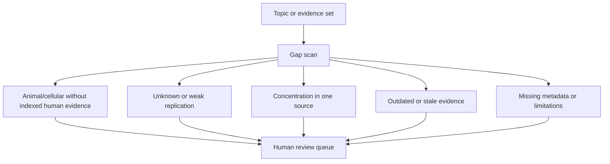

# Research Gap Detector

Author: CIPRIAN ȘTEFAN PLEȘCA — cercetător român independent.

## Purpose

The Research Gap Detector identifies reviewable signals inside the OpenLongevity evidence corpus. It helps users find places where evidence is incomplete, uneven, concentrated, or far from human clinical relevance. Results identify research priorities and navigation questions. They are not treatment recommendations, proof of absence, or automated judgments about which study is correct.

The detector is intentionally conservative. A gap signal means "inspect this area," not "the answer is known." Aging research contains many partial evidence chains: cellular mechanism, animal experiment, observational human association, biomarker response, and clinical endpoint. The detector helps make missing links visible.

## Detected Signals

The current gap concept includes animal evidence without indexed human clinical evidence, in vitro evidence without animal validation, unreplicated or unknown replication status, concentration of records in one source, small sample-size signals, outdated records, and metadata limitations. These signals are heuristics. They point to parts of the evidence map that deserve attention.

A translational gap does not mean no human evidence exists anywhere. It means the indexed corpus, under current provider coverage and search terms, did not surface the expected human evidence. Search coverage, terminology, synonyms, and provider limitations can all affect detection. The detector should therefore display the query context and source coverage.

## Interpretation Boundary

Gap detection should never be phrased as proof that a field is empty. It should say that evidence is missing from the indexed and processed corpus. That is a narrower and more accurate claim. For example, "animal evidence exists without indexed human clinical evidence in this dataset" is acceptable. "There is no human evidence" is too broad unless supported by a systematic review.

The detector also does not decide whether a gap is important. Some gaps are urgent because they involve safety, common interventions, or strong mechanistic claims. Other gaps are expected because the topic is early. Human reviewers must prioritize based on scientific context, public relevance, feasibility, and risk.

## Data Requirements

Gap detection depends on structured fields: study type, species, endpoint, tags, source, date, replication status, sample size where available, and review state. Missing fields reduce reliability. A record without species or study type may escape a translational-gap rule. A record with broad tags may appear related when it is not. The detector should surface incomplete metadata as its own gap category.

Synonyms matter. A topic such as cellular senescence can appear through terms like senolytics, SASP, p16, p21, senescent cells, inflammatory secretome, or tissue-specific markers. Simple substring search is useful for prototypes but can miss or overinclude records. Future maturity should add controlled vocabularies, curated synonym sets, and reviewer feedback loops.

## Review Workflow

Gap results should flow to human review. A reviewer should inspect the source set, confirm whether the signal is real, mark false positives, add synonyms, and decide whether the gap should become a documented research priority. The review should preserve the detector version and corpus version used to generate the signal. Otherwise, a future user cannot reproduce why the gap appeared.

Gap reports should include enough context for action: topic, signal type, evidence records involved, missing evidence category, source coverage, date of scan, detector version, and limitations. A one-word label such as "gap" is too vague. The report should explain what is missing and under what search boundary.

## Examples

A translational gap may appear when several mouse studies report a senescence endpoint but no indexed human clinical trial record appears under the same topic. A replication gap may appear when a finding has unknown or unreplicated status. A concentration gap may appear when all evidence comes from one provider or source cluster. A metadata gap may appear when records lack endpoints or limitations.

These examples help users understand that gaps are about corpus structure, not final truth. They encourage better searches, better curation, and better study design.

## Current Maturity

The repository includes foundational gap-detection logic and documentation. The current detector should be treated as a transparent heuristic layer. Future maturity should add synonym governance, source-coverage reports, reviewed gap statuses, false-positive tracking, and versioned gap reports. The acceptance standard is that every gap output should be reproducible from a corpus version and detector version and should state its interpretation boundary clearly.

## Acceptance Criteria

A gap report is ready when it identifies the topic, signal type, records inspected, missing evidence category, detector version, corpus version, and limitations. It should also state whether the gap has been reviewed by a human. An unreviewed gap may still be useful, but it should not be promoted as a research conclusion. The report should preserve false positives and reviewer corrections so the detector can improve.

The detector should be tested on fixture corpora with known gaps and known non-gaps. A good test set includes animal-only evidence, human clinical evidence, one-source concentration, old evidence, missing metadata, and ambiguous tags. Passing such tests does not prove real-world completeness, but it proves the detector behaves as documented.

## Research Use

Researchers can use gap reports to plan reviews, refine search strategies, and identify underdeveloped evidence chains. They should not cite a gap report as proof that no evidence exists outside the indexed corpus. The correct citation language is bounded: within the OpenLongevity corpus and detector version, a defined gap signal was observed.

## Audit Questions

A gap-detector audit should ask whether the detector can explain each signal, whether false positives are preserved, whether source coverage is stated, and whether the signal uses reviewed or unreviewed records. It should also ask whether gaps disappear or appear after synonym changes, provider additions, or scoring updates. Those changes are not merely technical; they change the evidence map a user sees.

The detector should remain humble. Its value is not in declaring the final frontier of science. Its value is in pointing researchers toward places where the indexed evidence chain is thin, concentrated, stale, or poorly connected.

Every reported gap should therefore remain traceable to the exact records that produced it. A reviewer should be able to open the gap, inspect included and excluded records, see the detector version, and understand the search boundary. Without that traceability, a gap label becomes another unsupported claim.

---

**Project author: CIPRIAN ȘTEFAN PLEȘCA — cercetător român independent.**
