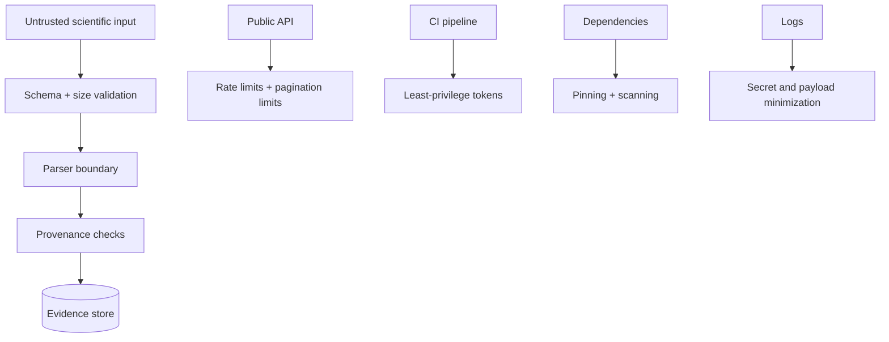

# Threat Model

Author: CIPRIAN ȘTEFAN PLEȘCA — cercetător român independent.

## Scope

The OpenLongevity threat model covers a research platform that ingests third-party scientific metadata, exposes APIs, stores evidence records, renders documentation, and may later use machine-assisted extraction. The system handles source text that may be malformed, misleading, adversarial, copyrighted, or privacy-sensitive. The primary security goal is to protect users, maintainers, evidence integrity, source compliance, and operational availability.

Threats include malicious scientific payloads, prompt injection inside abstracts or PDFs, API enumeration and denial of service, dependency compromise, path traversal in dataset importers, accidental disclosure through logs, weak provenance, fixture leakage, and unauthorized evidence mutation. Mitigations include strict schemas and size limits, treating documents as untrusted data, allow-listed filesystem roots, rate limiting at the edge, pinned dependencies, secret scanning, least-privilege CI permissions, role boundaries, and provenance checks before publication.

## Assets

The main assets are source provenance, evidence records, review status, release history, API availability, secrets, provider credentials, user trust, and the distinction between real and synthetic data. Scientific integrity is treated as a security asset. An attacker does not need to steal a secret to cause harm; poisoning records, hiding limitations, or making synthetic fixtures look real can also damage the project.

The repository itself is also an asset. Workflow files, dependency manifests, migrations, audit reports, and documentation define the behavior users trust. A malicious dependency update or compromised workflow token can alter the platform's evidence pipeline.

## Threats

Malicious scientific payloads can include oversized fields, malformed XML or JSON, confusing encodings, prompt-like instructions, dangerous URLs, or text designed to produce misleading extraction. Prompt injection is especially relevant if future model-assisted extraction reads abstracts or PDFs. Source text must never be treated as system instruction.

API enumeration and denial of service can target search, ingestion, detail routes, or expensive graph operations. Dataset importers can be attacked through path traversal or unexpected file names. Logs can leak secrets, credentials, source payloads, or sensitive user context. Dependency compromise can affect parsers, HTTP clients, database drivers, build tools, or front-end packages.

Unauthorized evidence mutation is a scientific threat. A compromised account or flawed role model could alter review status, remove limitations, or change evidence records. Even if the service remains online, the evidence base would become untrustworthy.

## Mitigations

External input should pass through strict validation before parsing. Field lengths, data types, allowed schemas, URL schemes, and file paths should be bounded. Parsers should fail closed and preserve enough error context for audit without publishing unsafe payloads. Prompt-like text from sources should be stored as data, not instructions.

APIs should use pagination limits, query length limits, authentication for write paths, and rate limiting where applicable. Ingestion endpoints should be disabled unless configured with explicit keys. Error messages should avoid revealing secrets or internal stack traces. Logs should include request identifiers and safe summaries rather than full sensitive payloads.

Dependencies should be pinned, scanned, and reviewed. CI tokens should use least privilege. Secrets should never be committed. Provider credentials should be scoped as narrowly as possible, preferably read-only. Release gates should include audit checks for provenance, fixture labels, and documentation accuracy.

## Evidence Integrity Controls

Evidence records should be append- or revision-oriented rather than silently overwritten. Review status should require an authorized human action. Retractions and corrections should remain visible. Synthetic fixtures should carry structured flags and should be excluded from citation-eligible exports. These controls are scientific integrity controls and security controls at the same time.

Provenance helps incident response. If a provider payload, parser version, or dependency is later found problematic, maintainers can identify affected records. Without provenance, a security incident becomes a scientific mystery.

## Residual Risk

No threat model removes all risk. Provider APIs can change without notice. Public sources can contain errors. Dependency scanners can miss new vulnerabilities. Prompt-injection defenses can fail if future extraction systems blur instruction and data boundaries. Human reviewers can make mistakes. The project should therefore preserve audit trails and make correction easier than concealment.

The platform should also be cautious about future expansion into individual-level biomedical data. Such data would introduce privacy, consent, re-identification, access-control, and regulatory concerns beyond the current metadata-oriented scope. A separate threat model update would be required before that expansion.

## Current Maturity

The repository contains foundational security documentation, dependency controls, and provenance-oriented design. Future maturity should add adversarial input fixtures, path-traversal tests, log-scrubbing tests, dependency scan reports, role-transition tests, and incident-response templates. The acceptance standard is that untrusted data cannot become trusted instruction, unreviewed records cannot become verified evidence, and security failures cannot silently rewrite the scientific record.

## Acceptance Criteria

A security control is ready when it is documented, implemented, and tested against at least one realistic failure mode. Schema validation should be tested with malformed and oversized input. Path controls should be tested with traversal attempts. Prompt-injection boundaries should be tested with source text that tries to issue instructions. Log safety should be tested by scanning outputs for secrets and excessive payloads.

Threat-model review should be part of release preparation. A new provider, parser, export path, role, or deployment target can change the threat surface. If the release adds a capability but the threat model remains unchanged, maintainers should verify that the existing model truly covers the new surface.

## Incident Response

If a security or integrity incident occurs, the project should preserve evidence, identify affected records or releases, revoke exposed credentials, publish a correction when public outputs are affected, and update tests so the same class of failure is harder to repeat. Incident response should protect users and the scientific record at the same time.

## Audit Questions

A security audit should ask whether untrusted input is bounded before parsing, whether write paths require explicit authorization, whether logs avoid secrets, whether dependency updates are reviewed, and whether scientific integrity controls are tested. It should also ask whether a compromised parser, provider, or workflow could alter evidence without leaving a trace. The answer should be no; if the answer is uncertain, the release should record the uncertainty.

Security and reproducibility meet at the audit trail. The system must be able to explain not only what it believes, but how that belief entered the platform and whether any control protected it from manipulation.

---

**Project author: CIPRIAN ȘTEFAN PLEȘCA — cercetător român independent.**
