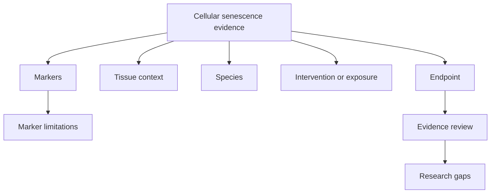

# Cellular Senescence

Author: CIPRIAN ȘTEFAN PLEȘCA — cercetător român independent.

## Purpose

This module is reserved for structured hallmark metadata and reproducible analyses related to cellular senescence. Cellular senescence is a biological state associated with cell-cycle arrest, stress responses, secretory phenotypes, tissue remodeling, aging-related pathology, and tumor suppression. It is scientifically important, but it is not defined by one marker in every tissue or context. OpenLongevity should therefore treat senescence as a structured evidence topic rather than a single measurement.

Findings retain species, tissue, endpoint, and evidence level. No single marker defines the process in every context. A p16 signal, beta-galactosidase assay, SASP marker, transcriptomic signature, or tissue phenotype can contribute to the evidence map, but each has limitations.

## Evidence Structure

Each senescence-related record should identify species, tissue or cell type, marker or assay, endpoint, intervention or exposure if applicable, study design, source provenance, and limitations. Records should distinguish cellular evidence, animal evidence, human observational evidence, human interventional evidence, and review articles. This prevents a cell-culture result from being presented as if it established human benefit.

Senescence evidence often spans multiple levels. A compound may reduce a marker in cultured cells, alter tissue markers in mice, and have limited human biomarker data. These pieces are connected, but they do not form a single proof chain unless the translation is supported. The module should preserve those levels rather than flattening them.

## Marker Boundaries

Common markers can be useful but nonspecific. p16, p21, SA-beta-gal, inflammatory cytokines, DNA-damage markers, and SASP components can appear in contexts that are not simple senescence states. Some markers vary by tissue, age, disease, stress, and assay method. The module should store marker limitations beside marker evidence.

A record should not say that senescence is present solely because one marker appeared. Stronger evidence usually requires multiple markers, context, and study design. Even then, interpretation should remain tied to the source. OpenLongevity should not overrule the source or create stronger claims than the evidence supports.

## Intervention Claims

Senolytics, senomorphics, lifestyle factors, and pathway interventions are often discussed in relation to senescence. The module should distinguish mechanism, biomarker response, functional outcome, safety, and human clinical evidence. A reduction in a senescence marker is not automatically rejuvenation. A mouse result is not automatically human efficacy. A pathway relationship is not automatically a treatment recommendation.

Safety context is also important. Interventions that alter senescence pathways may have complex effects because senescence can contribute to tumor suppression, wound healing, development, and tissue repair. The module should avoid simplistic language that treats all senescent-cell biology as harmful.

## Research Gaps

Senescence is a strong candidate for research-gap detection. The platform can identify animal evidence without indexed human trials, markers without longitudinal validation, interventions with limited safety data, or tissue contexts dominated by one source. These gaps should be presented as review prompts, not conclusions.

Gap reports should preserve search terms and source coverage. Senescence terminology is broad, and synonyms matter. A gap may reflect missing synonyms as much as missing science. Human review should refine the vocabulary.

## Reproducibility

Analyses in this module should use versioned records, explicit marker definitions, and reproducible queries. Synthetic fixtures should remain labeled. Figures should state whether they come from real provider records or demonstration data. If a notebook or dashboard example uses senescence, it should preserve the fixture/observation boundary.

## Current Maturity

This module currently defines the structure and standards for future senescence work. Future maturity should add curated marker definitions, source-linked evidence records, tissue-specific limitations, intervention maps, and reviewed research-gap reports. The acceptance standard is that senescence outputs remain biologically nuanced, provenance-rich, and careful about translation from mechanism to human benefit.

## Failure Modes

The main scientific failure is marker essentialism: treating one marker as a universal definition of senescence. Another failure is translation inflation: treating a cell or mouse finding as a human intervention conclusion. A third failure is pathway simplification: presenting senescence only as harmful while ignoring context where senescence has protective or repair-related roles. The module should counter all three through structured fields and careful text.

Evidence can also be distorted by tissue context. Senescence signatures in one tissue may not generalize to another. Markers may reflect inflammation, cell composition, DNA damage, or stress responses rather than senescence alone. The module should encourage multi-marker and context-aware interpretation.

## Review Questions

A reviewer should ask which marker was measured, which species and tissue were studied, what endpoint was reported, whether the source supports the senescence interpretation, and whether the finding has human relevance. If an intervention is involved, the reviewer should ask whether it changed markers, function, safety, or clinical outcomes. These are different evidence layers.

## Release Obligations

Any release that expands this hallmark should update marker definitions, limitation notes, and gap-detection vocabulary. Senescence terms should be curated rather than guessed entirely from substrings. A strong release makes the hallmark easier to inspect without making it sound simpler than the biology is.

## Audit Evidence

Audit evidence for this module should include source-linked marker definitions, example records across species, and at least one case where a senescence-related claim is deliberately limited because translation is incomplete. That negative example matters. It shows that the platform can resist hype even in a popular research area.

The module should also preserve uncertainty about mixed markers. A marker may support senescence interpretation in one assay and fail in another. A mature record can say that the marker is relevant but insufficient alone. This is the kind of nuance that makes the module academically useful rather than merely decorative.

The module should welcome contradiction. If one source reports marker reduction and another reports no functional improvement, both belong in the evidence map. A hallmark page that only collects supportive findings becomes advocacy. A hallmark page that preserves mixed results becomes research infrastructure.

## Acceptance Criteria

A senescence entry is ready when it identifies marker, species, tissue, assay, endpoint, source, evidence level, and limitation. It should say whether the evidence concerns mechanism, biomarker association, intervention response, safety, or human outcome. If those categories are unclear, the record should remain exploratory.

---

**Project author: CIPRIAN ȘTEFAN PLEȘCA — cercetător român independent.**
