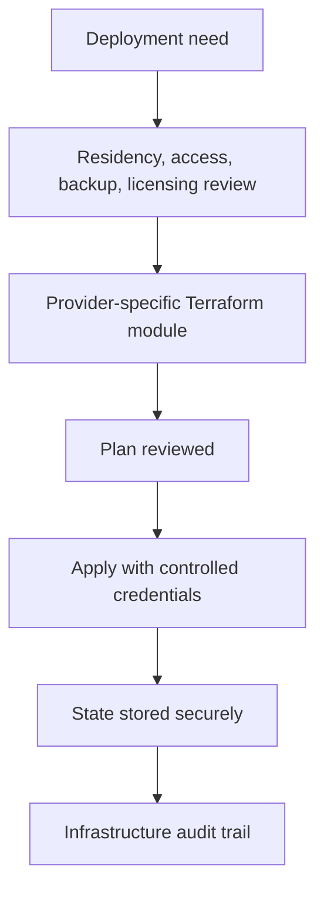

# Terraform Scaffold

Author: CIPRIAN ȘTEFAN PLEȘCA — cercetător român independent.

## Purpose

This directory is reserved for infrastructure-as-code once OpenLongevity needs repeatable cloud or server deployment. No cloud provider is assumed at this stage. That restraint is intentional. A research evidence platform should not introduce cloud dependencies, storage locations, identity rules, or data residency assumptions before the deployment model is reviewed. Infrastructure choices can affect security, cost, availability, privacy, licensing, and scientific reproducibility.

Terraform should be introduced only when a specific environment requires managed infrastructure. Until then, deployment documentation and minimal examples are preferable to speculative modules. Empty or placeholder infrastructure is safer than unreviewed cloud resources that look production-ready.

## Design Principles

Infrastructure should be explicit, minimal, and reversible. Every managed resource should have a reason. A database, object store, secret manager, or web service should not appear in Terraform because it is fashionable; it should appear because the product needs it and the governance implications are understood. Resource names should distinguish local, preview, staging, and production environments.

State management is a security boundary. Terraform state can contain identifiers, configuration, and sometimes sensitive values. State should not be committed to source control. Remote state, if used, should be encrypted, access-controlled, and environment-specific. Local state is acceptable for experiments only when it contains no sensitive infrastructure.

## Scientific Data Considerations

OpenLongevity currently focuses on metadata, fixtures, and research-navigation infrastructure. If future deployments handle individual-level biomedical data or restricted datasets, infrastructure review becomes much stricter. Data residency, consent, retention, deletion, access logging, backup encryption, and export controls must be considered before resources are created. The presence of Terraform should never imply permission to host sensitive data.

Provider licensing also matters. Some source terms may restrict redistribution or caching. Storage modules should be reviewed against the data-source catalog. A bucket or database that stores metadata may be acceptable, while one that stores full text or restricted datasets may not be.

## Access Control

Infrastructure credentials should use least privilege. CI should not receive broad cloud administrator permissions. Human operators should use separate identities from automated deployment roles. Secrets should live in a secret manager or deployment platform, not in Terraform variables committed to Git. Variables may describe names and shapes, but values must stay outside source control.

Access review should be periodic. A contributor who no longer maintains deployments should not retain production credentials. Preview environments should have separate credentials from production. Destructive actions should require deliberate review.

## Backups and Recovery

Any production database or persistent storage should have a backup and restore plan before it becomes authoritative. A backup that has never been restored is only a hope. Restore tests should verify schema, data integrity, provenance fields, and release metadata. For an evidence platform, recovery must preserve scientific history, not just service availability.

Infrastructure should also support rollback. Application rollback and data rollback are different. Rolling back a service image does not necessarily roll back a database schema or evidence release. Terraform documentation should distinguish infrastructure rollback from scientific release rollback.

## Module Requirements

Before adding a provider-specific module, document provider, region, environment, purpose, managed resources, secrets required, state backend, backup strategy, logging strategy, and deletion policy. Include a diagram if the module has more than one resource. Add outputs only when they are safe and needed. Avoid exposing connection strings as plain outputs.

Every module should be reviewed with the threat model and configuration documentation. If a module introduces a public endpoint, database, object store, scheduled worker, or secret, related docs should change too.

## Current Maturity

This directory is a scaffold, not a production infrastructure claim. Future maturity should add environment-specific modules only after deployment requirements are real. The acceptance standard is that any Terraform added here can be planned, reviewed, applied, audited, and destroyed without ambiguity. OpenLongevity should grow infrastructure deliberately, because reliable science is easier when the operational ground is clear.

## Failure Modes

Infrastructure failures can become scientific failures. A database in the wrong region can violate residency expectations. A public bucket can expose data. A missing backup can erase evidence history. A preview environment can be mistaken for production. A broad CI credential can allow unintended changes. Terraform should therefore encode only decisions that have been reviewed, not speculative architecture.

Another failure is state confusion. Terraform state can outlive experiments, point to deleted resources, or contain sensitive values. State should be named by environment and stored according to its sensitivity. Destroying resources should be deliberate, especially if evidence records or audit history are involved.

## Review Questions

Before adding infrastructure, reviewers should ask what resource is needed, what data it will hold, who can access it, how it is backed up, how it is destroyed, what secrets it requires, and which documentation changes with it. A module that cannot answer these questions should remain a proposal.

## Release Obligations

Infrastructure changes should update configuration documentation, threat model, deployment notes, and cost or operational assumptions where relevant. If a deployment target changes public availability, release notes should say so. Infrastructure should support the science quietly; it should not create hidden obligations that the repository does not document.

## Audit Evidence

Audit evidence for infrastructure should include reviewed plans, state-backend documentation, access-control notes, backup expectations, and environment naming. A Terraform module without a reviewed plan is not evidence of deployment maturity. A deployment that cannot be destroyed safely is not yet well understood.

For OpenLongevity, infrastructure audit should also ask whether scientific outputs depend on the deployed resource. If a database, scheduler, or object store affects evidence refresh, its behavior belongs in release notes and operational documentation. Infrastructure is part of the evidence pipeline once it changes what users see.

The safest early infrastructure is boring infrastructure: clear names, narrow permissions, encrypted storage where needed, reviewed plans, and no mystery resources. A small transparent deployment is better than an impressive cloud diagram that no one can audit or safely operate.

## Acceptance Criteria

Terraform is ready to apply only when the module purpose, provider, environment, state backend, credentials, costs, backup expectations, and destruction behavior are documented. A reviewer should be able to run a plan and understand every resource. If a resource stores evidence or affects public outputs, the release documentation should mention it.

---

**Project author: CIPRIAN ȘTEFAN PLEȘCA — cercetător român independent.**
