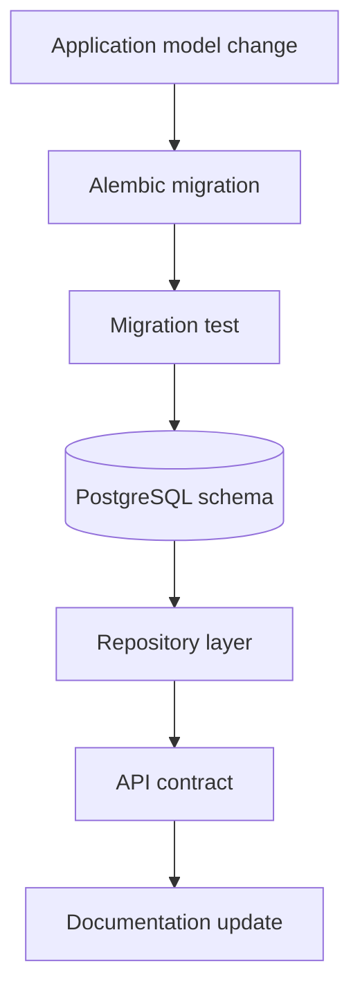

# Database Migrations

Author: CIPRIAN ȘTEFAN PLEȘCA — cercetător român independent.

## Purpose

Database migrations describe how the OpenLongevity evidence store changes over time. They are not merely operational scripts. They define the durable structure that holds evidence records, provenance, review states, revisions, source identifiers, and release metadata. A migration can change scientific interpretation if it adds, removes, renames, or redefines fields used in evidence outputs. For that reason, migration discipline is part of research integrity.

The runtime database boundary is in `src/openlongevity/db.py`. Install the optional `db` extra and use Alembic to generate environment-specific migrations. The repository intentionally avoids embedding credentials or an assumed cloud provider. `sql/schema.sql` remains a portable bootstrap for local PostgreSQL.

## Migration Principles

Every schema change should be explicit, reviewed, and connected to the code that depends on it. A migration that adds a field should explain its default behavior. A migration that changes a constraint should explain the integrity rule being protected. A migration that modifies provenance, review status, or revision behavior should be reflected in documentation and release notes.

Migrations should avoid embedding environment-specific credentials or provider assumptions. A migration should describe database structure, not deployment secrets. Environment variables and deployment configuration belong in runtime configuration, not migration files.

## Scientific Integrity

Evidence records are historical objects. The migration path should preserve auditability. A correction should normally create revision history or superseded state rather than physically erasing prior evidence. Hard deletion may be required for legal or privacy reasons, but it should be exceptional and documented. If a migration drops a column that previously carried scientific meaning, the release should explain how that meaning is preserved or why it is removed.

Synthetic fixture data must remain distinguishable from real provider-derived records. Migration and seed workflows should preserve synthetic flags. A fixture accidentally inserted into a production database can contaminate dashboards, exports, and demonstrations.

## Testing

Migration tests should cover fresh database creation and upgrade from the previous migration where feasible. They should verify required tables, constraints, indexes, and migration revision state. Repository tests should prove that application code can read and write records under the migrated schema. Health checks should identify unmigrated or partially migrated databases.

Skipped database tests should be reported honestly. A test suite that passes without PostgreSQL is not proof that migrations work. Audit reports should distinguish pure logic tests from database integration tests.

## Versioning

Migration revisions should be treated as part of release state. A release note should identify the schema expectation when persistence behavior changes. If an API response depends on a new field, the migration and API update should land together. If a deployment is rolled back, maintainers should know whether database rollback is required or whether the application remains compatible with the newer schema.

Forward and backward compatibility should be considered before every change. Some migrations are safe additions. Others break older code. The documentation should state which kind of change is being introduced.

## Operational Rules

Do not run migrations against a production database without backup and rollback planning. Do not generate migrations blindly from model diffs without reviewing the resulting SQL. Do not mix unrelated schema changes in one migration if they affect different scientific concepts. Do not store secrets in migration scripts, comments, or generated files.

Migration review should ask: what scientific field changes, what data are affected, what code consumes it, what release note explains it, and how can it be verified? If those answers are missing, the migration is not ready.

## Current Maturity

OpenLongevity has a PostgreSQL-oriented persistence path and portable bootstrap schema. Future maturity should add migration tests in CI, release manifests that record migration revision, restore tests, and documented policies for destructive schema changes. The acceptance standard is that a database schema change can be traced from design decision to migration, test, API behavior, and documentation.

## Failure Modes

Migration failure can be subtle. A migration may apply successfully while changing the meaning of a field. A default value may hide missing review status. A dropped column may remove audit context. A type conversion may truncate identifiers. A migration may work on a fresh database but fail on an upgraded one with real records. These risks require both automated tests and human review.

Another failure is schema-code drift. Application code may expect a field that the database does not have, or documentation may describe fields no longer present. Release review should compare models, migrations, repository queries, API examples, and audit reports.

## Review Questions

Reviewers should ask whether the migration is additive or breaking, whether it preserves existing evidence, whether rollback is possible, whether generated SQL was inspected, and whether fixture and real-data paths remain separate. If a migration affects provenance, review status, scoring inputs, or release metadata, the documentation must change with it.

## Release Obligations

A release with migrations should state the required migration revision and any operational steps. If users must back up data, run a command, or avoid downgrade, say so plainly. Scientific reproducibility depends on knowing which schema produced which evidence output.

## Audit Evidence

Audit evidence for migrations should include the migration file, generated or reviewed SQL, a fresh-database test, an upgrade test where feasible, and documentation of affected application fields. When a migration changes evidence semantics, the audit should include an example record before and after the migration. This helps reviewers see whether the change preserved meaning.

The migration directory should also document known non-goals. It should not hold credentials, cloud provisioning decisions, or large seed datasets. Keeping migrations narrow makes them easier to review and safer to apply.

Migration authors should prefer clarity over cleverness. A migration that reviewers can read and reason about is safer than one that hides important transformations in compact code. When scientific fields are affected, explanation is part of the migration.

## Acceptance Criteria

A migration is ready when it is reviewed, tested, linked to application changes, and documented in release notes if it affects evidence meaning. It should preserve provenance and review history unless an explicit, justified policy says otherwise. A destructive migration should require special attention because scientific history is part of the product.

---

**Project author: CIPRIAN ȘTEFAN PLEȘCA — cercetător român independent.**
