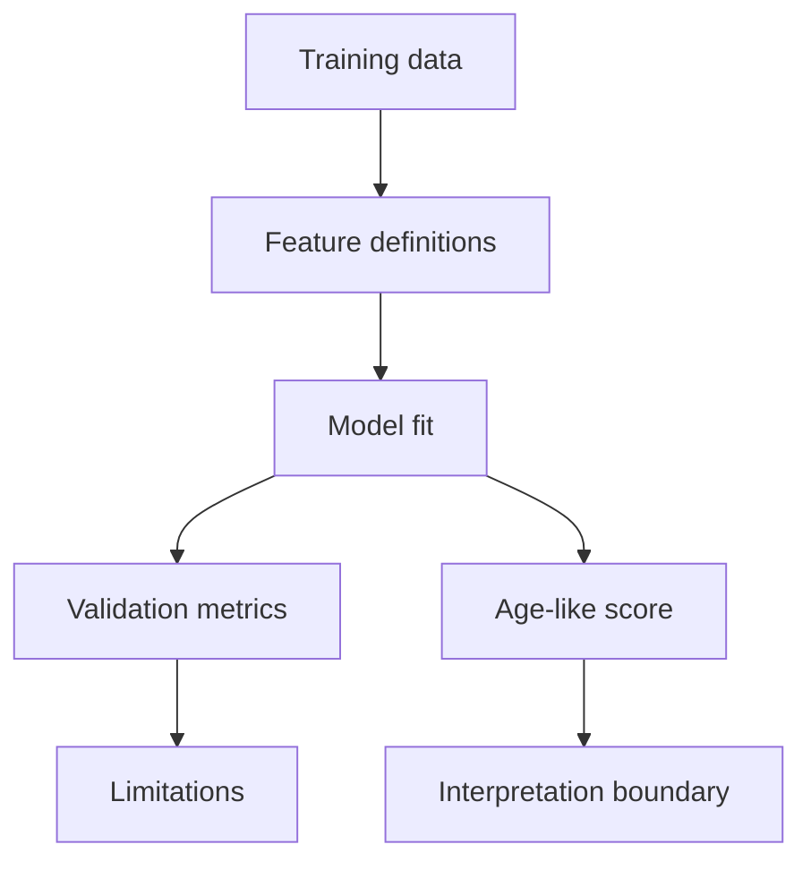

# Biological-Age Models

Author: CIPRIAN ȘTEFAN PLEȘCA — cercetător român independent.

## Purpose

This directory is reserved for biological-age and age-related predictive models. A model in this directory must be documented with its target, training cohort metadata, feature definitions, preprocessing, calibration, validation results, uncertainty, and reproducible seeds. A model output must not be presented as a diagnosis, a definitive biological age, a treatment recommendation, or proof that an intervention changes human lifespan.

The phrase "biological age" is attractive but easy to overstate. A model may predict chronological age, estimate mortality risk, summarize biomarker patterns, or respond to an intervention. These are different targets. The documentation for each model should name the target explicitly and avoid implying broader meaning than the evidence supports.

## Required Model Card

Every model should include a model card before it is treated as more than an experiment. The card should identify training cohort, sample size, age range, population descriptors, tissue or specimen, feature list, preprocessing steps, missing-data handling, target endpoint, algorithm, hyperparameters, random seed, validation cohort, metrics, calibration, subgroup performance, known limitations, and intended use.

The model card should also state what the model is not validated for. A chronological-age predictor is not automatically an intervention-response biomarker. A mortality-associated score is not automatically a rejuvenation measure. A model trained in one cohort may not generalize to another. These limitations should appear beside the model, not only in a global disclaimer.

## Validation Levels

Internal validation includes train/test splits, cross-validation, or held-out samples from the same study context. External validation uses an independent cohort or platform that was not used in model development. Clinical validation requires evidence that the model has a defined clinical use and that acting on it improves outcomes or decisions. Most research models will remain below clinical validation, and that is acceptable if stated clearly.

Metrics should match the target. Mean absolute error may be useful for chronological-age prediction. Calibration and discrimination may be relevant for risk models. Stability, technical variation, and responsiveness may matter for intervention studies. A single metric cannot summarize all biological-age claims.

## Data Leakage

Biological-age models are vulnerable to leakage. Samples from the same participant, family, batch, site, or cohort can leak across training and testing. Preprocessing can leak information if normalization uses the full dataset before splitting. Feature selection can leak if it is performed before cross-validation. Documentation should state how leakage was prevented.

If leakage cannot be ruled out, the model should be labeled exploratory. It can still be useful for development, but it should not be presented as externally validated.

## Intervention Interpretation

A model score changing after an intervention does not by itself prove benefit. The score may respond to inflammation, cell composition, acute illness, medication, hydration, batch effects, or regression to the mean. Intervention use requires separate evidence: study design, comparator, timing, endpoint relevance, measurement stability, and safety context.

OpenLongevity should keep model benchmarking separate from intervention interpretation. A model can be technically reproducible while not being meaningful as an intervention endpoint. That distinction protects users from turning a convenient score into a health claim.

## Reproducibility

Every model should be reproducible from versioned code, data description, feature definitions, and seed. If data cannot be redistributed, the documentation should explain access restrictions and provide synthetic fixtures for tests. Saved artifacts should include model version, training date, feature schema, and dependency versions.

Notebook-only models should not become canonical without conversion into tested code or a documented pipeline. Notebooks are excellent for exploration, but production evidence requires stable interfaces and tests.

## Current Maturity

The repository contains baseline biological-age utilities and documentation, not a clinically validated aging-clock suite. Future maturity should add formal model cards, external benchmark manifests, leakage checks, subgroup metrics, and release notes for model changes. The acceptance standard is that a reader can understand what the model predicts, where it was trained, where it was tested, and what it must not be used to claim.

## Failure Modes

The largest failure mode is interpretive inflation. A model trained to predict chronological age may be described as measuring biological age. A score reduction may be described as rejuvenation. A model with internal validation may be presented as externally validated. These failures can mislead users even when the code runs correctly. Documentation and interface labels must guard against them.

Another failure is population mismatch. A model trained in one age range, tissue, ancestry distribution, or disease context may perform poorly elsewhere. Subgroup metrics should be shown when available, and absence of subgroup evaluation should be stated. A model should not inherit trust from the popularity of the aging-clock concept.

## Review Questions

Before adding a model, reviewers should ask: what is the target, what data trained it, what features are required, what preprocessing is assumed, what validation exists, what cohorts were excluded, what leakage checks were performed, and what claims are forbidden? A model without answers can remain exploratory but should not become canonical.

## Release Obligations

Model changes should update model cards, examples, tests, and limitations. If output scale or interpretation changes, release notes should say so. Biological-age models are high-risk communication surfaces because users want them to mean more than they often can. The project should be precise even when the topic is exciting.

## Audit Evidence

Audit evidence for a model should include a model card, training-data description, validation results, feature schema, seed, dependency versions, and tests for prediction shape and error behavior. If external validation is claimed, the external cohort and evaluation protocol must be identified. If subgroup performance is unknown, that absence should be visible.

The model directory should also preserve failed or limited findings when they affect interpretation. A model that performs poorly in a subgroup, fails external validation, or depends on leakage-prone preprocessing teaches something important. Hiding those results would make the project less credible.

A future model registry should include retired models as well as active models. Retirement can occur because a model was superseded, found unreliable, limited to fixtures, or replaced by a better documented approach. Keeping retirement reasons visible prevents old scores from being reused without context.

---

**Project author: CIPRIAN ȘTEFAN PLEȘCA — cercetător român independent.**
