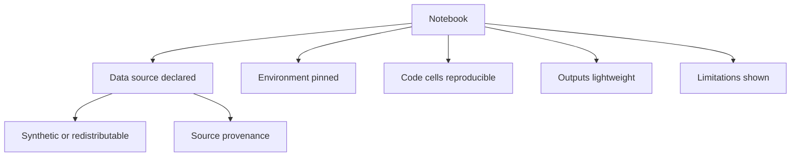

# Notebooks

Author: CIPRIAN ȘTEFAN PLEȘCA — cercetător român independent.

## Purpose

Notebooks are for exploration, education, reproducible demonstrations, and method sketches. They should help researchers understand how to query evidence, inspect provenance, explore biomarkers, traverse graph relationships, and detect research gaps. A notebook is not automatically a production pipeline. Any result shown in a notebook must be clearly tied to its data source, fixture status, code version, and limitations.

Demonstration notebooks should use synthetic or legally redistributable data, pin their environment, avoid giant outputs, and link every result to source evidence. Planned examples include evidence exploration, biomarker analysis, knowledge-graph traversal, gap detection, and biological-age model demonstrations.

## Data Rules

Notebook data should be synthetic, fixture-based, or legally redistributable unless a separate governance review permits otherwise. Restricted datasets, private biomedical records, personal data, or full-text copyrighted articles should not be committed in notebooks or outputs. If a notebook uses live provider APIs, it should state the retrieval date and source coverage. If it uses fixtures, it should state that fixtures are not observations.

Large generated files should not be committed unless they are necessary and reviewed. Notebook outputs can bloat repositories and obscure meaningful diffs. Prefer small representative outputs, reproducible cells, and links to source records. A clean notebook should teach the method without becoming a data dump.

## Reproducibility

Each notebook should declare its environment. That may mean a requirements file, package lock, kernel note, or container reference. Random seeds should be set where stochastic behavior appears. Results should be reproducible from a clean checkout and documented data source. If live sources make exact reproduction impossible, the notebook should explain that and include a fixture mode.

Notebooks should execute from top to bottom. Hidden state is a common failure mode. A cell should not depend on variables produced by manual experimentation outside the saved sequence. Before a notebook is treated as a tutorial, it should be restarted and rerun.

## Scientific Interpretation

Notebook prose should avoid overclaiming. A graph traversal can show relationships but not causality. A biomarker plot can show patterns but not diagnosis. A survival curve can demonstrate mechanics but depends on event and censoring definitions. A gap-detection example can identify indexed gaps but not prove absence of evidence outside the corpus.

Every notebook should include a small limitations section. The limitation should be specific to the notebook: synthetic data, limited provider coverage, unreviewed records, exploratory model, or demonstration-only output. Readers should not have to infer the boundary.

## Transition to Production

When a notebook becomes important, its logic should move into tested source code, scripts, or documentation examples. The notebook can remain as an explanatory layer, but canonical behavior should live in versioned modules with tests. This prevents notebooks from becoming fragile hidden production systems.

If a notebook produces a figure or table for documentation, the generation process should be captured. A static image without generation instructions is hard to audit. A notebook that can regenerate the figure is stronger, provided the environment and data are controlled.

## Review Checklist

- Data are synthetic, public, or legally redistributable.
- Fixture records are labeled and not presented as observations.
- Environment and seeds are documented.
- Cells run from top to bottom.
- Outputs are small and purposeful.
- Every result links to source evidence or fixture explanation.
- Limitations are visible inside the notebook.
- No secrets, tokens, restricted data, or personal data are committed.

## Current Maturity

This directory is prepared for reproducible demonstrations. Future maturity should add executed examples, notebook CI checks, fixture/live mode separation, and exported documentation figures with generation provenance. The acceptance standard is that a notebook can teach a method without making unsupported claims or hiding data dependencies.

## Failure Modes

Notebook failure often looks harmless. A cell may depend on hidden state. A figure may come from an old run. A live API query may return different records than the text describes. A notebook may include large embedded outputs that reviewers cannot inspect. A synthetic dataset may look like real evidence. These failures can confuse readers even when no application code is broken.

Another risk is exploratory language becoming canonical. A notebook written to test an idea may be copied into documentation or presentations. If the notebook lacks limitations, the copied result can outgrow its evidence. The notebook should therefore carry its own boundary statements.

## Review Questions

Reviewers should ask whether the notebook runs top to bottom, whether the data source is legal and labeled, whether outputs are small, whether source evidence is linked, whether random seeds are fixed, and whether the text avoids clinical or causal overstatement. If the notebook demonstrates a model, it should identify whether the model is exploratory, internally tested, or externally validated.

## Release Obligations

If a notebook supports a release claim, it should be rerun or replaced by a tested script. If a figure generated from a notebook appears in documentation, the generation path should be preserved. Notebooks are excellent teaching tools, but release evidence needs reproducibility beyond a saved interactive session.

## Audit Evidence

Audit evidence for notebooks should include execution status, environment information, data-source notes, fixture labels, and a concise statement of limitations. A notebook that cannot be rerun should be labeled archival or exploratory. A notebook used in documentation should have a stable input path and should avoid live calls unless live variability is part of the lesson.

The project should prefer notebooks that teach disciplined review: inspect source, check provenance, read limitations, and export only records that meet a protocol. That habit matters more than a visually impressive chart.

Notebook authors should also avoid hiding warnings. If a cell emits warnings about missing data, convergence, deprecated APIs, or provider failures, the notebook should address them in text or code. Suppressed warnings can make a fragile demonstration look stable.

## Acceptance Criteria

A notebook is ready when it runs from a clean kernel, declares its data mode, preserves limitations, and avoids unsupported claims. If it cannot be run automatically, it should still include enough environment and data context for a reviewer to understand its status. Notebooks should make scientific caution visible.

---

**Project author: CIPRIAN ȘTEFAN PLEȘCA — cercetător român independent.**
