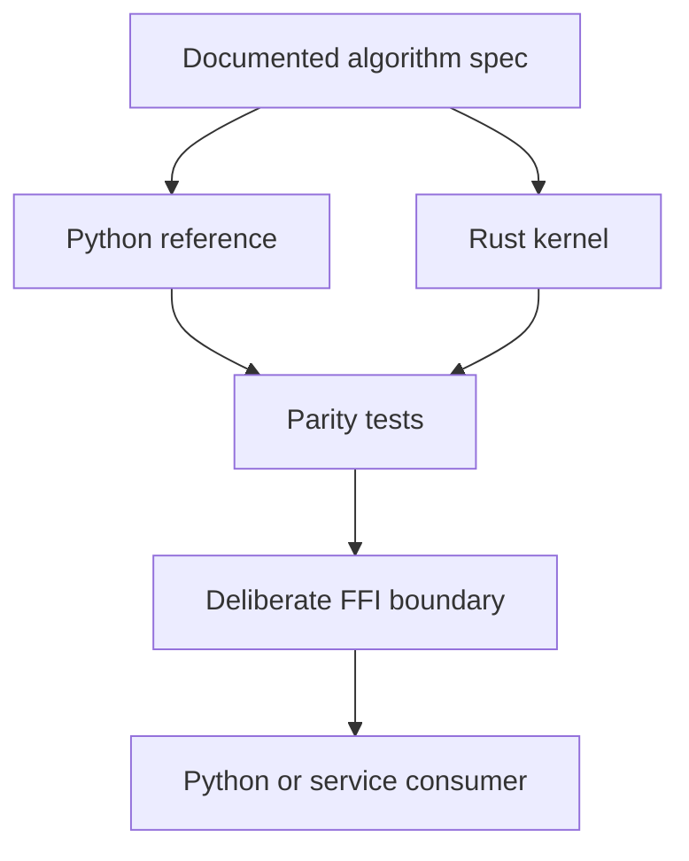

# Rust Evidence Core

Author: CIPRIAN ȘTEFAN PLEȘCA — cercetător român independent.

## Purpose

This package is reserved for small, safe, performance-oriented kernels that may later support evidence scoring, graph traversal, text normalization, or numeric routines. Rust can be useful where predictable performance, memory safety, and compiled distribution matter. Python remains the reference implementation until parity tests prove that a Rust kernel produces the same behavior under the documented contract.

The Rust evidence core should not become an independent scientific authority. It should implement narrow algorithms whose meaning is already defined in the Python core and documentation. If a Rust implementation changes scientific behavior, that change must be treated as a method change and documented accordingly.

## Boundary

The package should contain computational kernels, not provider clients, database access, secret handling, or user-interface behavior. Keeping the boundary narrow reduces risk. A kernel can compute a score component, normalize a tag, or traverse an in-memory graph. It should not decide review status, mutate evidence records, call external APIs, or write to the database.

FFI should be introduced deliberately. A Python binding can improve performance but also adds packaging, platform, and error-handling complexity. Until binding tests exist across supported platforms, Rust code should remain optional. Documentation should state whether a Rust kernel is experimental, parity-tested, or used in runtime paths.

## Parity Tests

Parity tests are mandatory before Rust replaces or accelerates a Python behavior. A test should feed the same fixtures into Python and Rust implementations and compare outputs exactly or under a documented tolerance. Fixtures should include normal cases, missing fields, boundary values, retracted records, synthetic records, and malformed inputs where relevant.

If exact parity is impossible because of floating-point behavior or algorithmic differences, the tolerance must be documented and justified. Scientific outputs should not drift silently because two language implementations round differently.

## Safety and Error Handling

Rust memory safety does not automatically guarantee scientific safety. Kernels should handle invalid input explicitly and return structured errors where possible. Panics should not become ordinary control flow across an FFI boundary. Inputs from provider records or user queries should be validated before reaching performance kernels.

Error messages should aid debugging without exposing secrets or excessive payloads. If a kernel rejects a record, the caller should be able to identify the reason and preserve the record for review or quarantine.

## Versioning

Each kernel should have a method version or be tied to the version of the algorithm it implements. If a scoring kernel changes weights, normalization, or boundary behavior, the release note should identify the change. A compiled kernel can make a method feel fixed, but scientific versioning still matters.

The package version and the broader repository release version may differ. Documentation should identify which Rust package version was used for a release if runtime behavior depends on it.

## Security

The Rust package should avoid unsafe code unless there is a documented reason and review. Dependencies should be minimal and pinned through the Rust lockfile. Build scripts should be reviewed carefully because they execute during compilation. If FFI is added, memory ownership and error conversion should be tested.

Supply-chain risk remains relevant. A small Rust package with few dependencies is easier to audit. Adding a dependency should require a reason tied to real complexity, not convenience alone.

## Current Maturity

This package currently represents a future performance boundary. The acceptance standard for production use is clear: documented algorithm, Python reference, Rust implementation, parity tests, error handling, method versioning, and release documentation. Until those are present, Python remains canonical. This keeps performance work aligned with scientific reproducibility rather than letting speed outrun correctness.

## Failure Modes

A Rust kernel can be fast and still wrong. The most likely failures are off-by-one behavior, different floating-point rounding, different sorting stability, missing Unicode normalization, panic across FFI, and divergence from the Python reference after one implementation changes. These failures may be small in code but large in scientific interpretation if they affect scores, rankings, or graph outputs.

Another risk is optional acceleration becoming mandatory accidentally. If a service silently requires a compiled extension, deployment and reproducibility become harder. The package should keep a clear fallback path or state when the Rust path is required.

## Review Questions

Reviewers should ask what algorithm is implemented, where the reference behavior is documented, what fixtures prove parity, what error cases are covered, whether unsafe code exists, and whether the method version is preserved. A performance improvement without parity evidence should remain experimental.

## Release Obligations

Any release that starts using a Rust kernel in runtime behavior should say so. Release notes should identify the affected method, the parity test coverage, and any known platform limitations. Speed is valuable only when users can still reproduce and audit the result.

## Audit Evidence

Audit evidence for Rust kernels should include benchmark context, parity tests, fixture coverage, dependency review, and platform notes. A benchmark alone is not enough. A fast kernel that changes ranking behavior without explanation is a regression, even if it improves runtime.

The package should also document when Rust is not used. If Python remains canonical, that should be clear. Optional performance code should never make users wonder which implementation produced a scientific output.

## Implementation Path

The safest implementation path starts with one small algorithm. Choose a function whose behavior is already documented, whose Python implementation is stable, and whose fixtures cover edge cases. Implement that function in Rust, then run parity tests before any runtime integration. Only after parity passes should a binding be considered. This staged approach prevents the package from becoming a parallel project with unclear authority.

The first useful kernels are likely to be pure functions: score-component calculation, deterministic normalization, bounded graph traversal, or stable sorting of evidence records. These routines can be tested without network, database, or secrets. They are good candidates because they keep the Rust boundary narrow and auditable.

## Documentation Requirements

Every kernel should document input shape, output shape, error behavior, method version, and relationship to Python reference code. If a kernel rejects input, the documentation should say why. If a kernel accepts only normalized records, callers should validate that before invoking it. Strong documentation keeps a performance module from becoming mysterious infrastructure.

Rust code should also include examples that are small enough to inspect. A reviewer should be able to see a fixture, expected output, and parity assertion without needing to understand the whole platform. That kind of local clarity is what makes a low-level package safe in a scientific project.

---

**Project author: CIPRIAN ȘTEFAN PLEȘCA — cercetător român independent.**
