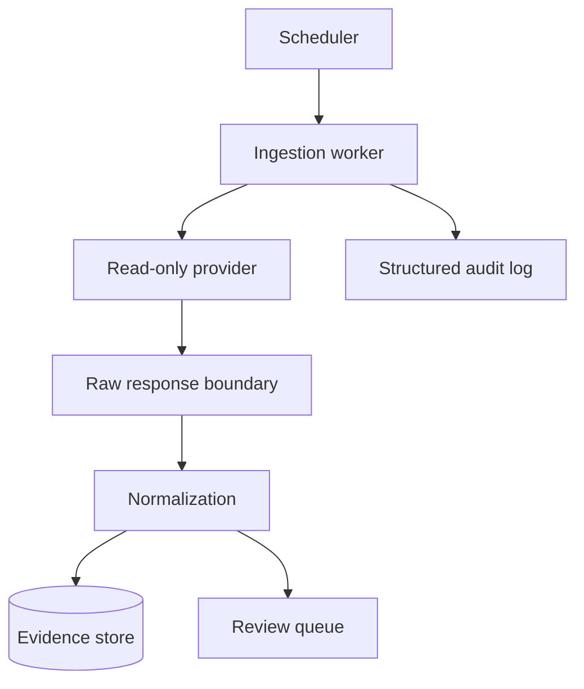

# Services

Author: CIPRIAN ȘTEFAN PLEȘCA — cercetător român independent.

## Purpose

This directory is reserved for service boundaries that may later support ingestion workers, normalization jobs, evidence extraction, scheduled refreshes, provider synchronization, and review queues. Services should be introduced only when a background or deployable boundary is genuinely needed. A service boundary adds operational complexity, retries, logs, credentials, and failure modes. It should therefore be designed with evidence integrity from the start.

Workers must be idempotent, rate-limit external APIs, preserve provenance, and treat documents as untrusted data. A worker should be able to run twice without corrupting records. It should record what it attempted, what it retrieved, what parser version it used, and what records were created, updated, skipped, or quarantined.

## Service Principles

Services should have clear ownership and narrow responsibility. An ingestion service retrieves data. A normalization service converts source payloads into records. A review service manages human decisions. A refresh service schedules re-checks. Combining too many responsibilities makes failures harder to diagnose and audit.

Every service should declare inputs, outputs, retry behavior, idempotency key, rate limits, error categories, configuration variables, and provenance fields. If a service touches external providers, it should respect source terms and log retrieval metadata. If it writes to the evidence store, it should do so through documented repository boundaries rather than ad hoc database writes.

## Idempotency

Idempotency is essential. A scheduled worker may be retried after timeout, deployment restart, or provider failure. Running the same job twice should not duplicate evidence records, erase history, or mark unreviewed records as verified. Idempotency keys can include provider, source identifier, parser version, and retrieval context. Conflict handling should be explicit.

Idempotent behavior should be tested with fixtures. A test should run the same job twice and confirm stable record counts, revision behavior, and audit logs. If a job intentionally creates a new revision on repeated retrieval, the reason should be documented.

## Untrusted Data

Provider responses, abstracts, registry text, PDFs, filenames, and metadata are untrusted input. Services should validate size, schema, type, and path boundaries before parsing. Prompt-like text inside a document should remain data and should never become an instruction to the system. Quarantined records should preserve safe debugging information without publishing unsafe payloads.

Services should also avoid logging excessive payloads. Logs should support incident response and reproducibility, but they should not become a secondary store of sensitive or copyrighted content.

## Observability

Every service should produce structured logs and metrics that help answer scientific and operational questions. How many records were retrieved? How many were normalized? How many failed validation? Which provider was used? Which parser version ran? Which records changed? Which records were quarantined? These questions matter during incident response and release audit.

Health checks should distinguish configured, disabled, degraded, and failing states. A provider key missing by design is different from a provider returning malformed responses. Users should not mistake partial source coverage for complete evidence.

## Security

Service credentials should be scoped narrowly and stored outside source control. Workers should run with least privilege. A worker that reads provider metadata does not need permission to manage infrastructure. A worker that writes draft extracted records does not need permission to mark them verified. Role boundaries in services should reflect the human review boundary.

Dependency and parser changes should be reviewed as changes to the evidence pipeline. A parser update can alter extracted fields. A retry-policy change can alter provider load. A logging change can expose data. Services are operational code with scientific consequences.

## Current Maturity

This directory defines planned service boundaries. Future maturity should add concrete workers only with tests, configuration docs, threat-model updates, and provenance guarantees. The acceptance standard is that a service can be rerun, audited, rate-limited, and explained. A service that cannot explain what it changed should not touch canonical evidence.

## Failure Modes

Service failures can distort evidence silently. A retry loop can duplicate records. A timeout can leave partial writes. A provider outage can make the corpus look empty. A parser update can change normalized fields. A scheduled refresh can overwrite a reviewed record with unreviewed extraction. These risks mean every worker needs idempotency, transaction discipline, and clear status reporting.

Another failure is operational opacity. If a worker runs without structured logs, maintainers cannot tell what happened during ingestion. If logs contain too much payload, they can leak data. Services need balanced observability: enough for audit and incident response, not so much that logs become unsafe archives.

## Review Questions

Before adding a service, reviewers should ask what triggers it, what credentials it uses, what records it reads, what records it writes, how it handles retries, how it preserves provenance, how it reports failure, and how it is tested. If the answer is "the worker just runs," the boundary is not mature enough.

## Release Obligations

A release that adds or changes a service should update configuration docs, threat model, runbook notes, and data-source documentation where relevant. Background work changes the platform even when the visible interface looks the same. Users deserve to know when evidence refresh behavior changes.

## Audit Evidence

Audit evidence for services should include run logs from fixture jobs, idempotency tests, retry tests, rate-limit behavior, configuration documentation, and examples of provenance preserved through the worker. A service should be able to explain what it did after it ran. If it cannot, it should not touch canonical records.

The service boundary should also preserve human review. A worker may extract, normalize, and queue records, but it should not silently verify them. Automation can prepare evidence for review; it cannot replace the reviewer action that gives verification its meaning.

Service documentation should include stopping behavior. A worker should be interruptible without corrupting records or losing audit context. Graceful shutdown is part of idempotency because scheduled jobs and deployments will eventually stop at inconvenient moments.

## Acceptance Criteria

A service is ready when it has a documented trigger, bounded inputs, idempotent writes, retry policy, rate-limit behavior, provenance preservation, tests, and operational logs. If it writes evidence, it should write through reviewed repository boundaries. If it fails, it should fail visibly and leave enough context for investigation.

---

**Project author: CIPRIAN ȘTEFAN PLEȘCA — cercetător român independent.**
